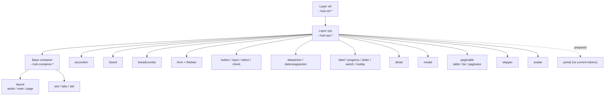
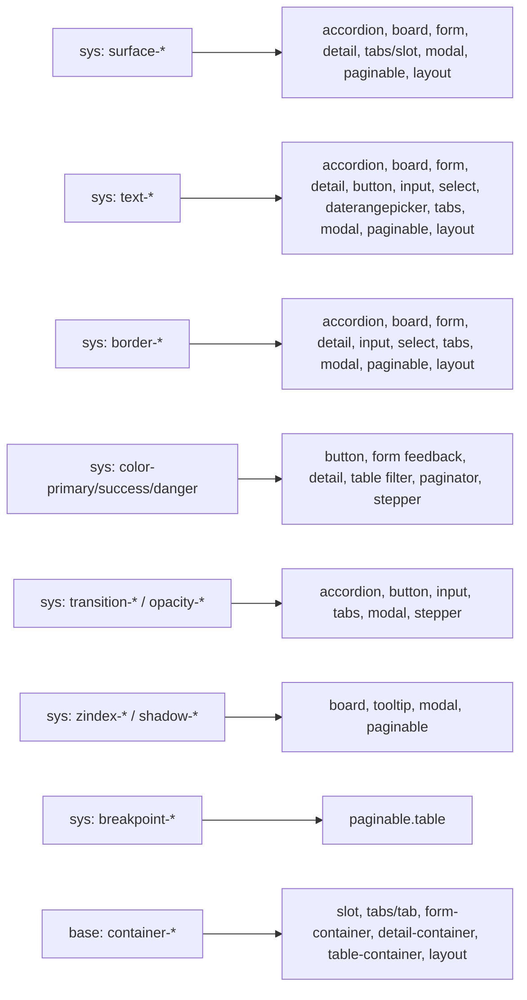

# CSS Variables — ng-hub-ui

## Introduction

This document is the reference guide for the CSS custom property system used across all `ng-hub-ui` libraries. It is intended for frontend developers, UX engineers, and QA teams who need to understand, use, or extend design tokens in the `hub-library/projects` ecosystem. It covers the full token architecture (from primitives to component-level variables), naming conventions, theming rules, and a complete per-component variable inventory.

## Token Architecture

### Three-layer model

The ng-hub-ui token system is organized into three layers, following a model similar to Bootstrap's base/component split but extended with a dedicated semantic layer:

| Layer              | Purpose                                              | Recommended prefix    | Example                    |
| ------------------ | ---------------------------------------------------- | --------------------- | -------------------------- |
| `ref` (primitives) | Raw design values (palettes, spacing, radius, sizes) | `--hub-ref-*`         | `--hub-ref-color-blue-500` |
| `sys` (semantic)   | Global tokens with usage intent                      | `--hub-sys-*`         | `--hub-sys-color-primary`  |
| `component`        | Component-specific tokens                            | `--hub-{component}-*` | `--hub-paginator-link-bg`  |

The `--hub-` prefix is mandatory for all tokens in this system. It provides a clear namespace that avoids collisions with third-party libraries (Bootstrap, Angular Material, etc.) and makes it immediately obvious that a variable belongs to the ng-hub-ui design system. All new tokens must use this prefix regardless of layer.

Layer dependency rules:

- `ref` depends on no other variable — only literal values.
- `sys` depends on `ref`.
- `component` depends preferably on `sys` (and optionally on `ref`).
- Avoid `component -> component` dependencies, except for explicit compatibility aliases.

Container scope note:

- `--hub-container-*` is a cross-cutting base scope, not part of the `ref` or `sys` collections.
- It acts as an inheritable bridge between semantic tokens and concrete components/slots.
- In design tools (Figma), it should be organized as a component/foundation collection (base styles), not as primitive (`ref`) or semantic (`sys`) tokens.



The following diagram shows how `sys` token families fan out to specific components:



### Compatibility note

All new variables must use the `ref + sys + component` model from the start. The `container` scope remains a dedicated inheritable base layer (`--hub-container-*`) used as a bridge across slots/components. Existing tokens can be migrated progressively by introducing the canonical name and keeping the old one as a `var()` fallback during a transition period of at least two stable releases.

### `inherit` mapping for design tools (Figma)

`inherit` is a CSS behavior, not a design token value. In token inventories and Figma variable collections, do not store `inherit` as a string; map it to the parent semantic token used by the component context.

Recommended mapping rules:

- Typography inheritance (`font-family`, `font-size`, `font-weight`, `line-height`) should alias the parent/container typography tokens.
- Text color inheritance should alias the parent/container text color token (default: `--hub-sys-text-primary`, unless a component state overrides it).
- Example: `--hub-breadcrumb-font-size: inherit` should be mapped to the container typography size (`--hub-container-font-size` → `--hub-ref-font-size-base`), and `--hub-board-card-title-color: inherit` to the parent text color token.

### Icon token mapping for design tools (Figma)

Icon variables defined as `url("data:image/svg+xml,...")` (for example `--hub-datepicker-icon` or `--hub-check-input-checked-icon`) are implementation details for CSS rendering. In Figma, they should not be represented as string variables.

Recommended mapping rules:

- Map icon URL tokens to an icon component instance from the design system (for example `Chevron/Down` for dropdown indicators).
- Keep icon visual properties as tokens (`color`, `size`, `opacity`, `state`) and bind those properties to semantic/component tokens.
- Use component variants for icon state/direction changes (for example `down/up`, `default/hover/active/disabled`) instead of new URL variables.

## Naming Convention

### Patterns by layer

All tokens follow lowercase kebab-case. The `--hub-` prefix is mandatory. No ambiguous abbreviations — `bg` and `color` are acceptable, but non-standard acronyms should be avoided.

| Layer       | Pattern                                         |
| ----------- | ----------------------------------------------- |
| `ref`       | `--hub-ref-{group}-{token}`                     |
| `sys`       | `--hub-sys-{group}-{token}`                     |
| `component` | `--hub-{component}-{slot?}-{property}-{state?}` |

### Directional spacing rule

For paired spacing tokens in this library, the canonical naming is `-x` and `-y`.

- Use `-x` for horizontal pairs (`left + right` or logical inline axis).
- Use `-y` for vertical pairs (`top + bottom` or logical block axis).
- `-inline` and `-block` may still appear in CSS property usage (`padding-inline`, `margin-block`), but they are not the preferred suffixes for design tokens in the current `ng-hub-ui` catalog.
- New component tokens should follow the existing inventory and prefer `--hub-{component}-...-padding-x` / `--hub-{component}-...-padding-y`.
- Single-value spacing tokens (one uniform value, not a pair — e.g. `--hub-avatar-content-padding`) are not paired tokens and may keep the bare `-padding` suffix.
- **Grandfathered exceptions** (published API, kept for compatibility; do not imitate in new tokens): the `modal` margin cascade (`--hub-modal-margin` shorthand plus `-margin-block` and per-side variants) and the logical-suffix tokens `--hub-nav-mobile-*-padding-inline` / `--hub-nav-mobile-body-padding-block-end` / `--hub-nav-vertical-panel-padding-{inline,block}` / `--hub-nav-header-*-inline-start` / `--hub-table-batch-actions-margin-inline-end`.

### Allowed states

States appear as the final suffix of a token name:

- `hover`
- `focus`
- `active`
- `disabled`
- `selected`
- `open`
- `closed`

### Valid and invalid examples

Valid:

- `--hub-ref-space-3`
- `--hub-sys-border-color-default`
- `--hub-paginator-link-bg`
- `--hub-paginator-link-bg-hover`
- `--hub-accordion-btn-color-active`

Invalid:

- `--tableColorPrimary` (camelCase and no prefix)
- `--hub-primary` (too generic, no semantic group)
- `--hub-table-active-link` (inconsistent order: must end with state)

### Formal regex validation

| Layer       | Regex                                  |
| ----------- | -------------------------------------- |
| `ref`       | `^--hub-ref-[a-z0-9]+(?:-[a-z0-9]+)+$` |
| `sys`       | `^--hub-sys-[a-z0-9]+(?:-[a-z0-9]+)+$` |
| `component` | `^--hub-[a-z0-9]+(?:-[a-z0-9]+){1,}$`  |

## `ref` Variables (Primitives)

### Colors

Color primitives are organized as full tonal ramps (`100`–`900`), Bootstrap-aligned. Semantic intent (primary, success, …) is assigned later in the `sys` layer — **never reference a hue ramp directly from a component**. There are no flat `--hub-ref-color-primary` aliases: `primary` is `blue`, `success` is `green`, `danger` is `red`, `warning` is `yellow`, `info` is `cyan`.

#### Neutrals

| Variable               | Value     |
| ---------------------- | --------- |
| `--hub-ref-color-white` | `#ffffff` |
| `--hub-ref-color-black` | `#000000` |
| `--hub-ref-color-gray-100` | `#f8f9fa` |
| `--hub-ref-color-gray-200` | `#e9ecef` |
| `--hub-ref-color-gray-300` | `#dee2e6` |
| `--hub-ref-color-gray-400` | `#ced4da` |
| `--hub-ref-color-gray-500` | `#adb5bd` |
| `--hub-ref-color-gray-600` | `#6c757d` |
| `--hub-ref-color-gray-700` | `#495057` |
| `--hub-ref-color-gray-800` | `#343a40` |
| `--hub-ref-color-gray-900` | `#212529` |

#### Tonal ramps

Token pattern: `--hub-ref-color-{hue}-{step}`, where `{hue}` ∈ `blue · green · red · yellow · cyan` and `{step}` ∈ `100…900`.

| Step | `blue` (primary) | `green` (success) | `red` (danger) | `yellow` (warning) | `cyan` (info) |
| ---- | ---------------- | ----------------- | -------------- | ------------------ | ------------- |
| 100  | `#cfe2ff`        | `#d1e7dd`         | `#f8d7da`      | `#fff3cd`          | `#cff4fc`     |
| 200  | `#9ec5fe`        | `#a3cfbb`         | `#f1aeb5`      | `#ffe69c`          | `#9eeaf9`     |
| 300  | `#6ea8fe`        | `#75b798`         | `#ea868f`      | `#ffda6a`          | `#6edff6`     |
| 400  | `#3d8bfd`        | `#479f76`         | `#e35d6a`      | `#ffcd39`          | `#3dd5f3`     |
| 500  | `#0d6efd`        | `#198754`         | `#dc3545`      | `#ffc107`          | `#0dcaf0`     |
| 600  | `#0a58ca`        | `#146c43`         | `#b02a37`      | `#cc9a06`          | `#0aa2c0`     |
| 700  | `#084298`        | `#0f5132`         | `#842029`      | `#997404`          | `#087990`     |
| 800  | `#052c65`        | `#0a3622`         | `#58151c`      | `#664d03`          | `#055160`     |
| 900  | `#031633`        | `#051b11`         | `#2c0b0e`      | `#332701`          | `#032830`     |

#### Surfaces

| Variable             | Value     |
| -------------------- | --------- |
| `--hub-ref-surface-1` | `#ffffff` |
| `--hub-ref-surface-2` | `#f8f9fa` |

### Spacing

| Variable          | Value     |
| ----------------- | --------- |
| `--hub-ref-space-0` | `0`       |
| `--hub-ref-space-1` | `0.25rem` |
| `--hub-ref-space-2` | `0.5rem`  |
| `--hub-ref-space-3` | `1rem`    |
| `--hub-ref-space-4` | `1.5rem`  |
| `--hub-ref-space-5` | `3rem`    |
| `--hub-ref-space-6` | `4.5rem`  |
| `--hub-ref-space-7` | `6rem`    |

### Radius

| Variable             | Value      |
| -------------------- | ---------- |
| `--hub-ref-radius-none` | `0`       |
| `--hub-ref-radius-sm`   | `0.25rem`  |
| `--hub-ref-radius-md`   | `0.375rem` |
| `--hub-ref-radius-lg`   | `0.5rem`   |
| `--hub-ref-radius-xl`   | `1rem`     |
| `--hub-ref-radius-xxl`  | `2rem`     |
| `--hub-ref-radius-pill` | `50rem`    |

### Borders

| Variable                 | Value |
| ------------------------ | ----- |
| `--hub-ref-border-width` | `1px` |

### Typography

| Variable                         | Value                                                                                |
| -------------------------------- | ------------------------------------------------------------------------------------ |
| `--hub-ref-font-family-base`     | `system-ui, -apple-system, "Segoe UI", Roboto, "Helvetica Neue", Arial, sans-serif`  |
| `--hub-ref-font-family-display`  | `"Sora", system-ui, -apple-system, "Segoe UI", Roboto, sans-serif`                   |
| `--hub-ref-font-family-mono`     | `SFMono-Regular, Menlo, Monaco, Consolas, "Liberation Mono", "Courier New", monospace` |
| `--hub-ref-font-size-xs`         | `0.75rem`                                                                            |
| `--hub-ref-font-size-sm`         | `0.875rem`                                                                           |
| `--hub-ref-font-size-base`       | `1rem`                                                                              |
| `--hub-ref-font-size-lg`         | `1.25rem`                                                                           |
| `--hub-ref-font-weight-light`    | `300`                                                                               |
| `--hub-ref-font-weight-base`     | `400`                                                                               |
| `--hub-ref-font-weight-medium`   | `500`                                                                               |
| `--hub-ref-font-weight-semibold` | `600`                                                                               |
| `--hub-ref-font-weight-bold`     | `700`                                                                               |
| `--hub-ref-line-height-sm`       | `1.25`                                                                              |
| `--hub-ref-line-height-base`     | `1.5`                                                                               |
| `--hub-ref-line-height-lg`       | `2`                                                                                 |

### Icons

| Variable            | Value |
| ------------------- | ----- |
| `--hub-ref-icon-size` | `1em` |

## `sys` Variables (Semantic)

### Surfaces, text and borders

Semantic neutrals. The token names are stable across themes; only the literal values change per theme (dark shown where it differs).

| Token                            | Light                          | Dark      |
| -------------------------------- | ------------------------------ | --------- |
| `--hub-sys-surface-page`         | `#ffffff`                      | `#121212` |
| `--hub-sys-surface-elevated`     | `#f8f9fa`                      | `#1e1e1e` |
| `--hub-sys-text-primary`         | `#212529`                      | `#f8f9fa` |
| `--hub-sys-text-muted`           | `#6c757d`                      | `#adb5bd` |
| `--hub-sys-border-color-default` | `#dee2e6`                      | `#343a40` |
| `--hub-sys-link-color`           | `var(--hub-sys-color-primary)` | inherits  |
| `--hub-sys-link-hover-color`     | `#0a58ca`                      | `#9ec5fe` |
| `--hub-sys-color-ink`            | `#212529`                      | `#f8f9fa` |

Stable semantic aliases (named mappings used by components for readability):

| Alias                             | Maps to                          |
| --------------------------------- | -------------------------------- |
| `--hub-sys-color-surface-default` | `--hub-sys-surface-page`         |
| `--hub-sys-color-surface-subtle`  | `--hub-sys-surface-elevated`     |
| `--hub-sys-color-text-subtle`     | `--hub-sys-text-muted`           |
| `--hub-sys-color-border-subtle`   | `--hub-sys-border-color-default` |

### Semantic colors (generated)

Semantic color families are **generated, not enumerated**. A theme sets only the accent of each variant (`--hub-sys-color-{variant}`); the role family is derived once in `:root` with `color-mix()` against the contextual `--hub-sys-surface-page` and `--hub-sys-color-ink`. Overriding a single accent — even on a subtree — recomputes the whole family at runtime. `--hub-sys-color-ink` is the per-theme contrast target (dark on light themes, light on dark/terminal).

**Variants:** `primary` · `secondary` · `success` · `danger` · `warning` · `info` · `neutral` · `light` · `dark`. The set is **open**: redefine `$hub-accents` (or pass `$hub-accents-extra`) before importing to add as many variants as you want (e.g. brand, accent, tertiary) — each one derives the same role family. Chromatic and neutral variants share the same generative engine.

**Roles per variant** and their derivation:

| Role            | Token                                   | Derivation                        |
| --------------- | --------------------------------------- | --------------------------------- |
| accent (base)   | `--hub-sys-color-{variant}`             | the only value a theme sets       |
| `subtle`        | `--hub-sys-color-{variant}-subtle`         | `color-mix(12% accent, surface)`  |
| `border-subtle` | `--hub-sys-color-{variant}-border-subtle`  | `color-mix(35% accent, surface)`  |
| `emphasis`      | `--hub-sys-color-{variant}-emphasis`       | `color-mix(80% accent, ink)`      |
| `on`            | `--hub-sys-color-{variant}-on`             | grayscale contrast flip via relative color |

**Canonical example (`primary`, light theme):**

```css
--hub-sys-color-primary:               #0d6efd; /* accent — theme-set */
--hub-sys-color-primary-subtle:        color-mix(in oklch, var(--hub-sys-color-primary) 12%, var(--hub-sys-surface-page));
--hub-sys-color-primary-border-subtle: color-mix(in oklch, var(--hub-sys-color-primary) 35%, var(--hub-sys-surface-page));
--hub-sys-color-primary-emphasis:      color-mix(in oklch, var(--hub-sys-color-primary) 80%, var(--hub-sys-color-ink));
--hub-sys-color-primary-on:            oklch(from var(--hub-sys-color-primary) clamp(0, (0.62 - l) * 1000, 1) 0 h);
```

> The identical family is generated for **every** variant. `hub-tokens` is the implementation of this rule — do not hand-enumerate the other variants here.

Default accents per built-in light/dark theme:

| Variant     | Hue    | Light     | Dark      |
| ----------- | ------ | --------- | --------- |
| `primary`   | blue   | `#0d6efd` | `#6ea8fe` |
| `success`   | green  | `#198754` | `#75b798` |
| `danger`    | red    | `#dc3545` | `#ea868f` |
| `warning`   | yellow | `#ffc107` | `#ffda6a` |
| `info`      | cyan   | `#0dcaf0` | `#6edff6` |

Neutral variant accents (part of `$hub-accents` — they derive the **same full role family** as the chromatic variants; the built-in theme maps do not re-tint them):

| Token                       | Default (all built-in themes)            |
| --------------------------- | ---------------------------------------- |
| `--hub-sys-color-secondary` | `var(--hub-ref-color-gray-600, #6c757d)` |
| `--hub-sys-color-neutral`   | `var(--hub-ref-color-gray-600, #6c757d)` |
| `--hub-sys-color-light`     | `var(--hub-ref-color-gray-100, #f8f9fa)` |
| `--hub-sys-color-dark`      | `var(--hub-ref-color-gray-900, #212529)` |

Standalone brand aliases (base only — no derived role family):

| Token                              | Value                                    |
| ---------------------------------- | ---------------------------------------- |
| `--hub-sys-color-brand-default`    | `var(--hub-sys-color-primary, #0d6efd)`  |
| `--hub-sys-color-brand-on-default` | `var(--hub-ref-color-white, #fff)`       |

**Expressive gradient** (theme-aware; re-colors when `data-theme` changes):

| Token                       | Light value                                                                                |
| --------------------------- | ------------------------------------------------------------------------------------------ |
| `--hub-sys-gradient-1`      | `#7c3aed`                                                                                   |
| `--hub-sys-gradient-2`      | `#db2777`                                                                                   |
| `--hub-sys-gradient-3`      | `#d97706`                                                                                   |
| `--hub-sys-gradient-accent` | `linear-gradient(135deg, var(--hub-sys-gradient-1), var(--hub-sys-gradient-2), var(--hub-sys-gradient-3))` |

### Borders and shadows

| Token                            | Layer | Status    | Light                                     | Dark                                    | Notes                  |
| -------------------------------- | ----- | --------- | ----------------------------------------- | --------------------------------------- | ---------------------- |
| `--hub-sys-border-color-default` | `sys` | `PENDING` | `#dee2e6`                                 | `#343a40`                               | Standard border        |
| `--hub-sys-shadow-sm`            | `sys` | `PENDING` | `0 0.125rem 0.25rem rgba(0, 0, 0, 0.075)` | `0 0.125rem 0.25rem rgba(0, 0, 0, 0.3)` | Low elevation          |
| `--hub-sys-shadow`               | `sys` | `PENDING` | `0 0.5rem 1rem rgba(0, 0, 0, 0.15)`       | `0 0.5rem 1rem rgba(0, 0, 0, 0.3)`      | Medium elevation       |
| `--hub-sys-shadow-lg`            | `sys` | `PENDING` | `0 1rem 3rem rgba(0, 0, 0, 0.175)`        | `0 1rem 3rem rgba(0, 0, 0, 0.3)`        | High elevation (modal) |
| `--hub-sys-shadow-inset`         | `sys` | `PENDING` | `inset 0 1px 2px rgba(0, 0, 0, 0.075)`    | `inset 0 1px 2px rgba(0, 0, 0, 0.3)`    | Inset shadow           |
| `--hub-sys-shadow-none`          | `sys` | `PENDING` | `none`                                    | `none`                                  | Explicit no shadow     |
| `--hub-sys-shadow-md`            | `sys` | `PENDING` | `var(--hub-sys-shadow)`                   | `var(--hub-sys-shadow)`                 | Alias of medium shadow |

### Radius (sys aliases)

Semantic aliases over the `ref` radius scale, so components reference `sys` rather than primitives.

| Token                   | Maps to                 |
| ----------------------- | ----------------------- |
| `--hub-sys-radius-none` | `--hub-ref-radius-none` |
| `--hub-sys-radius-sm`   | `--hub-ref-radius-sm`   |
| `--hub-sys-radius-md`   | `--hub-ref-radius-md`   |
| `--hub-sys-radius-lg`   | `--hub-ref-radius-lg`   |
| `--hub-sys-radius-xl`   | `--hub-ref-radius-xl`   |
| `--hub-sys-radius-xxl`  | `--hub-ref-radius-xxl`  |
| `--hub-sys-radius-pill` | `--hub-ref-radius-pill` |

### Focus and accessibility

The following tokens are required for all interactive elements. Do not remove `outline` from elements without replacing it with a tokenized focus ring.

| Token                         | Recommended value          | Status    |
| ----------------------------- | -------------------------- | --------- |
| `--hub-sys-focus-ring-width`  | `0.25rem`                  | `PENDING` |
| `--hub-sys-focus-ring-color`  | `rgba(13, 110, 253, 0.25)` | `PENDING` |
| `--hub-sys-focus-ring-offset` | `2px`                      | `PENDING` |
| `--hub-sys-hit-area-min-size` | `44px`                     | `PENDING` |
| `--hub-sys-text-contrast-min` | `4.5`                      | `PENDING` |

Accessibility rules for new tokens and components:

1. Minimum contrast: normal text `>= 4.5:1`; large text (`>= 18px` regular or `>= 14px` bold) `>= 3:1`.
2. Focus ring is required on all interactive elements; use global focus tokens for color, width, and offset.
3. Minimum touch target: recommended minimum `44px x 44px` for interactive controls.

### Z-index layers

| Token                             | Recommended value | Status    |
| --------------------------------- | ----------------- | --------- |
| `--hub-sys-zindex-dropdown`       | `1000`            | `PENDING` |
| `--hub-sys-zindex-sticky`         | `1020`            | `PENDING` |
| `--hub-sys-zindex-fixed`          | `1030`            | `PENDING` |
| `--hub-sys-zindex-modal-backdrop` | `1050`            | `PENDING` |
| `--hub-sys-zindex-modal`          | `1055`            | `PENDING` |
| `--hub-sys-zindex-popover`        | `1070`            | `PENDING` |
| `--hub-sys-zindex-tooltip`        | `1080`            | `PENDING` |
| `--hub-sys-zindex-toast`          | `1090`            | `PENDING` |

### Transitions and states

| Token                           | Recommended value                                            | Status    |
| ------------------------------- | ------------------------------------------------------------ | --------- |
| `--hub-sys-transition-fast`                 | `all 0.15s ease-in-out`                                      | `PENDING` |
| `--hub-sys-transition-base`                 | `all 0.2s ease-in-out`                                       | `PENDING` |
| `--hub-sys-transition-slow`                 | `all 0.3s ease-in-out`                                       | `PENDING` |
| `--hub-sys-transition-fade`                 | `opacity 0.15s linear`                                       | `PENDING` |
| `--hub-sys-transition-collapse`             | `height 0.35s ease`                                          | `PENDING` |
| `--hub-sys-transition-duration-base`        | `260ms`                                                      | `PENDING` |
| `--hub-sys-transition-timing-function-base` | `ease`                                                       | `PENDING` |
| `--hub-sys-state-active-bg`                 | `rgba(0, 0, 0, 0.1)` / `rgba(255, 255, 255, 0.1)` (dark)     | `PENDING` |
| `--hub-sys-state-hover-bg`                  | `rgba(0, 0, 0, 0.075)` / `rgba(255, 255, 255, 0.075)` (dark) | `PENDING` |
| `--hub-sys-state-striped-bg`                | `rgba(0, 0, 0, 0.05)` / `rgba(255, 255, 255, 0.05)` (dark)   | `PENDING` |

### Breakpoints

| Token                      | Recommended value | Status    |
| -------------------------- | ----------------- | --------- |
| `--hub-sys-breakpoint-xs`  | `0`               | `PENDING` |
| `--hub-sys-breakpoint-sm`  | `576px`           | `PENDING` |
| `--hub-sys-breakpoint-md`  | `768px`           | `PENDING` |
| `--hub-sys-breakpoint-lg`  | `992px`           | `PENDING` |
| `--hub-sys-breakpoint-xl`  | `1200px`          | `PENDING` |
| `--hub-sys-breakpoint-xxl` | `1400px`          | `PENDING` |

### Opacity

| Token                        | Recommended value | Status    |
| ---------------------------- | ----------------- | --------- |
| `--hub-sys-opacity-0`        | `0`               | `PENDING` |
| `--hub-sys-opacity-25`       | `0.25`            | `PENDING` |
| `--hub-sys-opacity-50`       | `0.5`             | `PENDING` |
| `--hub-sys-opacity-75`       | `0.75`            | `PENDING` |
| `--hub-sys-opacity-100`      | `1`               | `PENDING` |
| `--hub-sys-opacity-disabled` | `0.65`            | `PENDING` |

### Light / Dark theme

Theming rule: the same semantic tokens (`--hub-sys-*`) are used in both themes. Only the assigned values change per theme. Components must consume semantic tokens, not literals.

| Semantic token                   | Light                      | Dark                        |
| -------------------------------- | -------------------------- | --------------------------- |
| `--hub-sys-surface-page`         | `#ffffff`                  | `#121212`                   |
| `--hub-sys-surface-elevated`     | `#f8f9fa`                  | `#1e1e1e`                   |
| `--hub-sys-text-primary`         | `#212529`                  | `#f8f9fa`                   |
| `--hub-sys-text-muted`           | `#6c757d`                  | `#adb5bd`                   |
| `--hub-sys-border-color-default` | `#dee2e6`                  | `#343a40`                   |
| `--hub-sys-color-primary`        | `#0d6efd`                  | `#6ea8fe`                   |
| `--hub-sys-color-success`        | `#198754`                  | `#75b798`                   |
| `--hub-sys-color-danger`         | `#dc3545`                  | `#ea868f`                   |
| `--hub-sys-focus-ring-color`     | `rgba(13, 110, 253, 0.25)` | `rgba(110, 168, 254, 0.35)` |

CSS implementation:

```css
:root,
[data-theme='light'] {
	--hub-sys-surface-page: #ffffff;
	--hub-sys-text-primary: #212529;
	--hub-sys-border-color-default: #dee2e6;
}

[data-theme='dark'] {
	--hub-sys-surface-page: #121212;
	--hub-sys-text-primary: #f8f9fa;
	--hub-sys-border-color-default: #343a40;
}
```

### Structure (sizing · grid · gap)

Canonical structural tokens (Bootstrap-compatible). Sizing keywords and fractional widths, the responsive page-wrapper max-widths, the grid column count and gutters, and a semantic `gap` scale aliasing the spacing scale. Consumed directly, via the layout mixins (`hub.stack`, `hub.cluster`, `hub.grid`, `hub.center`) or via the opt-in utility sheets.

| Variable | Value |
| -------- | ----- |
| `--hub-sys-size-full` | `100%` |
| `--hub-sys-size-auto` | `auto` |
| `--hub-sys-size-min` | `min-content` |
| `--hub-sys-size-max` | `max-content` |
| `--hub-sys-size-fit` | `fit-content` |
| `--hub-sys-size-1-2` | `50%` |
| `--hub-sys-size-1-3` | `33.333333%` |
| `--hub-sys-size-2-3` | `66.666667%` |
| `--hub-sys-size-1-4` | `25%` |
| `--hub-sys-size-3-4` | `75%` |
| `--hub-sys-container-max-width-sm` | `540px` |
| `--hub-sys-container-max-width-md` | `720px` |
| `--hub-sys-container-max-width-lg` | `960px` |
| `--hub-sys-container-max-width-xl` | `1140px` |
| `--hub-sys-container-max-width-xxl` | `1320px` |
| `--hub-sys-grid-columns` | `12` |
| `--hub-sys-grid-gutter-x` | `var(--hub-ref-space-4)` |
| `--hub-sys-grid-gutter-y` | `var(--hub-ref-space-0)` |
| `--hub-sys-gap-0` | `var(--hub-ref-space-0)` |
| `--hub-sys-gap-1` | `var(--hub-ref-space-1)` |
| `--hub-sys-gap-2` | `var(--hub-ref-space-2)` |
| `--hub-sys-gap-3` | `var(--hub-ref-space-3)` |
| `--hub-sys-gap-4` | `var(--hub-ref-space-4)` |
| `--hub-sys-gap-5` | `var(--hub-ref-space-5)` |

## `container` Variables (Inheritable base)

These variables form a cross-cutting **re-base hook layer** for the page container and for `generic`, `tabs`, and `tab` slots. They are defined once with real defaults; a container component (e.g. `panels`) reads them for its outer chrome (surface, border, padding, typography) as `var(--hub-container-*, <component fallback>)`. Because they are live CSS variables, **overriding a single container token on a subtree re-bases every descendant container that reads it** — no recompile. Each component still keeps its own `--hub-{component}-*` token as the final fallback.

### Typography

| Recommended variable              | Recommended initial value         | Notes                             |
| --------------------------------- | --------------------------------- | --------------------------------- |
| `--hub-container-font-family`     | `var(--hub-ref-font-family-base)` | Typography inherited by container |
| `--hub-container-font-size`       | `var(--hub-ref-font-size-base)`   | Typographic size inherited        |
| `--hub-container-font-weight`     | `var(--hub-ref-font-weight-base)` | Font weight inherited             |
| `--hub-container-font-style`      | `normal`                          | Typographic style inherited       |
| `--hub-container-text-color`      | `var(--hub-sys-text-primary)`     | Base text color                   |
| `--hub-container-text-align`      | `start`                           | Text alignment                    |
| `--hub-container-text-decoration` | `none`                            | Text decoration                   |
| `--hub-container-text-transform`  | `none`                            | Text transformation               |

### Layout

| Recommended variable              | Recommended initial value | Notes                           |
| --------------------------------- | ------------------------- | ------------------------------- |
| `--hub-container-flex-direction`  | `row`                     | Direction in flex layout        |
| `--hub-container-flex-wrap`       | `nowrap`                  | Wrapping in flex layout         |
| `--hub-container-justify-content` | `flex-start`              | Main axis distribution          |
| `--hub-container-align-items`     | `stretch`                       | Cross axis alignment            |
| `--hub-container-row-gap`         | `var(--hub-ref-space-2)`        | Vertical gap between children   |
| `--hub-container-column-gap`      | `var(--hub-ref-space-2)`        | Horizontal gap between children |
| `--hub-container-margin-x`        | `0`                             | Horizontal outer margin         |
| `--hub-container-margin-y`        | `0`                             | Vertical outer margin           |
| `--hub-container-padding-x`       | `var(--hub-ref-space-3)`        | Horizontal inner padding (per-axis re-base) |
| `--hub-container-padding-y`       | `var(--hub-ref-space-3)`        | Vertical inner padding (per-axis re-base) |
| `--hub-container-width`           | `100%`                          | Default width                   |

### Visual

| Recommended variable            | Recommended initial value             | Notes                |
| ------------------------------- | ------------------------------------- | -------------------- |
| `--hub-container-bg`            | `var(--hub-sys-surface-page)`         | Container background |
| `--hub-container-border-radius` | `var(--hub-ref-radius-md, 0.375rem)`  | Container radius     |
| `--hub-container-border-width`  | `var(--hub-ref-border-width, 1px)`    | Border thickness     |
| `--hub-container-border-style`  | `solid`                               | Border style         |
| `--hub-container-border-color`  | `var(--hub-sys-border-color-default)` | Border color         |

Example of base token assignment to a component:

```css
.hub-accordion {
	--hub-accordion-color: var(--hub-sys-text-primary);
	--hub-accordion-bg: var(--hub-sys-surface-page);
	--hub-accordion-border-color: var(--hub-sys-border-color-default);
	--hub-accordion-border-radius: var(--hub-ref-radius-sm);
	--hub-accordion-btn-focus-box-shadow: 0 0 0 var(--hub-sys-focus-ring-width, 0.25rem) var(--hub-sys-focus-ring-color);
}
```

## Components

**Component accent-slot family (generative).** Components that expose a semantic variant read a single local accent slot — `--hub-{component}-accent` — defaulting to `var(--hub-sys-color-primary)`, and derive its role family locally with `color-mix(in oklch, …)` / relative color: `--hub-{component}-accent-subtle`, `-border-subtle`, `-emphasis` and the contrast pair `-on`. Because derivation reads the live slot, a custom accent (e.g. `brand`) works at runtime with a single rule — `[data-variant="brand"] { --hub-{component}-accent: var(--hub-sys-color-brand) }` — without recompiling the library. This family is generated by the slot convention (mirroring the sys family) and is not enumerated row-by-row below.

Unified component inventory with current (`IN_USE`) and planned (`PENDING`) variables, always using the final canonical token name.

Default table format: `Token` + `Initial value` + `Usage` + `Status` + `Source`.
Implemented components can use the same definitive format when the inventory is already normalized.

Status legend:

- `IN_USE`: token is implemented and consumed in code.
- `PENDING`: token is defined in the catalog but not yet implemented everywhere it is intended to be used.
- `INTERNAL`: the component writes the variable at runtime (from inputs/config/state). It is not a theming hook — external overrides are ignored — but it is inventoried so every variable in code has a row.

Source legend:

- File paths point to the current implementation source.
- `PROPOSAL` marks a documented target token not yet implemented in code.
- `UX-EXCEL` marks a token imported from the UX inventory.
- `INVENTORY` marks a token consolidated from prior internal inventories.

### `accordion`

| Token                                          | Initial value                                                                                                                                                                                                                                                                                | Usage                                        | Status   | Source                                                               |
| ---------------------------------------------- | -------------------------------------------------------------------------------------------------------------------------------------------------------------------------------------------------------------------------------------------------------------------------------------------- | -------------------------------------------- | -------- | -------------------------------------------------------------------- |
| `--hub-accordion-active-bg`                    | `var(--hub-sys-color-primary-subtle, #e7f1ff)`                                                                                                                                                                                                                                               | Active/expanded header background color      | `IN_USE` | `panels/src/lib/components/panels/panels.variables.scss:128` |
| `--hub-accordion-active-color`                 | `var(--hub-sys-color-primary, #0d6efd)`                                                                                                                                                                                                                                                      | Active/expanded header text color            | `IN_USE` | `panels/src/lib/components/panels/panels.variables.scss:127` |
| `--hub-accordion-bg`                           | `var(--hub-sys-surface-page, #fff)`                                                                                                                                                                                                                                                          | Panel background color                       | `IN_USE` | `panels/src/lib/components/panels/panels.variables.scss:115` |
| `--hub-accordion-body-padding-x`               | `1.25rem`                                                                                                                                                                                                                                                                                    | Horizontal body padding                      | `IN_USE` | `panels/src/lib/components/panels/panels.variables.scss:152` |
| `--hub-accordion-body-padding-y`               | `var(--hub-ref-space-3, 1rem)`                                                                                                                                                                                                                                                               | Vertical body padding                        | `IN_USE` | `panels/src/lib/components/panels/panels.variables.scss:153` |
| `--hub-accordion-border-color`                 | `var(--hub-sys-border-color-default, rgba(0, 0, 0, 0.125))`                                                                                                                                                                                                                                  | Panel border color                           | `IN_USE` | `panels/src/lib/components/panels/panels.variables.scss:117` |
| `--hub-accordion-border-radius`                | `var(--hub-ref-radius-sm, 0.25rem)`                                                                                                                                                                                                                                                          | Panel border radius                          | `IN_USE` | `panels/src/lib/components/panels/panels.variables.scss:118` |
| `--hub-accordion-border-width`                 | `var(--hub-ref-border-width, 1px)`                                                                                                                                                                                                                                                           | Panel border width                           | `IN_USE` | `panels/src/lib/components/panels/panels.variables.scss:116` |
| `--hub-accordion-btn-bg`                       | `var(--hub-sys-surface-page, #fff)`                                                                                                                                                                                                                                                          | Header button background                     | `IN_USE` | `panels/src/lib/components/panels/panels.variables.scss:126` |
| `--hub-accordion-btn-color`                    | `var(--hub-sys-text-primary, #212529)`                                                                                                                                                                                                                                                       | Header button text color                     | `IN_USE` | `panels/src/lib/components/panels/panels.variables.scss:125` |
| `--hub-accordion-btn-focus-box-shadow`         | `0 0 0 var(--hub-sys-focus-ring-width, 0.25rem) var(--hub-sys-focus-ring-color, rgba(13, 110, 253, 0.25))`                                                                                                                                                                                   | Focus ring shadow                            | `IN_USE` | `panels/src/lib/components/panels/panels.variables.scss:136` |
| `--hub-accordion-btn-icon-mask`                | `url("data:image/svg+xml;charset=UTF-8,%3Csvg viewBox='0 0 16 16' xmlns='http://www.w3.org/2000/svg'%3E%3Cpath fill='%23000' fill-rule='evenodd' d='M1.646 4.646a.5.5 0 0 1 .708 0L8 10.293l5.646-5.647a.5.5 0 0 1 .708.708l-6 6a.5.5 0 0 1-.708 0l-6-6a.5.5 0 0 1 0-.708z'/%3E%3C/svg%3E")` | Chevron icon mask (down by default)          | `IN_USE` | `panels/src/lib/components/panels/panels.variables.scss:131` |
| `--hub-accordion-btn-icon-transform`           | `rotate(-180deg)`                                                                                                                                                                                                                                                                            | Expanded state icon transform (up direction) | `IN_USE` | `panels/src/lib/components/panels/panels.variables.scss:133` |
| `--hub-accordion-btn-icon-transition`          | `transform 0.2s ease-in-out`                                                                                                                                                                                                                                                                 | Icon transition                              | `IN_USE` | `panels/src/lib/components/panels/panels.variables.scss:134` |
| `--hub-accordion-btn-icon-width`               | `1.25rem`                                                                                                                                                                                                                                                                                    | Icon size                                    | `IN_USE` | `panels/src/lib/components/panels/panels.variables.scss:132` |
| `--hub-accordion-btn-padding-x`                | `1.25rem`                                                                                                                                                                                                                                                                                    | Header horizontal padding                    | `IN_USE` | `panels/src/lib/components/panels/panels.variables.scss:123` |
| `--hub-accordion-btn-padding-y`                | `var(--hub-ref-space-3, 1rem)`                                                                                                                                                                                                                                                               | Header vertical padding                      | `IN_USE` | `panels/src/lib/components/panels/panels.variables.scss:124` |
| `--hub-accordion-collapse-transition-duration` | `0.25s`                                                                                                                                                                                                                                                                                      | Collapse/expand transition duration          | `IN_USE` | `panels/src/lib/components/panels/panels.variables.scss:147` |
| `--hub-accordion-collapse-transition-easing`   | `cubic-bezier(0.4, 0, 0.2, 1)`                                                                                                                                                                                                                                                               | Collapse/expand transition easing            | `IN_USE` | `panels/src/lib/components/panels/panels.variables.scss:149` |
| `--hub-accordion-color`                        | `var(--hub-sys-text-primary, #212529)`                                                                                                                                                                                                                                                       | Panel text color                             | `IN_USE` | `panels/src/lib/components/panels/panels.variables.scss:114` |
| `--hub-accordion-icon-active-color`            | `var(--hub-accordion-active-color, var(--hub-sys-color-primary, #0d6efd))`                                                                                                                                                                                                                   | Expanded icon color                          | `IN_USE` | `panels/src/lib/components/panels/panels.variables.scss:130` |
| `--hub-accordion-icon-color`                   | `var(--hub-accordion-btn-color, var(--hub-sys-text-primary, #212529))`                                                                                                                                                                                                                       | Collapsed icon color                         | `IN_USE` | `panels/src/lib/components/panels/panels.variables.scss:129` |
| `--hub-accordion-inner-border-radius`          | `calc(var(--hub-accordion-border-radius, var(--hub-ref-radius-sm, 0.25rem)) - var(--hub-accordion-border-width, var(--hub-ref-border-width, 1px)))`                                                                                                                                          | Inner border radius                          | `IN_USE` | `panels/src/lib/components/panels/panels.variables.scss:120` |
| `--hub-accordion-transition`                   | `color 0.15s ease-in-out, background-color 0.15s ease-in-out, border-color 0.15s ease-in-out, box-shadow 0.15s ease-in-out, border-radius 0.15s ease`                                                                                                                                        | Header visual transition                     | `IN_USE` | `panels/src/lib/components/panels/panels.variables.scss:140` |

### `avatar`

| Token                               | Initial value                                                                            | Usage                                                  | Status   | Source                                 |
| ----------------------------------- | ---------------------------------------------------------------------------------------- | ------------------------------------------------------ | -------- | -------------------------------------- |
| `--hub-avatar-size` | runtime (`50px`) | Avatar box size in px — written on the host from the `size` input (the input is the API; a CSS override is overruled by the inline style) | `INTERNAL` | `avatar/src/lib/avatar.component.ts:73` |
| `--hub-avatar-overflow` | `hidden` | Overflow clipping behavior for avatar container | `IN_USE` | `avatar/src/lib/avatar.component.scss:4` |
| `--hub-avatar-border-radius-round` | `50%` | Round shape radius token | `IN_USE` | `avatar/src/lib/avatar.component.scss:5` |
| `--hub-avatar-border-radius-square` | `var(--hub-ref-radius-sm, 0.25rem)` | Default square shape radius token | `IN_USE` | `avatar/src/lib/avatar.component.scss:6` |
| `--hub-avatar-border-radius` | `var(--hub-avatar-border-radius-round, var(--hub-avatar-border-radius-square, 0.25rem))` | Effective avatar radius used in host/container/content | `IN_USE` | `avatar/src/lib/avatar.component.scss:7` |
| `--hub-avatar-border-width-default` | `var(--hub-ref-border-width, 1px)` | Default border width when border is enabled | `IN_USE` | `avatar/src/lib/avatar.component.scss:11` |
| `--hub-avatar-border-width` | `0` | Effective avatar border width | `IN_USE` | `avatar/src/lib/avatar.component.scss:12` |
| `--hub-avatar-border-color` | `transparent` | Effective avatar border color | `IN_USE` | `avatar/src/lib/avatar.component.scss:13` |
| `--hub-avatar-fg-color` | `var(--hub-avatar-accent-on, var(--hub-ref-color-white, #fff))` | Text/avatar foreground color token | `IN_USE` | `avatar/src/lib/avatar.component.scss:24` |
| `--hub-avatar-bg-color` | `var(--hub-avatar-accent, var(--hub-sys-color-primary, #0d6efd))` | Avatar surface color token (accent by default; initials/value override it, images cover it) | `IN_USE` | `avatar/src/lib/avatar.component.scss:28` |
| `--hub-avatar-font-family` | `var( --hub-ref-font-family-base, system-ui, -apple-system, 'Segoe UI', Roboto, 'Helvetica Neue', Arial, sans-serif )` | Avatar text font family | `IN_USE` | `avatar/src/lib/avatar.component.scss:29` |
| `--hub-avatar-font-weight` | `var(--hub-ref-font-weight-base, 400)` | Avatar text font weight | `IN_USE` | `avatar/src/lib/avatar.component.scss:39` |
| `--hub-avatar-font-size` | `calc(var(--hub-avatar-size, 50px) / 3)` | Avatar text font size | `IN_USE` | `avatar/src/lib/avatar.component.scss:40` |
| `--hub-avatar-line-height` | `var(--hub-avatar-size, 50px)` | Avatar text line-height token | `IN_USE` | `avatar/src/lib/avatar.component.scss:41` |
| `--hub-avatar-text-transform` | `uppercase` | Avatar text transform | `IN_USE` | `avatar/src/lib/avatar.component.scss:42` |
| `--hub-avatar-text-align` | `center` | Avatar text alignment | `IN_USE` | `avatar/src/lib/avatar.component.scss:43` |
| `--hub-avatar-object-fit` | `cover` | Avatar image object-fit token | `IN_USE` | `avatar/src/lib/avatar.component.scss:44` |
| `--hub-avatar-content-padding` | `calc(var(--hub-avatar-size, 50px) * 0.2)` | Padding around projected custom content (icon/SVG/image) | `IN_USE` | `avatar/src/lib/avatar.component.scss:50` |
| `--hub-avatar-content-icon-size` | `calc(var(--hub-avatar-size, 50px) * 0.55)` | Font size for projected icon fonts / emoji | `IN_USE` | `avatar/src/lib/avatar.component.scss:51` |
| `--hub-avatar-badge-size` | `calc(var(--hub-avatar-size, 50px) * 0.28)` | Badge dot diameter / label min-height (scales with size) | `IN_USE` | `avatar/src/lib/avatar.component.scss:54` |
| `--hub-avatar-badge-offset` | `0px` | Badge inset from the bottom-end corner | `IN_USE` | `avatar/src/lib/avatar.component.scss:55` |
| `--hub-avatar-badge-ring-width` | `max(2px, calc(var(--hub-avatar-size, 50px) * 0.05))` | Ring around the badge (separates it from the avatar) | `IN_USE` | `avatar/src/lib/avatar.component.scss:56` |
| `--hub-avatar-badge-ring-color` | `var(--hub-sys-surface-page, #fff)` | Badge ring colour | `IN_USE` | `avatar/src/lib/avatar.component.scss:57` |
| `--hub-avatar-badge-color` | `var(--hub-sys-color-secondary, #6c757d)` | Badge fill (neutral default; pick a semantic colour with the `badgeColor` input → `--hub-sys-color-*`) | `IN_USE` | `avatar/src/lib/avatar.component.scss:59` |
| `--hub-avatar-badge-text-color` | `var(--hub-ref-color-white, #fff)` | Badge label text colour | `IN_USE` | `avatar/src/lib/avatar.component.scss:60` |
| `--hub-avatar-badge-font-size` | `calc(var(--hub-avatar-size, 50px) * 0.22)` | Badge label font size | `IN_USE` | `avatar/src/lib/avatar.component.scss:61` |
| `--hub-avatar-badge-padding` | `calc(var(--hub-avatar-size, 50px) * 0.08)` | Badge label inline padding | `IN_USE` | `avatar/src/lib/avatar.component.scss:62` |
| `--hub-avatar-group-overlap`        | `calc(var(--hub-avatar-size, 50px) * 0.3)`                                               | Overlap amount between stacked avatars in `.hub-avatar-group` | `IN_USE` | `avatar/src/lib/avatar.component.scss:65` |
| `--hub-avatar-group-ring-width`     | `max(2px, calc(var(--hub-avatar-size, 50px) * 0.04))`                                    | Ring width on each avatar inside a group               | `IN_USE` | `avatar/src/lib/avatar.component.scss:66` |
| `--hub-avatar-group-ring-color`     | `var(--hub-sys-surface-page, #fff)`                                                      | Ring colour on each avatar inside a group              | `IN_USE` | `avatar/src/lib/avatar.component.scss:67` |

### `board`

| Token                                      | Initial value                                                                    | Usage                                           | Status   | Source                                                   |
| ------------------------------------------ | -------------------------------------------------------------------------------- | ----------------------------------------------- | -------- | -------------------------------------------------------- |
| `--hub-board-container-color`              | `var(--hub-sys-text-primary, #212529)`                                           | Board text color                                | `IN_USE` | `board/src/lib/components/board/board.component.scss:3`  |
| `--hub-board-container-bg`                 | `var(--hub-sys-surface-page, #fff)`                                              | Board background                                | `IN_USE` | `board/src/lib/components/board/board.component.scss:4`  |
| `--hub-board-border-width`                 | `var(--hub-ref-border-width, 1px)`                                               | Base border width shared by columns and cards   | `IN_USE` | `board/src/lib/components/board/board.component.scss:5`  |
| `--hub-board-border-color`                 | `var(--hub-sys-border-color-default, #dee2e6)`                                   | Base border color shared by columns and cards   | `IN_USE` | `board/src/lib/components/board/board.component.scss:6`  |
| `--hub-board-border-radius`                | `var(--hub-ref-radius-md, 0.375rem)`                                             | Base border radius shared by columns and cards  | `IN_USE` | `board/src/lib/components/board/board.component.scss:7`  |
| `--hub-board-columns-gap`                  | `var(--hub-ref-space-3, 1rem)`                                                   | Gap between board columns                       | `IN_USE` | `board/src/lib/components/board/board.component.scss:8`  |
| `--hub-board-column-width`                 | `256px`                                                                          | Column width                                    | `IN_USE` | `board/src/lib/components/board/board.component.scss:9`  |
| `--hub-board-column-min-height`            | `200px`                                                                          | Column minimum height                           | `IN_USE` | `board/src/lib/components/board/board.component.scss:10` |
| `--hub-board-column-body-min-height`       | `128px`                                                                          | Column body minimum height                      | `IN_USE` | `board/src/lib/components/board/board.component.scss:11` |
| `--hub-board-column-body-gap`              | `var(--hub-ref-space-3, 1rem)`                                                   | Gap between cards in a column                   | `IN_USE` | `board/src/lib/components/board/board.component.scss:12` |
| `--hub-board-column-spacer-y`              | `0.75rem`                                                                        | Base vertical spacer for column sections        | `IN_USE` | `board/src/lib/components/board/board.component.scss:13` |
| `--hub-board-column-spacer-x`              | `var(--hub-ref-space-3, 1rem)`                                                   | Base horizontal spacer for column sections      | `IN_USE` | `board/src/lib/components/board/board.component.scss:14` |
| `--hub-board-column-border-width`          | `var(--hub-board-border-width)`                                                  | Column border width (inherits from board base)  | `IN_USE` | `board/src/lib/components/board/board.component.scss:15` |
| `--hub-board-column-border-color`          | `var(--hub-board-border-color)`                                                  | Column border color (inherits from board base)  | `IN_USE` | `board/src/lib/components/board/board.component.scss:16` |
| `--hub-board-column-border-radius`         | `var(--hub-board-border-radius)`                                                 | Column border radius (inherits from board base) | `IN_USE` | `board/src/lib/components/board/board.component.scss:17` |
| `--hub-board-column-box-shadow`            | `none`                                                                           | Column box shadow                               | `IN_USE` | `board/src/lib/components/board/board.component.scss:18` |
| `--hub-board-column-inner-border-radius`   | `var(--hub-board-border-radius)`                                                 | Inner radius for column header/footer           | `IN_USE` | `board/src/lib/components/board/board.component.scss:19` |
| `--hub-board-column-cap-padding-y`         | `var(--hub-ref-space-2, 0.5rem)`                                                 | Column cap shared vertical padding              | `IN_USE` | `board/src/lib/components/board/board.component.scss:20` |
| `--hub-board-column-cap-padding-x`         | `var(--hub-ref-space-3, 1rem)`                                                   | Column cap shared horizontal padding            | `IN_USE` | `board/src/lib/components/board/board.component.scss:21` |
| `--hub-board-column-cap-bg`                | `var(--hub-sys-surface-elevated, #f8f9fa)`                           | Column cap shared background                    | `IN_USE` | `board/src/lib/components/board/board.component.scss:22` |
| `--hub-board-column-cap-color`             | `inherit`                                                                        | Column cap shared text color                    | `IN_USE` | `board/src/lib/components/board/board.component.scss:23` |
| `--hub-board-column-header-padding-y`      | `var(--hub-board-column-cap-padding-y)`                                          | Column header vertical padding                  | `IN_USE` | `board/src/lib/components/board/board.component.scss:24` |
| `--hub-board-column-header-padding-x`      | `var(--hub-board-column-cap-padding-x)`                                          | Column header horizontal padding                | `IN_USE` | `board/src/lib/components/board/board.component.scss:25` |
| `--hub-board-column-header-bg`             | `var(--hub-board-column-cap-bg)`                                                 | Column header background                        | `IN_USE` | `board/src/lib/components/board/board.component.scss:26` |
| `--hub-board-column-header-color`          | `var(--hub-board-column-cap-color)`                                              | Column header text color                        | `IN_USE` | `board/src/lib/components/board/board.component.scss:27` |
| `--hub-board-column-footer-padding-y`      | `var(--hub-board-column-cap-padding-y)`                                          | Column footer vertical padding                  | `IN_USE` | `board/src/lib/components/board/board.component.scss:28` |
| `--hub-board-column-footer-padding-x`      | `var(--hub-board-column-cap-padding-x)`                                          | Column footer horizontal padding                | `IN_USE` | `board/src/lib/components/board/board.component.scss:29` |
| `--hub-board-column-footer-bg`             | `var(--hub-board-column-cap-bg)`                                                 | Column footer background                        | `IN_USE` | `board/src/lib/components/board/board.component.scss:30` |
| `--hub-board-column-footer-color`          | `var(--hub-board-column-cap-color)`                                              | Column footer text color                        | `IN_USE` | `board/src/lib/components/board/board.component.scss:31` |
| `--hub-board-column-body-padding-y`        | `var(--hub-board-column-spacer-y)`                                               | Column body vertical padding                    | `IN_USE` | `board/src/lib/components/board/board.component.scss:32` |
| `--hub-board-column-body-padding-x`        | `var(--hub-board-column-spacer-x)`                                               | Column body horizontal padding                  | `IN_USE` | `board/src/lib/components/board/board.component.scss:33` |
| `--hub-board-column-header-title-color`    | `inherit`                                                                        | Column header title color                       | `IN_USE` | `board/src/lib/components/board/board.component.scss:34` |
| `--hub-board-column-header-title-spacer-y` | `var(--hub-ref-space-2, 0.5rem)`                                                 | Column header title bottom spacing              | `IN_USE` | `board/src/lib/components/board/board.component.scss:35` |
| `--hub-board-column-header-subtitle-color` | `var(--hub-sys-text-muted, #6c757d)`                                             | Column header subtitle color                    | `IN_USE` | `board/src/lib/components/board/board.component.scss:36` |
| `--hub-board-column-height`                | `100%`                                                                           | Column height                                   | `IN_USE` | `board/src/lib/components/board/board.component.scss:37` |
| `--hub-board-column-color`                 | `var(--hub-board-container-color)`                                               | Column text color                               | `IN_USE` | `board/src/lib/components/board/board.component.scss:38` |
| `--hub-board-column-bg`                    | `var(--hub-board-container-bg)`                                                  | Column background                               | `IN_USE` | `board/src/lib/components/board/board.component.scss:39` |
| `--hub-board-card-spacer-y`                | `0.75rem`                                                                        | Base vertical spacer for card sections          | `IN_USE` | `board/src/lib/components/board/board.component.scss:40` |
| `--hub-board-card-spacer-x`                | `var(--hub-ref-space-3, 1rem)`                                                   | Base horizontal spacer for card sections        | `IN_USE` | `board/src/lib/components/board/board.component.scss:41` |
| `--hub-board-card-title-spacer-y`          | `var(--hub-ref-space-2, 0.5rem)`                                                 | Card title bottom spacing                       | `IN_USE` | `board/src/lib/components/board/board.component.scss:42` |
| `--hub-board-card-title-color`             | `inherit`                                                                        | Card title color                                | `IN_USE` | `board/src/lib/components/board/board.component.scss:43` |
| `--hub-board-card-subtitle-color`          | `var(--hub-sys-text-muted, #6c757d)`                                             | Card subtitle color                             | `IN_USE` | `board/src/lib/components/board/board.component.scss:44` |
| `--hub-board-card-border-width`            | `var(--hub-board-border-width)`                                                  | Card border width (inherits from board base)    | `IN_USE` | `board/src/lib/components/board/board.component.scss:45` |
| `--hub-board-card-border-color`            | `var(--hub-board-border-color)`                                                  | Card border color (inherits from board base)    | `IN_USE` | `board/src/lib/components/board/board.component.scss:46` |
| `--hub-board-card-border-radius`           | `var(--hub-board-border-radius)`                                                 | Card border radius (inherits from board base)   | `IN_USE` | `board/src/lib/components/board/board.component.scss:47` |
| `--hub-board-card-box-shadow`              | `none`                                                                           | Card box shadow                                 | `IN_USE` | `board/src/lib/components/board/board.component.scss:48` |
| `--hub-board-card-inner-border-radius`     | `calc(var(--hub-board-card-border-radius) - var(--hub-board-card-border-width))` | Inner card border radius                        | `IN_USE` | `board/src/lib/components/board/board.component.scss:49` |
| `--hub-board-card-cap-padding-y`           | `var(--hub-ref-space-2, 0.5rem)`                                                 | Card cap shared vertical padding                | `IN_USE` | `board/src/lib/components/board/board.component.scss:52` |
| `--hub-board-card-cap-padding-x`           | `var(--hub-ref-space-3, 1rem)`                                                   | Card cap shared horizontal padding              | `IN_USE` | `board/src/lib/components/board/board.component.scss:53` |
| `--hub-board-card-cap-bg`                  | `var(--hub-sys-surface-elevated, #f8f9fa)`                           | Card cap shared background                      | `IN_USE` | `board/src/lib/components/board/board.component.scss:54` |
| `--hub-board-card-cap-color`               | `inherit`                                                                        | Card cap shared text color                      | `IN_USE` | `board/src/lib/components/board/board.component.scss:55` |
| `--hub-board-card-padding-y`               | `var(--hub-board-card-spacer-y)`                                                 | Card body vertical padding                      | `IN_USE` | `board/src/lib/components/board/board.component.scss:56` |
| `--hub-board-card-padding-x`               | `var(--hub-board-card-spacer-x)`                                                 | Card body horizontal padding                    | `IN_USE` | `board/src/lib/components/board/board.component.scss:57` |
| `--hub-board-card-header-padding-y`        | `var(--hub-board-card-cap-padding-y)`                                            | Card header vertical padding                    | `IN_USE` | `board/src/lib/components/board/board.component.scss:58` |
| `--hub-board-card-header-padding-x`        | `var(--hub-board-card-cap-padding-x)`                                            | Card header horizontal padding                  | `IN_USE` | `board/src/lib/components/board/board.component.scss:59` |
| `--hub-board-card-header-bg`               | `var(--hub-board-card-cap-bg)`                                                   | Card header background                          | `IN_USE` | `board/src/lib/components/board/board.component.scss:60` |
| `--hub-board-card-header-color`            | `var(--hub-board-card-cap-color)`                                                | Card header text color                          | `IN_USE` | `board/src/lib/components/board/board.component.scss:61` |
| `--hub-board-card-footer-padding-y`        | `var(--hub-board-card-cap-padding-y)`                                            | Card footer vertical padding                    | `IN_USE` | `board/src/lib/components/board/board.component.scss:62` |
| `--hub-board-card-footer-padding-x`        | `var(--hub-board-card-cap-padding-x)`                                            | Card footer horizontal padding                  | `IN_USE` | `board/src/lib/components/board/board.component.scss:63` |
| `--hub-board-card-footer-bg`               | `var(--hub-board-card-cap-bg)`                                                   | Card footer background                          | `IN_USE` | `board/src/lib/components/board/board.component.scss:64` |
| `--hub-board-card-footer-color`            | `var(--hub-board-card-cap-color)`                                                | Card footer text color                          | `IN_USE` | `board/src/lib/components/board/board.component.scss:65` |
| `--hub-board-card-height`                  | `auto`                                                                           | Card height                                     | `IN_USE` | `board/src/lib/components/board/board.component.scss:66` |
| `--hub-board-card-color`                   | `var(--hub-board-container-color)`                                               | Card text color                                 | `IN_USE` | `board/src/lib/components/board/board.component.scss:67` |
| `--hub-board-card-bg`                      | `var(--hub-board-container-bg)`                                                  | Card background                                 | `IN_USE` | `board/src/lib/components/board/board.component.scss:68` |
| `--hub-board-drag-transition`              | `transform 250ms cubic-bezier(0, 0, 0.2, 1)`                                     | Drag-and-drop animation transition              | `IN_USE` | `board/src/lib/components/board/board.component.scss:69` |
| `--hub-board-accent`                       | `var(--hub-sys-color-primary, #0d6efd)`                                          | Semantic accent — re-based per `variant`; drives the drop placeholder | `IN_USE` | `board/src/lib/components/board/board.component.scss:75` |
| `--hub-board-accent-subtle`                | `color-mix(in oklch, var(--hub-board-accent) 12%, var(--hub-sys-surface-page, #fff))` | Soft accent tint for the placeholder background | `IN_USE` | `board/src/lib/components/board/board.component.scss:77` |
| `--hub-board-placeholder-border-color`     | `var(--hub-board-accent)`                                                        | Drop placeholder border color                   | `IN_USE` | `board/src/lib/components/board/board.component.scss:79` |
| `--hub-board-placeholder-border-width` | `2px` | Drop placeholder border width | `IN_USE` | `board/src/lib/components/board/board.component.scss:80` |
| `--hub-board-placeholder-border-style` | `dashed` | Drop placeholder border style | `IN_USE` | `board/src/lib/components/board/board.component.scss:81` |
| `--hub-board-placeholder-bg`               | `var(--hub-board-accent-subtle)`                                                | Drop placeholder background                     | `IN_USE` | `board/src/lib/components/board/board.component.scss:82` |
| `--hub-board-placeholder-min-height` | `60px` | Drop placeholder minimum height | `IN_USE` | `board/src/lib/components/board/board.component.scss:83` |

### `breadcrumbs`

| Token                                    | Initial value                              | Usage                                                             | Status   | Source                                                                   |
| ---------------------------------------- | ------------------------------------------ | ----------------------------------------------------------------- | -------- | ------------------------------------------------------------------------ |
| `--hub-breadcrumb-padding-x` | `var(--hub-ref-space-3, 1rem)` | Horizontal padding of the breadcrumb list | `IN_USE` | `breadcrumbs/src/lib/components/breadcrumb/breadcrumb.component.scss:3` |
| `--hub-breadcrumb-padding-y` | `0.25rem` | Vertical padding of the breadcrumb list | `IN_USE` | `breadcrumbs/src/lib/components/breadcrumb/breadcrumb.component.scss:4` |
| `--hub-breadcrumb-margin-bottom` | `var(--hub-ref-space-0, 0)` | Bottom margin of the breadcrumb list | `IN_USE` | `breadcrumbs/src/lib/components/breadcrumb/breadcrumb.component.scss:5` |
| `--hub-breadcrumb-bg` | `var(--hub-sys-surface-page, transparent)` | Background color of the breadcrumb list | `IN_USE` | `breadcrumbs/src/lib/components/breadcrumb/breadcrumb.component.scss:6` |
| `--hub-breadcrumb-color` | `var(--hub-sys-text-primary, #212529)` | Base text color of the breadcrumb list | `IN_USE` | `breadcrumbs/src/lib/components/breadcrumb/breadcrumb.component.scss:7` |
| `--hub-breadcrumb-font-size` | `inherit` | Font size of the breadcrumb list; inherits from parent by default | `IN_USE` | `breadcrumbs/src/lib/components/breadcrumb/breadcrumb.component.scss:29` |
| `--hub-breadcrumb-border-radius` | `var(--hub-ref-radius-md, 0.375rem)` | Border radius of the breadcrumb list container | `IN_USE` | `breadcrumbs/src/lib/components/breadcrumb/breadcrumb.component.scss:8` |
| `--hub-breadcrumb-divider-color` | `var(--hub-sys-text-muted, #6c757d)` | Color of the separator between breadcrumb items | `IN_USE` | `breadcrumbs/src/lib/components/breadcrumb/breadcrumb.component.scss:9` |
| `--hub-breadcrumb-divider` | `'>'` | Content of the separator (LTR) | `IN_USE` | `breadcrumbs/src/lib/components/breadcrumb/breadcrumb.component.scss:27` |
| `--hub-breadcrumb-divider-flipped` | `'<'` | Content of the separator (RTL) | `IN_USE` | `breadcrumbs/src/lib/components/breadcrumb/breadcrumb.component.scss:28` |
| `--hub-breadcrumb-item-padding-x` | `var(--hub-ref-space-1, 0.25rem)` | Horizontal padding between breadcrumb items | `IN_USE` | `breadcrumbs/src/lib/components/breadcrumb/breadcrumb.component.scss:10` |
| `--hub-breadcrumb-item-active-color` | `var(--hub-sys-text-muted, #6c757d)` | Text color of the last (active) breadcrumb item | `IN_USE` | `breadcrumbs/src/lib/components/breadcrumb/breadcrumb.component.scss:11` |
| `--hub-breadcrumb-accent` | `var(--hub-sys-color-primary, #0d6efd)` | Semantic accent for the links — re-based per `variant` (default = link colour) | `IN_USE` | `breadcrumbs/src/lib/components/breadcrumb/breadcrumb.component.scss:19` |
| `--hub-breadcrumb-link-color` | `var(--hub-breadcrumb-accent)` | Text color of breadcrumb links (follows the accent) | `IN_USE` | `breadcrumbs/src/lib/components/breadcrumb/breadcrumb.component.scss:23` |
| `--hub-breadcrumb-link-hover-color` | `var(--hub-breadcrumb-accent-emphasis, var(--hub-sys-link-hover-color, #0a58ca))` | Text color of breadcrumb links on hover | `IN_USE` | `breadcrumbs/src/lib/components/breadcrumb/breadcrumb.component.scss:24` |
| `--hub-breadcrumb-link-decoration` | `none` | Text decoration of breadcrumb links | `IN_USE` | `breadcrumbs/src/lib/components/breadcrumb/breadcrumb.component.scss:25` |
| `--hub-breadcrumb-link-hover-decoration` | `underline` | Text decoration of breadcrumb links on hover | `IN_USE` | `breadcrumbs/src/lib/components/breadcrumb/breadcrumb.component.scss:26` |
| `--hub-breadcrumb-max-item-width` | `12rem` | Max width of a breadcrumb item label before it is clipped with an ellipsis (opt-in via the `truncateItems` input) | `IN_USE` | `breadcrumbs/src/lib/components/breadcrumb/breadcrumb.component.scss:32` |

### `calendar`

| Token                                  | Initial value                                                           | Usage                                           | Status   | Source                                                            |
| -------------------------------------- | ----------------------------------------------------------------------- | ----------------------------------------------- | -------- | ----------------------------------------------------------------- |
| `--hub-calendar-bg`                    | `var(--hub-sys-surface-page, #ffffff)`                                  | Calendar container background                   | `IN_USE` | `calendar/src/lib/components/calendar/calendar.component.scss:3`  |
| `--hub-calendar-color`                 | `var(--hub-sys-text-primary, #212529)`                                  | Calendar base text color                        | `IN_USE` | `calendar/src/lib/components/calendar/calendar.component.scss:4`  |
| `--hub-calendar-accent`                | `var(--hub-sys-color-primary, #0d6efd)`                                 | Semantic accent — re-based per `variant`; drives today/selected day, active view button, events | `IN_USE` | `calendar/src/lib/components/calendar/calendar.component.scss:10`  |
| `--hub-calendar-accent-subtle`         | `color-mix(in oklch, var(--hub-calendar-accent) 12%, var(--hub-sys-surface-page, #fff))` | Selected-day tint (generated from the accent) | `IN_USE` | `calendar/src/lib/components/calendar/calendar.component.scss:16` |
| `--hub-calendar-border-color`          | `var(--hub-sys-border-color-default, #dee2e6)`                          | Calendar border color                           | `IN_USE` | `calendar/src/lib/components/calendar/calendar.component.scss:5`  |
| `--hub-calendar-border-radius`         | `var(--hub-ref-radius-md, 0.375rem)`                                      | Calendar border radius                          | `IN_USE` | `calendar/src/lib/components/calendar/calendar.component.scss:6`  |
| `--hub-calendar-font-family` | `var(--hub-ref-font-family-base, system-ui, -apple-system, 'Segoe UI', Roboto, 'Helvetica Neue', Arial, sans-serif)` | Calendar typography family | `IN_USE` | `calendar/src/lib/components/calendar/calendar.component.scss:18` |
| `--hub-calendar-header-bg` | `var(--hub-sys-surface-elevated, #f8f9fa)` | Header background | `IN_USE` | `calendar/src/lib/components/calendar/calendar.component.scss:19` |
| `--hub-calendar-btn-bg` | `var(--hub-ref-color-white, #ffffff)` | Calendar button background | `IN_USE` | `calendar/src/lib/components/calendar/calendar.component.scss:22` |
| `--hub-calendar-btn-color` | `inherit` | Calendar button text color | `IN_USE` | `calendar/src/lib/components/calendar/calendar.component.scss:23` |
| `--hub-calendar-btn-border-color` | `var(--hub-sys-border-color-default, #dee2e6)` | Calendar button border color | `IN_USE` | `calendar/src/lib/components/calendar/calendar.component.scss:24` |
| `--hub-calendar-btn-border-radius` | `var(--hub-ref-radius-sm, 0.25rem)` | Calendar button border radius | `IN_USE` | `calendar/src/lib/components/calendar/calendar.component.scss:25` |
| `--hub-calendar-btn-padding-x` | `var(--hub-ref-space-3, 1rem)` | Calendar button horizontal padding | `IN_USE` | `calendar/src/lib/components/calendar/calendar.component.scss:26` |
| `--hub-calendar-btn-padding-y` | `var(--hub-ref-space-2, 0.5rem)` | Calendar button vertical padding | `IN_USE` | `calendar/src/lib/components/calendar/calendar.component.scss:27` |
| `--hub-calendar-btn-hover-bg` | `var(--hub-sys-state-hover-bg, rgba(0, 0, 0, 0.075))` | Calendar button hover background | `IN_USE` | `calendar/src/lib/components/calendar/calendar.component.scss:28` |
| `--hub-calendar-btn-active-bg` | `var(--hub-calendar-accent)` | Active button background | `IN_USE` | `calendar/src/lib/components/calendar/calendar.component.scss:29` |
| `--hub-calendar-btn-active-color` | `var(--hub-calendar-accent-on, var(--hub-ref-color-white, #ffffff))` | Active button text color | `IN_USE` | `calendar/src/lib/components/calendar/calendar.component.scss:30` |
| `--hub-calendar-day-min-height` | `80px` | Day cell minimum height | `IN_USE` | `calendar/src/lib/components/calendar/calendar.component.scss:33` |
| `--hub-calendar-day-hover-bg` | `var(--hub-sys-state-hover-bg, rgba(0, 0, 0, 0.075))` | Day cell hover background | `IN_USE` | `calendar/src/lib/components/calendar/calendar.component.scss:34` |
| `--hub-calendar-day-today-bg` | `color-mix(in oklch, var(--hub-calendar-accent) 8%, var(--hub-calendar-bg, #fff))` | Today day-cell background | `IN_USE` | `calendar/src/lib/components/calendar/calendar.component.scss:35` |
| `--hub-calendar-day-other-month-bg` | `var(--hub-sys-surface-elevated, #f8f9fa)` | Other-month day-cell background | `IN_USE` | `calendar/src/lib/components/calendar/calendar.component.scss:36` |
| `--hub-calendar-day-other-month-color` | `var(--hub-sys-text-muted, #6c757d)` | Other-month day-cell text color | `IN_USE` | `calendar/src/lib/components/calendar/calendar.component.scss:37` |
| `--hub-calendar-day-weekend-bg` | `var(--hub-sys-surface-elevated, #f8f9fa)` | Weekend day-cell background | `IN_USE` | `calendar/src/lib/components/calendar/calendar.component.scss:38` |
| `--hub-calendar-day-selected-bg` | `var(--hub-calendar-accent-subtle)` | Selected day-cell background | `IN_USE` | `calendar/src/lib/components/calendar/calendar.component.scss:39` |
| `--hub-calendar-day-drag-over-bg` | `color-mix(in oklch, var(--hub-calendar-accent) 32%, var(--hub-calendar-bg, #fff))` | Drag-over day-cell background | `IN_USE` | `calendar/src/lib/components/calendar/calendar.component.scss:40` |
| `--hub-calendar-event-bg` | `var(--hub-calendar-accent)` | Event chip background | `IN_USE` | `calendar/src/lib/components/calendar/calendar.component.scss:41` |
| `--hub-calendar-event-color` | `var(--hub-calendar-accent-on, var(--hub-ref-color-white, #ffffff))` | Event chip text color | `IN_USE` | `calendar/src/lib/components/calendar/calendar.component.scss:42` |
| `--hub-calendar-event-border-radius` | `var(--hub-ref-radius-sm, 0.25rem)` | Event chip border radius | `IN_USE` | `calendar/src/lib/components/calendar/calendar.component.scss:43` |
| `--hub-calendar-event-padding-x` | `var(--hub-ref-space-2, 0.5rem)` | Event chip horizontal padding | `IN_USE` | `calendar/src/lib/components/calendar/calendar.component.scss:44` |
| `--hub-calendar-event-padding-y` | `var(--hub-ref-space-1, 0.25rem)` | Event chip vertical padding | `IN_USE` | `calendar/src/lib/components/calendar/calendar.component.scss:45` |
| `--hub-calendar-event-font-size` | `var(--hub-ref-font-size-sm, 0.875rem)` | Event chip font size | `IN_USE` | `calendar/src/lib/components/calendar/calendar.component.scss:46` |
| `--hub-calendar-month-card-bg` | `var(--hub-sys-surface-elevated, #f8f9fa)` | Month card background (year view) | `IN_USE` | `calendar/src/lib/components/calendar/calendar.component.scss:47` |
| `--hub-calendar-month-card-hover-bg` | `var(--hub-sys-state-hover-bg, rgba(0, 0, 0, 0.075))` | Month card hover background (year view) | `IN_USE` | `calendar/src/lib/components/calendar/calendar.component.scss:48` |
| `--hub-calendar-primary` | `var(--hub-calendar-accent)` | Accent color alias used in month cards | `IN_USE` | `calendar/src/lib/components/calendar/calendar.component.scss:51` |
| `--hub-calendar-muted` | `var(--hub-sys-text-muted, #6c757d)` | Muted text alias for secondary labels | `IN_USE` | `calendar/src/lib/components/calendar/calendar.component.scss:52` |
| `--hub-calendar-btn-transition` | `var(--hub-sys-transition-base, all 0.2s ease-in-out)` | Transition for calendar actions and month cards | `IN_USE` | `calendar/src/lib/components/calendar/calendar.component.scss:53` |
| `--hub-calendar-day-padding-x` | `var(--hub-ref-space-2, 0.5rem)` | Day cell horizontal padding | `IN_USE` | `calendar/src/lib/components/calendar/calendar.component.scss:31` |
| `--hub-calendar-day-padding-y` | `var(--hub-ref-space-2, 0.5rem)` | Day cell vertical padding | `IN_USE` | `calendar/src/lib/components/calendar/calendar.component.scss:32` |
| `--hub-calendar-header-padding-x` | `var(--hub-ref-space-3, 1rem)` | Header horizontal padding | `IN_USE` | `calendar/src/lib/components/calendar/calendar.component.scss:20` |
| `--hub-calendar-header-padding-y` | `var(--hub-ref-space-3, 1rem)` | Header vertical padding | `IN_USE` | `calendar/src/lib/components/calendar/calendar.component.scss:21` |
| `--hub-calendar-month-card-padding-x` | `var(--hub-ref-space-4, 1.5rem)` | Month card horizontal padding | `IN_USE` | `calendar/src/lib/components/calendar/calendar.component.scss:49` |
| `--hub-calendar-month-card-padding-y` | `var(--hub-ref-space-4, 1.5rem)` | Month card vertical padding | `IN_USE` | `calendar/src/lib/components/calendar/calendar.component.scss:50` |

### `form`

The `form` component uses the same unified layout contract as `detail`, with the `--hub-form-*` prefix and `flex` as the default display mode.

#### Canonical unified layout tokens (`form container`)

| Token                                   | Initial value                              | Usage                                                    | Status    | Source     |
| --------------------------------------- | ------------------------------------------ | -------------------------------------------------------- | --------- | ---------- |
| `--hub-form-container-display`          | `flex`                                     | Container display mode (`flex` or `grid`)                | `PENDING` | `PROPOSAL` |
| `--hub-form-container-bg`               | `var(--hub-sys-surface-page)`              | Container background                                     | `PENDING` | `PROPOSAL` |
| `--hub-form-container-color`            | `var(--hub-sys-text-primary)`              | Container text color                                     | `PENDING` | `PROPOSAL` |
| `--hub-form-container-border-width`     | `var(--hub-ref-border-width, 1px)`         | Container border width                                   | `PENDING` | `PROPOSAL` |
| `--hub-form-container-border-style`     | `solid`                                    | Container border style                                   | `PENDING` | `PROPOSAL` |
| `--hub-form-container-border-color`     | `var(--hub-sys-border-color-default)`      | Container border color                                   | `PENDING` | `PROPOSAL` |
| `--hub-form-container-margin-x`         | `0`                                        | Container horizontal margin                              | `PENDING` | `PROPOSAL` |
| `--hub-form-container-margin-y`         | `0`                                        | Container vertical margin                                | `PENDING` | `PROPOSAL` |
| `--hub-form-container-gap-row`          | `var(--hub-ref-space-2, 0.5rem)`           | Row gap of the container (`flex` or `grid`)              | `PENDING` | `PROPOSAL` |
| `--hub-form-container-gap-column`       | `var(--hub-ref-space-3, 1rem)`             | Column gap of the container (`flex` or `grid`)           | `PENDING` | `PROPOSAL` |
| `--hub-form-container-template-columns` | `repeat(auto-fit, minmax(12rem, 1fr))`     | Container grid template columns (`grid` mode)            | `PENDING` | `PROPOSAL` |
| `--hub-form-container-direction`        | `column`                                   | Container flex direction (`flex` mode)                   | `PENDING` | `PROPOSAL` |
| `--hub-form-container-wrap`             | `wrap`                                     | Container flex wrap (`flex` mode)                        | `PENDING` | `PROPOSAL` |
| `--hub-form-container-justify-content`  | `flex-start`                               | Container main axis distribution                         | `PENDING` | `PROPOSAL` |
| `--hub-form-container-align-items`      | `stretch`                                  | Container cross axis alignment                           | `PENDING` | `PROPOSAL` |
| `--hub-form-container-align-content`    | `flex-start`                               | Container multi-line or track alignment                  | `PENDING` | `PROPOSAL` |
| `--hub-form-fieldset-display`           | `flex`                                     | Fieldset display mode (`flex` or `grid`)                 | `PENDING` | `PROPOSAL` |
| `--hub-form-fieldset-bg`                | `transparent`                              | Fieldset background                                      | `PENDING` | `PROPOSAL` |
| `--hub-form-fieldset-color`             | `inherit`                                  | Fieldset text color                                      | `PENDING` | `PROPOSAL` |
| `--hub-form-fieldset-border-style`      | `solid`                                    | Fieldset border style                                    | `PENDING` | `PROPOSAL` |
| `--hub-form-fieldset-margin-x`          | `0`                                        | Fieldset horizontal margin                               | `PENDING` | `PROPOSAL` |
| `--hub-form-fieldset-margin-y`          | `0`                                        | Fieldset vertical margin                                 | `PENDING` | `PROPOSAL` |
| `--hub-form-fieldset-gap-row`           | `var(--hub-ref-space-2, 0.5rem)`           | Fieldset row gap                                         | `PENDING` | `PROPOSAL` |
| `--hub-form-fieldset-gap-column`        | `var(--hub-ref-space-2, 0.5rem)`           | Fieldset column gap                                      | `PENDING` | `PROPOSAL` |
| `--hub-form-fieldset-template-columns`  | `1fr`                                      | Grid template columns (`grid` mode)                      | `PENDING` | `PROPOSAL` |
| `--hub-form-fieldset-direction`         | `column`                                   | Flex direction (`flex` mode)                             | `PENDING` | `PROPOSAL` |
| `--hub-form-fieldset-wrap`              | `nowrap`                                   | Flex wrap (`flex` mode)                                  | `PENDING` | `PROPOSAL` |
| `--hub-form-fieldset-justify-content`   | `flex-start`                               | Main axis distribution                                   | `PENDING` | `PROPOSAL` |
| `--hub-form-fieldset-align-items`       | `stretch`                                  | Cross axis alignment                                     | `PENDING` | `PROPOSAL` |
| `--hub-form-fieldset-align-content`     | `flex-start`                               | Multi-line alignment (`flex`) / track alignment (`grid`) | `PENDING` | `PROPOSAL` |
| `--hub-form-legend-color`               | `var(--hub-sys-text-muted)`                | Legend text color                                        | `PENDING` | `PROPOSAL` |
| `--hub-form-legend-font-size`           | `var(--hub-ref-font-size-sm, 0.875rem)`    | Legend font size                                         | `PENDING` | `PROPOSAL` |
| `--hub-form-legend-font-weight`         | `var(--hub-ref-font-weight-semibold, 600)` | Legend font weight                                       | `PENDING` | `PROPOSAL` |
| `--hub-form-legend-padding-x`           | `var(--hub-ref-space-1, 0.25rem)`          | Legend horizontal padding                                | `PENDING` | `PROPOSAL` |
| `--hub-form-legend-padding-y`           | `0`                                        | Legend vertical padding                                  | `PENDING` | `PROPOSAL` |
| `--hub-form-legend-margin-x`            | `0`                                        | Legend horizontal margin                                 | `PENDING` | `PROPOSAL` |
| `--hub-form-legend-margin-y`            | `0`                                        | Legend vertical margin                                   | `PENDING` | `PROPOSAL` |
| `--hub-form-legend-bg`                  | `transparent`                              | Legend background                                        | `PENDING` | `PROPOSAL` |

| Token                                    | Initial value                              | Usage                                                      | Status    | Source                                    |
| ---------------------------------------- | ------------------------------------------ | ---------------------------------------------------------- | --------- | ----------------------------------------- |
| `--hub-form-fieldset-border-color` | `var(--hub-sys-border-color-default, #dee2e6)` | Form fieldset border color | `IN_USE` | `forms/src/lib/components/fieldset/fieldset.component.scss:18` |
| `--hub-form-fieldset-border-radius` | `var(--hub-ref-radius-md, 0.375rem)` | Form fieldset border radius | `IN_USE` | `forms/src/lib/components/fieldset/fieldset.component.scss:19` |
| `--hub-form-fieldset-border-width` | `var(--hub-ref-border-width, 1px)` | Form fieldset border width | `IN_USE` | `forms/src/lib/components/fieldset/fieldset.component.scss:17` |
| `--hub-form-fieldset-legend-padding-y`   | `0`                                        | Suggested vertical padding for fieldset legends            | `PENDING` | `PROPOSAL`                                |
| `--hub-form-fieldset-padding-x` | `var(--hub-ref-space-3, 1rem)` | Fieldset horizontal padding | `IN_USE` | `forms/src/lib/styles/_tokens.scss:14` |
| `--hub-form-fieldset-padding-y` | `var(--hub-ref-space-3, 1rem)` | Fieldset vertical padding | `IN_USE` | `forms/src/lib/styles/_tokens.scss:15` |
| `--hub-form-focus-ring-color` | `var(--hub-sys-focus-ring-color, rgba(13, 110, 253, 0.25))` | Form focus ring color | `IN_USE` | `forms/src/lib/styles/_tokens.scss:38` |
| `--hub-form-focus-ring-width` | `var(--hub-sys-focus-ring-width, 0.25rem)` | Form focus ring width | `IN_USE` | `forms/src/lib/styles/_tokens.scss:37` |
| `--hub-form-gap`                         | `var(--hub-ref-space-3, 1rem)`             | Vertical gap between form fields                           | `PENDING` | `UX-EXCEL`                                |
| `--hub-form-padding-bottom`              | `var(--hub-ref-space-3, 1rem)`             | Bottom padding of the form body                            | `PENDING` | `UX-EXCEL`                                |
| `--hub-form-padding-top`                 | `var(--hub-ref-space-3, 1rem)`             | Top padding of the form body                               | `PENDING` | `UX-EXCEL`                                |
| `--hub-form-container-border-radius`     | `var(--hub-ref-radius-md, 0.375rem)`       | Border radius of the form container                        | `PENDING` | `UX-EXCEL`                                |
| `--hub-form-container-gap`               | `var(--hub-ref-space-3, 1rem)`             | Gap between form content blocks                            | `PENDING` | `UX-EXCEL`                                |
| `--hub-form-container-padding-x`         | `var(--hub-ref-space-3, 1rem)`             | Horizontal padding of the form container                   | `PENDING` | `UX-EXCEL`                                |
| `--hub-form-container-padding-y`         | `var(--hub-ref-space-3, 1rem)`             | Vertical padding of the form container                     | `PENDING` | `UX-EXCEL`                                |
| `--hub-form-feedback-font-size` | `var(--hub-ref-font-size-sm, 0.875rem)` | Form feedback font size | `IN_USE` | `forms/src/lib/styles/_tokens.scss:30` |
| `--hub-form-feedback-margin-top` | `var(--hub-ref-space-1, 0.25rem)` | Form feedback margin top | `IN_USE` | `forms/src/lib/styles/_tokens.scss:31` |
| `--hub-form-invalid-border-color` | `var(--hub-sys-color-danger, #dc3545)` | Form invalid border color | `IN_USE` | `forms/src/lib/styles/_tokens.scss:19` |
| `--hub-form-invalid-color` | `var(--hub-sys-color-danger, #dc3545)` | Form invalid color | `IN_USE` | `forms/src/lib/styles/_tokens.scss:18` |
| `--hub-form-text-color` | `var(--hub-sys-text-muted, #6c757d)` | Form text color | `IN_USE` | `forms/src/lib/styles/_tokens.scss:33` |
| `--hub-form-text-font-size` | `var(--hub-ref-font-size-sm, 0.875rem)` | Form text font size | `IN_USE` | `forms/src/lib/styles/_tokens.scss:34` |
| `--hub-form-text-margin-top` | `var(--hub-ref-space-1, 0.25rem)` | Form text margin top | `IN_USE` | `forms/src/lib/styles/_tokens.scss:35` |
| `--hub-form-disabled-opacity` | `var(--hub-sys-opacity-disabled, 0.65)` | Disabled field opacity | `IN_USE` | `forms/src/lib/styles/_tokens.scss:41` |
| `--hub-form-feedback-color` | `var(--hub-form-invalid-color)` | Validation feedback text color | `IN_USE` | `forms/src/lib/styles/_tokens.scss:29` |
| `--hub-form-field-gap` | `var(--hub-ref-space-1, 0.25rem)` | Gap between label and control | `IN_USE` | `forms/src/lib/styles/_tokens.scss:12` |
| `--hub-form-invalid-focus-ring-color` | `var(--hub-sys-color-danger-subtle, rgba(220, 53, 69, 0.25))` | Invalid field focus ring color | `IN_USE` | `forms/src/lib/styles/_tokens.scss:20` |
| `--hub-form-valid-color` | `var(--hub-sys-color-success, #198754)` | Valid (success) field accent color — opt-in via `showValid` | `IN_USE` | `forms/src/lib/styles/_tokens.scss:24` |
| `--hub-form-valid-border-color` | `var(--hub-sys-color-success, #198754)` | Valid field border color (opt-in) | `IN_USE` | `forms/src/lib/styles/_tokens.scss:25` |
| `--hub-form-valid-focus-ring-color` | `var(--hub-sys-color-success-subtle, rgba(25, 135, 84, 0.25))` | Valid field focus ring color (opt-in) | `IN_USE` | `forms/src/lib/styles/_tokens.scss:26` |
| `--hub-form-valid-feedback-color` | `var(--hub-form-valid-color)` | Valid (success) feedback text color | `IN_USE` | `forms/src/lib/styles/_tokens.scss:27` |
| `--hub-form-label-horizontal-max-width` | `12rem` | Horizontal label max width | `IN_USE` | `forms/src/lib/styles/_tokens.scss:16` |
| `--hub-form-required-color` | `var(--hub-sys-color-danger, #dc3545)` | Required field marker color | `IN_USE` | `forms/src/lib/styles/_tokens.scss:40` |
| `--hub-form-row-gap` | `var(--hub-ref-space-3, 1rem)` | Horizontal label gutter gap | `IN_USE` | `forms/src/lib/styles/_tokens.scss:13` |
| `--hub-form-transition` | `border-color 0.15s ease-in-out, box-shadow 0.15s ease-in-out` | Shared field transition | `IN_USE` | `forms/src/lib/styles/_tokens.scss:42` |

### `detail`

The `detail` token set is defined as a single, standardized collection that supports both `flex` and `grid` layouts without legacy aliases.

#### Container (`detail`)

| Token                                     | Initial value                          | Usage                                          | Status    | Source     |
| ----------------------------------------- | -------------------------------------- | ---------------------------------------------- | --------- | ---------- |
| `--hub-detail-container-display`          | `flex`                                 | Container display mode (`flex` or `grid`)      | `PENDING` | `PROPOSAL` |
| `--hub-detail-container-bg`               | `var(--hub-sys-surface-page)`          | Container background                           | `PENDING` | `PROPOSAL` |
| `--hub-detail-container-color`            | `var(--hub-sys-text-primary)`          | Container text color                           | `PENDING` | `PROPOSAL` |
| `--hub-detail-container-border-width`     | `var(--hub-ref-border-width, 1px)`     | Container border width                         | `PENDING` | `PROPOSAL` |
| `--hub-detail-container-border-style`     | `solid`                                | Container border style                         | `PENDING` | `PROPOSAL` |
| `--hub-detail-container-border-color`     | `var(--hub-sys-border-color-default)`  | Container border color                         | `PENDING` | `PROPOSAL` |
| `--hub-detail-container-border-radius`    | `var(--hub-ref-radius-md, 0.375rem)`   | Container border radius                        | `PENDING` | `PROPOSAL` |
| `--hub-detail-container-padding-x`        | `var(--hub-ref-space-3, 1rem)`         | Container horizontal padding                   | `PENDING` | `PROPOSAL` |
| `--hub-detail-container-padding-y`        | `var(--hub-ref-space-3, 1rem)`         | Container vertical padding                     | `PENDING` | `PROPOSAL` |
| `--hub-detail-container-margin-x`         | `0`                                    | Container horizontal margin                    | `PENDING` | `PROPOSAL` |
| `--hub-detail-container-margin-y`         | `0`                                    | Container vertical margin                      | `PENDING` | `PROPOSAL` |
| `--hub-detail-container-gap-row`          | `var(--hub-ref-space-2, 0.5rem)`       | Row gap of the container (`flex` or `grid`)    | `PENDING` | `PROPOSAL` |
| `--hub-detail-container-gap-column`       | `var(--hub-ref-space-3, 1rem)`         | Column gap of the container (`flex` or `grid`) | `PENDING` | `PROPOSAL` |
| `--hub-detail-container-template-columns` | `repeat(auto-fit, minmax(12rem, 1fr))` | Container grid template columns (`grid` mode)  | `PENDING` | `PROPOSAL` |
| `--hub-detail-container-direction`        | `column`                               | Container flex direction (`flex` mode)         | `PENDING` | `PROPOSAL` |
| `--hub-detail-container-wrap`             | `wrap`                                 | Container flex wrap (`flex` mode)              | `PENDING` | `PROPOSAL` |
| `--hub-detail-container-justify-content`  | `flex-start`                           | Container main axis distribution               | `PENDING` | `PROPOSAL` |
| `--hub-detail-container-align-items`      | `stretch`                              | Container cross axis alignment                 | `PENDING` | `PROPOSAL` |
| `--hub-detail-container-align-content`    | `flex-start`                           | Container multi-line or track alignment        | `PENDING` | `PROPOSAL` |

#### Fieldset (`detail fieldset`)

| Token                                    | Initial value                         | Usage                                                    | Status    | Source     |
| ---------------------------------------- | ------------------------------------- | -------------------------------------------------------- | --------- | ---------- |
| `--hub-detail-fieldset-display`          | `flex`                                | Fieldset display mode (`flex` or `grid`)                 | `PENDING` | `PROPOSAL` |
| `--hub-detail-fieldset-bg`               | `transparent`                         | Fieldset background                                      | `PENDING` | `PROPOSAL` |
| `--hub-detail-fieldset-color`            | `inherit`                             | Fieldset text color                                      | `PENDING` | `PROPOSAL` |
| `--hub-detail-fieldset-border-width`     | `var(--hub-ref-border-width, 1px)`    | Fieldset border width                                    | `PENDING` | `PROPOSAL` |
| `--hub-detail-fieldset-border-style`     | `solid`                               | Fieldset border style                                    | `PENDING` | `PROPOSAL` |
| `--hub-detail-fieldset-border-color`     | `var(--hub-sys-border-color-default)` | Fieldset border color                                    | `PENDING` | `PROPOSAL` |
| `--hub-detail-fieldset-border-radius`    | `var(--hub-ref-radius-sm, 0.25rem)`   | Fieldset border radius                                   | `PENDING` | `PROPOSAL` |
| `--hub-detail-fieldset-padding-x`        | `var(--hub-ref-space-2, 0.5rem)`      | Fieldset horizontal padding                              | `PENDING` | `PROPOSAL` |
| `--hub-detail-fieldset-padding-y`        | `var(--hub-ref-space-2, 0.5rem)`      | Fieldset vertical padding                                | `PENDING` | `PROPOSAL` |
| `--hub-detail-fieldset-margin-x`         | `0`                                   | Fieldset horizontal margin                               | `PENDING` | `PROPOSAL` |
| `--hub-detail-fieldset-margin-y`         | `0`                                   | Fieldset vertical margin                                 | `PENDING` | `PROPOSAL` |
| `--hub-detail-fieldset-gap-row`          | `var(--hub-ref-space-2, 0.5rem)`      | Fieldset row gap                                         | `PENDING` | `PROPOSAL` |
| `--hub-detail-fieldset-gap-column`       | `var(--hub-ref-space-2, 0.5rem)`      | Fieldset column gap                                      | `PENDING` | `PROPOSAL` |
| `--hub-detail-fieldset-template-columns` | `1fr`                                 | Grid template columns (`grid` mode)                      | `PENDING` | `PROPOSAL` |
| `--hub-detail-fieldset-direction`        | `column`                              | Flex direction (`flex` mode)                             | `PENDING` | `PROPOSAL` |
| `--hub-detail-fieldset-wrap`             | `nowrap`                              | Flex wrap (`flex` mode)                                  | `PENDING` | `PROPOSAL` |
| `--hub-detail-fieldset-justify-content`  | `flex-start`                          | Main axis distribution                                   | `PENDING` | `PROPOSAL` |
| `--hub-detail-fieldset-align-items`      | `stretch`                             | Cross axis alignment                                     | `PENDING` | `PROPOSAL` |
| `--hub-detail-fieldset-align-content`    | `flex-start`                          | Multi-line alignment (`flex`) / track alignment (`grid`) | `PENDING` | `PROPOSAL` |

#### Legend (`detail legend`)

| Token                             | Initial value                              | Usage                     | Status    | Source     |
| --------------------------------- | ------------------------------------------ | ------------------------- | --------- | ---------- |
| `--hub-detail-legend-color`       | `var(--hub-sys-text-muted)`                | Legend text color         | `PENDING` | `PROPOSAL` |
| `--hub-detail-legend-font-size`   | `var(--hub-ref-font-size-sm, 0.875rem)`    | Legend font size          | `PENDING` | `PROPOSAL` |
| `--hub-detail-legend-font-weight` | `var(--hub-ref-font-weight-semibold, 600)` | Legend font weight        | `PENDING` | `PROPOSAL` |
| `--hub-detail-legend-padding-x`   | `var(--hub-ref-space-1, 0.25rem)`          | Legend horizontal padding | `PENDING` | `PROPOSAL` |
| `--hub-detail-legend-padding-y`   | `0`                                        | Legend vertical padding   | `PENDING` | `PROPOSAL` |
| `--hub-detail-legend-margin-x`    | `0`                                        | Legend horizontal margin  | `PENDING` | `PROPOSAL` |
| `--hub-detail-legend-margin-y`    | `0`                                        | Legend vertical margin    | `PENDING` | `PROPOSAL` |
| `--hub-detail-legend-bg`          | `transparent`                              | Legend background         | `PENDING` | `PROPOSAL` |

### `input`

| Token                                    | Initial value                                                                                                                                                                                                                                                                                                                                                                                                                                                                                                                                                                                                                                                                                                                                                                                                                                                                                                                                     | Usage                                                                                                                                                                                                                                                                                                                                                                                                                                                                                                                                                                                                                                                                                                                                                                                                                                                                                                                                                                          | Status   | Source                                    |
| ---------------------------------------- | ------------------------------------------------------------------------------------------------------------------------------------------------------------------------------------------------------------------------------------------------------------------------------------------------------------------------------------------------------------------------------------------------------------------------------------------------------------------------------------------------------------------------------------------------------------------------------------------------------------------------------------------------------------------------------------------------------------------------------------------------------------------------------------------------------------------------------------------------------------------------------------------------------------------------------------------------- | ------------------------------------------------------------------------------------------------------------------------------------------------------------------------------------------------------------------------------------------------------------------------------------------------------------------------------------------------------------------------------------------------------------------------------------------------------------------------------------------------------------------------------------------------------------------------------------------------------------------------------------------------------------------------------------------------------------------------------------------------------------------------------------------------------------------------------------------------------------------------------------------------------------------------------------------------------------------------------ | -------- | ----------------------------------------- |
| `--hub-input-bg` | `var(--hub-sys-surface-page, #fff)` | Input bg | `IN_USE` | `forms/src/lib/styles/_tokens.scss:52` |
| `--hub-input-border-color` | `var(--hub-sys-border-color-default, #dee2e6)` | Input border color | `IN_USE` | `forms/src/lib/styles/_tokens.scss:60` |
| `--hub-input-border-radius` | `var(--hub-ref-radius-md, 0.375rem)` | Input border radius | `IN_USE` | `forms/src/lib/styles/_tokens.scss:61` |
| `--hub-input-border-width` | `var(--hub-ref-border-width, 1px)` | Input border width | `IN_USE` | `forms/src/lib/styles/_tokens.scss:59` |
| `--hub-input-color` | `var(--hub-sys-text-primary, #212529)` | Input color | `IN_USE` | `forms/src/lib/styles/_tokens.scss:51` |
| `--hub-input-focus-border-color` | `var(--hub-sys-color-primary, #0d6efd)` | Input focus border color | `IN_USE` | `forms/src/lib/styles/_tokens.scss:62` |
| `--hub-input-focus-box-shadow` | `0 0 0 var(--hub-form-focus-ring-width) var(--hub-form-focus-ring-color)` | Input focus box shadow | `IN_USE` | `forms/src/lib/styles/_tokens.scss:63` |
| `--hub-input-font-family` | `var(--hub-ref-font-family-base, system-ui, -apple-system, 'Segoe UI', Roboto, 'Helvetica Neue', Arial, sans-serif)` | Input font family | `IN_USE` | `forms/src/lib/styles/_tokens.scss:53` |
| `--hub-input-font-size` | `var(--hub-ref-font-size-base, 1rem)` | Input font size | `IN_USE` | `forms/src/lib/styles/_tokens.scss:54` |
| `--hub-input-font-weight` | `var(--hub-ref-font-weight-base, 400)` | Input font weight | `IN_USE` | `forms/src/lib/styles/_tokens.scss:55` |
| `--hub-input-group-addon-bg` | `var(--hub-sys-surface-elevated, #f8f9fa)` | Input group addon bg | `IN_USE` | `forms/src/lib/styles/_tokens.scss:69` |
| `--hub-input-group-addon-border-color` | `var( --hub-input-border-color )` | Input group addon border color | `IN_USE` | `forms/src/lib/styles/_tokens.scss:71` |
| `--hub-input-group-addon-color` | `var(--hub-sys-text-muted, #6c757d)` | Input group addon color | `IN_USE` | `forms/src/lib/styles/_tokens.scss:70` |
| `--hub-input-line-height` | `var(--hub-ref-line-height-base, 1.5)` | Input line height | `IN_USE` | `forms/src/lib/styles/_tokens.scss:56` |
| `--hub-input-padding-x` | `0.75rem` | Input padding x | `IN_USE` | `forms/src/lib/styles/_tokens.scss:58` |
| `--hub-input-padding-y` | `0.375rem` | Input padding y | `IN_USE` | `forms/src/lib/styles/_tokens.scss:57` |
| `--hub-input-placeholder-color` | `var(--hub-sys-text-muted, #6c757d)` | Input placeholder color | `IN_USE` | `forms/src/lib/styles/_tokens.scss:64` |
| `--hub-input-transition` | `var(--hub-form-transition)` | Input transition | `IN_USE` | `forms/src/lib/styles/_tokens.scss:65` |
| `--hub-input-wrapper-gap` | `var(--hub-ref-space-2, 0.5rem)` | Input wrapper gap | `IN_USE` | `forms/src/lib/styles/_tokens.scss:66` |
| `--hub-textarea-border-radius` | `var( --hub-input-border-radius )` | Textarea border radius | `IN_USE` | `forms/src/lib/styles/_tokens.scss:96` |
| `--hub-textarea-min-height` | `4.5rem` | Textarea min height | `IN_USE` | `forms/src/lib/styles/_tokens.scss:97` |
| `--hub-textarea-padding-x` | `var(--hub-input-padding-x)` | Textarea padding x | `IN_USE` | `forms/src/lib/styles/_tokens.scss:94` |
| `--hub-textarea-padding-y` | `var(--hub-input-padding-y)` | Textarea padding y | `IN_USE` | `forms/src/lib/styles/_tokens.scss:95` |
| `--hub-input-color-size` | `2.5rem` | Color input swatch size | `IN_USE` | `forms/src/lib/styles/_tokens.scss:91` |
| `--hub-input-counter-button-bg` | `var(--hub-sys-surface-elevated, #f8f9fa)` | Counter stepper button background | `IN_USE` | `forms/src/lib/styles/_tokens.scss:86` |
| `--hub-input-counter-button-color` | `var(--hub-sys-text-primary, #212529)` | Counter stepper button color | `IN_USE` | `forms/src/lib/styles/_tokens.scss:87` |
| `--hub-input-counter-button-width` | `2.5rem` | Counter stepper button width | `IN_USE` | `forms/src/lib/styles/_tokens.scss:88` |
| `--hub-input-eye-mask` | `url("data:image/svg+xml,%3Csvg xmlns='http://www.w3.org/2000/svg' viewBox='0 0 16 16'%3E%3Cpath d='M16 8s-3-5.5-8-5.5S0 8 0 8s3 5.5 8 5.5S16 8 16 8zM1.173 8a13.133 13.133 0 0 1 1.66-2.043C4.12 4.668 5.88 3.5 8 3.5c2.12 0 3.879 1.168 5.168 2.457A13.133 13.133 0 0 1 14.828 8c-.058.087-.122.183-.195.288-.335.48-.83 1.12-1.465 1.755C11.879 11.332 10.119 12.5 8 12.5c-2.12 0-3.879-1.168-5.168-2.457A13.134 13.134 0 0 1 1.172 8z'/%3E%3Cpath d='M8 5.5a2.5 2.5 0 1 0 0 5 2.5 2.5 0 0 0 0-5zM4.5 8a3.5 3.5 0 1 1 7 0 3.5 3.5 0 0 1-7 0z'/%3E%3C/svg%3E")` | Password visibility toggle eye icon | `IN_USE` | `forms/src/lib/components/input/input.component.scss:303` |
| `--hub-input-icon-color` | `var(--hub-sys-text-muted, #6c757d)` | Affix glyph color (projected leading/trailing content) | `IN_USE` | `forms/src/lib/styles/_tokens.scss:74` |
| `--hub-input-icon-size` | `var(--hub-ref-font-size-base, 1rem)` | Affix glyph size | `IN_USE` | `forms/src/lib/styles/_tokens.scss:75` |
| `--hub-input-affix-inset` | `var(--hub-input-padding-x)` | Affix inset from the field edge | `IN_USE` | `forms/src/lib/styles/_tokens.scss:76` |
| `--hub-input-affix-gap` | `var(--hub-ref-space-2, 0.5rem)` | Gap between the affix and the control text | `IN_USE` | `forms/src/lib/styles/_tokens.scss:77` |
| `--hub-input-clear-icon` | `url("data:image/svg+xml,%3Csvg xmlns='http://www.w3.org/2000/svg' viewBox='0 0 16 16'%3E%3Cpath fill='black' d='M4.646 4.646a.5.5 0 0 1 .708 0L8 7.293l2.646-2.647a.5.5 0 0 1 .708.708L8.707 8l2.647 2.646a.5.5 0 0 1-.708.708L8 8.707l-2.646 2.647a.5.5 0 0 1-.708-.708L7.293 8 4.646 5.354a.5.5 0 0 1 0-.708'/%3E%3C/svg%3E")` | Clear (✕) button glyph as a mask image | `IN_USE` | `forms/src/lib/styles/_tokens.scss:80` |
| `--hub-input-clear-size` | `var(--hub-ref-font-size-base, 1rem)` | Clear button size | `IN_USE` | `forms/src/lib/styles/_tokens.scss:81` |
| `--hub-input-clear-color` | `var(--hub-sys-text-muted, #6c757d)` | Clear button color | `IN_USE` | `forms/src/lib/styles/_tokens.scss:82` |
| `--hub-input-clear-hover-color` | `var(--hub-sys-color-danger, #dc3545)` | Clear button color on hover/focus | `IN_USE` | `forms/src/lib/styles/_tokens.scss:83` |

### `badges`

| Token | Initial value | Usage | Status | Source |
| --- | --- | --- | --- | --- |
| `--hub-badge-accent` | `var(--hub-sys-color-primary, #0d6efd)` | Badge accent | `IN_USE` | `badges/src/lib/components/badge/badge.component.scss:17` |
| `--hub-badge-accent-border` | `color-mix(in oklch, var(--hub-badge-accent) 35%, var(--hub-sys-surface-page, #fff))` | Badge accent border | `IN_USE` | `badges/src/lib/components/badge/badge.component.scss:20` |
| `--hub-badge-accent-on` | `oklch(from var(--hub-badge-accent) clamp(0, (0.62 - l) * 1000, 1) 0 h)` | Badge accent contrast (on-color) | `IN_USE` | `badges/src/lib/components/badge/badge.component.scss:23` |
| `--hub-badge-accent-emphasis` | `color-mix(in oklch, var(--hub-badge-accent) 80%, var(--hub-sys-color-ink, #212529))` | Badge accent emphasis | `IN_USE` | `badges/src/lib/components/badge/badge.component.scss:18` |
| `--hub-badge-accent-subtle` | `color-mix(in oklch, var(--hub-badge-accent) 12%, var(--hub-sys-surface-page, #fff))` | Badge accent subtle | `IN_USE` | `badges/src/lib/components/badge/badge.component.scss:19` |
| `--hub-badge-align` | `center` | Badge align | `IN_USE` | `badges/src/lib/components/badge/badge.component.scss:37` |
| `--hub-badge-bg` | `var(--hub-badge-accent)` | Badge bg | `IN_USE` | `badges/src/lib/components/badge/badge.component.scss:24` |
| `--hub-badge-border-color` | `var(--hub-badge-accent)` | Badge border color | `IN_USE` | `badges/src/lib/components/badge/badge.component.scss:26` |
| `--hub-badge-border-radius` | `var(--hub-ref-radius-pill, 50rem)` | Badge border radius | `IN_USE` | `badges/src/lib/components/badge/badge.component.scss:39` |
| `--hub-badge-border-width` | `var(--hub-ref-border-width, 1px)` | Badge border width | `IN_USE` | `badges/src/lib/components/badge/badge.component.scss:38` |
| `--hub-badge-color` | `var(--hub-badge-accent-on)` | Badge color | `IN_USE` | `badges/src/lib/components/badge/badge.component.scss:25` |
| `--hub-badge-direction` | `row` | Badge direction | `IN_USE` | `badges/src/lib/components/badge/badge.component.scss:36` |
| `--hub-badge-dot-color` | `currentColor` | Badge dot color | `IN_USE` | `badges/src/lib/components/badge/badge.component.scss:27` |
| `--hub-badge-dot-size` | `var(--hub-ref-space-2, 0.5rem)` | Badge dot size | `IN_USE` | `badges/src/lib/components/badge/badge.component.scss:41` |
| `--hub-badge-focus-ring-color` | `var(--hub-sys-focus-ring-color, rgba(13, 110, 253, 0.25))` | Badge focus ring color | `IN_USE` | `badges/src/lib/components/badge/badge.component.scss:46` |
| `--hub-badge-focus-ring-width` | `var(--hub-sys-focus-ring-width, 0.25rem)` | Badge focus ring width | `IN_USE` | `badges/src/lib/components/badge/badge.component.scss:45` |
| `--hub-badge-font-family` | `var(--hub-ref-font-family-base, system-ui, -apple-system, 'Segoe UI', Roboto, 'Helvetica Neue', Arial, sans-serif)` | Badge font family | `IN_USE` | `badges/src/lib/components/badge/badge.component.scss:28` |
| `--hub-badge-font-size` | `var(--hub-ref-font-size-sm, 0.875rem)` | Badge font size | `IN_USE` | `badges/src/lib/components/badge/badge.component.scss:29` |
| `--hub-badge-max-width` | `100%` | Badge max width (truncation bound for the content ellipsis) | `IN_USE` | `badges/src/lib/components/badge/badge.component.scss:40` |
| `--hub-badge-font-weight` | `var(--hub-ref-font-weight-semibold, 600)` | Badge font weight | `IN_USE` | `badges/src/lib/components/badge/badge.component.scss:30` |
| `--hub-badge-gap` | `var(--hub-ref-space-1, 0.25rem)` | Badge gap | `IN_USE` | `badges/src/lib/components/badge/badge.component.scss:35` |
| `--hub-badge-letter-spacing` | `0.01em` | Badge letter spacing | `IN_USE` | `badges/src/lib/components/badge/badge.component.scss:32` |
| `--hub-badge-line-height` | `1` | Badge line height | `IN_USE` | `badges/src/lib/components/badge/badge.component.scss:31` |
| `--hub-badge-padding-x` | `var(--hub-ref-space-2, 0.5rem)` | Badge padding x | `IN_USE` | `badges/src/lib/components/badge/badge.component.scss:33` |
| `--hub-badge-padding-y` | `var(--hub-ref-space-1, 0.25rem)` | Badge padding y | `IN_USE` | `badges/src/lib/components/badge/badge.component.scss:34` |
| `--hub-badge-remove-gap` | `0.125rem` | Badge remove gap | `IN_USE` | `badges/src/lib/components/badge/badge.component.scss:43` |
| `--hub-badge-remove-hover-bg` | `color-mix(in oklch, currentColor 12%, transparent)` | Badge remove hover bg | `IN_USE` | `badges/src/lib/components/badge/badge.component.scss:44` |
| `--hub-badge-remove-size` | `1rem` | Badge remove size | `IN_USE` | `badges/src/lib/components/badge/badge.component.scss:42` |
| `--hub-badge-transition` | `var(--hub-sys-transition-base, all 0.2s ease-in-out)` | Badge transition | `IN_USE` | `badges/src/lib/components/badge/badge.component.scss:47` |
| `--hub-badge-group-align` | runtime (`center`) | Cross-axis alignment of grouped badges — written from the `align` input | `INTERNAL` | `badges/src/lib/components/badge-group/badge-group.component.ts:25` |
| `--hub-badge-group-gap` | runtime (`0.5rem`) | Spacing between grouped badges — written from the `gap` input | `INTERNAL` | `badges/src/lib/components/badge-group/badge-group.component.ts:24` |
### `buttons`

| Token | Initial value | Usage | Status | Source |
| --- | --- | --- | --- | --- |
| `--hub-button-border-radius` | `var(--hub-sys-radius-md, 0.375rem)` | Button border radius | `IN_USE` | `buttons/src/lib/components/btn/button.component.scss:7` |
| `--hub-button-border-width` | `1.5px` | Button border width | `IN_USE` | `buttons/src/lib/components/btn/button.component.scss:8` |
| `--hub-button-disabled-opacity` | `var(--hub-sys-opacity-disabled, 0.65)` | Button disabled opacity | `IN_USE` | `buttons/src/lib/components/btn/button.component.scss:14` |
| `--hub-button-font-size` | `var(--hub-ref-font-size-base, 1rem)` | Button font size | `IN_USE` | `buttons/src/lib/components/btn/button.component.scss:9` |
| `--hub-button-font-weight` | `var(--hub-ref-font-weight-medium, 500)` | Button font weight | `IN_USE` | `buttons/src/lib/components/btn/button.component.scss:10` |
| `--hub-button-gap` | `var(--hub-ref-space-2, 0.5rem)` | Button gap | `IN_USE` | `buttons/src/lib/components/btn/button.component.scss:11` |
| `--hub-button-padding-x` | `var(--hub-ref-space-3, 1rem)` | Button padding x | `IN_USE` | `buttons/src/lib/components/btn/button.component.scss:5` |
| `--hub-button-padding-y` | `var(--hub-ref-space-2, 0.5rem)` | Button padding y | `IN_USE` | `buttons/src/lib/components/btn/button.component.scss:6` |
| `--hub-button-spinner-size` | `0.875em` | Button spinner size | `IN_USE` | `buttons/src/lib/components/btn/button.component.scss:13` |
| `--hub-button-transition` | `var(--hub-sys-transition-fast, all 0.15s ease-in-out)` | Button transition | `IN_USE` | `buttons/src/lib/components/btn/button.component.scss:12` |
| `--hub-dropdown-item-border-radius` | `var(--hub-sys-radius-sm, 0.25rem)` | Dropdown item border radius | `IN_USE` | `buttons/src/lib/components/dropdown-item/dropdown-item.component.scss:8` |
| `--hub-dropdown-item-disabled-opacity` | `0.45` | Dropdown item disabled opacity | `IN_USE` | `buttons/src/lib/components/dropdown-item/dropdown-item.component.scss:9` |
| `--hub-dropdown-item-hover-bg` | `var(--hub-sys-color-surface-subtle, #f8f9fa)` | Dropdown item hover bg | `IN_USE` | `buttons/src/lib/components/dropdown-item/dropdown-item.component.scss:7` |
| `--hub-dropdown-item-padding-x` | `var(--hub-ref-space-3, 1rem)` | Dropdown item padding x | `IN_USE` | `buttons/src/lib/components/dropdown-item/dropdown-item.component.scss:6` |
| `--hub-dropdown-item-padding-y` | `var(--hub-ref-space-2, 0.5rem)` | Dropdown item padding y | `IN_USE` | `buttons/src/lib/components/dropdown-item/dropdown-item.component.scss:5` |
| `--hub-dropdown-panel-bg` | `var(--hub-sys-color-surface-default, #fff)` | Dropdown panel bg | `IN_USE` | `buttons/src/lib/components/dropdown-panel/dropdown-panel.component.scss:8` |
| `--hub-dropdown-panel-border-color` | `var(--hub-sys-color-border-subtle, #dee2e6)` | Dropdown panel border color | `IN_USE` | `buttons/src/lib/components/dropdown-panel/dropdown-panel.component.scss:9` |
| `--hub-dropdown-panel-border-radius` | `var(--hub-sys-radius-md, 0.375rem)` | Dropdown panel border radius | `IN_USE` | `buttons/src/lib/components/dropdown-panel/dropdown-panel.component.scss:10` |
| `--hub-dropdown-panel-max-height` | `20rem` | Dropdown panel max height | `IN_USE` | `buttons/src/lib/components/dropdown-panel/dropdown-panel.component.scss:6` |
| `--hub-dropdown-panel-min-width` | `11.25rem` | Dropdown panel min width | `IN_USE` | `buttons/src/lib/components/dropdown-panel/dropdown-panel.component.scss:5` |
| `--hub-dropdown-panel-padding-y` | `var(--hub-ref-space-1, 0.25rem)` | Dropdown panel padding y | `IN_USE` | `buttons/src/lib/components/dropdown-panel/dropdown-panel.component.scss:7` |
| `--hub-dropdown-panel-shadow` | `var(--hub-sys-shadow-lg, 0 1rem 3rem rgba(0, 0, 0, 0.175))` | Dropdown panel shadow | `IN_USE` | `buttons/src/lib/components/dropdown-panel/dropdown-panel.component.scss:11` |
| `--hub-dropdown-panel-zindex` | `var(--hub-sys-zindex-dropdown, 1000)` | Dropdown panel z index | `IN_USE` | `buttons/src/lib/components/dropdown-panel/dropdown-panel.component.scss:12` |
| `--hub-fab-border-radius` | `50%` | Fab border radius | `IN_USE` | `buttons/src/lib/components/fab/fab.component.scss:8` |
| `--hub-fab-extended-height` | `3.5rem` | Fab extended height | `IN_USE` | `buttons/src/lib/components/fab/fab.component.scss:12` |
| `--hub-fab-extended-padding-x` | `1.25rem` | Fab extended padding x | `IN_USE` | `buttons/src/lib/components/fab/fab.component.scss:14` |
| `--hub-fab-extended-radius` | `1.75rem` | Fab extended radius | `IN_USE` | `buttons/src/lib/components/fab/fab.component.scss:13` |
| `--hub-fab-offset` | `var(--hub-ref-space-3, 1rem)` | Fab offset | `IN_USE` | `buttons/src/lib/components/fab/fab.component.scss:11` |
| `--hub-fab-shadow` | `var(--hub-sys-shadow-md, 0 0.5rem 1rem rgba(0, 0, 0, 0.15))` | Fab shadow | `IN_USE` | `buttons/src/lib/components/fab/fab.component.scss:9` |
| `--hub-fab-shadow-hover` | `var(--hub-sys-shadow-lg, 0 1rem 3rem rgba(0, 0, 0, 0.175))` | Fab shadow hover | `IN_USE` | `buttons/src/lib/components/fab/fab.component.scss:10` |
| `--hub-fab-size-large` | `4.5rem` | Fab size large | `IN_USE` | `buttons/src/lib/components/fab/fab.component.scss:7` |
| `--hub-fab-size-mini` | `2.5rem` | Fab size mini | `IN_USE` | `buttons/src/lib/components/fab/fab.component.scss:5` |
| `--hub-fab-size-standard` | `3.5rem` | Fab size standard | `IN_USE` | `buttons/src/lib/components/fab/fab.component.scss:6` |
| `--hub-fab-transition` | `box-shadow 0.2s ease, transform 0.15s ease` | Fab transition | `IN_USE` | `buttons/src/lib/components/fab/fab.component.scss:15` |
| `--hub-fab-zindex` | `var(--hub-sys-zindex-fixed, 1030)` | Fab z index | `IN_USE` | `buttons/src/lib/components/fab/fab.component.scss:16` |
| `--hub-speed-dial-animation` | `0.2s ease` | Speed dial animation | `IN_USE` | `buttons/src/lib/components/speed-dial/speed-dial.component.scss:4` |
| `--hub-speed-dial-gap` | `0.625rem` | Speed dial gap | `IN_USE` | `buttons/src/lib/components/speed-dial/speed-dial.component.scss:2` |
| `--hub-speed-dial-zindex` | `var(--hub-sys-zindex-fixed, 1030)` | Speed dial z index | `IN_USE` | `buttons/src/lib/components/speed-dial/speed-dial.component.scss:3` |
| `--hub-dropdown-divider-color` | `var(--hub-sys-color-border-subtle, #e2e8f0)` | Background color of the dropdown divider line | `IN_USE` | `buttons/src/lib/components/dropdown-divider/dropdown-divider.component.ts:19` |
| `--hub-speed-dial-label-bg` | `var(--hub-sys-color-ink, #212529)` | Background of the speed-dial item label chip (tooltip-style, theme-aware) | `IN_USE` | `buttons/src/lib/components/speed-dial/speed-dial-item/speed-dial-item.component.scss:6` |
| `--hub-speed-dial-label-color` | `var(--hub-sys-surface-page, #ffffff)` | Text color of the speed-dial item label chip | `IN_USE` | `buttons/src/lib/components/speed-dial/speed-dial-item/speed-dial-item.component.scss:7` |
| `--hub-dropdown-header-color` | `var(--hub-sys-color-text-subtle, #94a3b8)` | Text color of a dropdown section header | `IN_USE` | `buttons/src/lib/components/dropdown-header/dropdown-header.component.ts:17` |
| `--hub-dropdown-header-font-size` | `var(--hub-ref-font-size-xs, 0.75rem)` | Font size of a dropdown section header | `IN_USE` | `buttons/src/lib/components/dropdown-header/dropdown-header.component.ts:15` |
| `--hub-dropdown-header-padding-x` | `var(--hub-ref-space-3, 1rem)` | Horizontal padding of a dropdown section header | `IN_USE` | `buttons/src/lib/components/dropdown-header/dropdown-header.component.ts:14` |
### `utils`

| Token | Initial value | Usage | Status | Source |
| --- | --- | --- | --- | --- |
| `--hub-overlay-backdrop-zindex` | `calc(var(--hub-sys-zindex-dropdown, 1000) - 1)` | Overlay backdrop z index | `IN_USE` | `utils/src/lib/styles/overlay.scss:17` |
| `--hub-overlay-bg` | `var(--hub-sys-surface-elevated, #f8f9fa)` | Overlay bg | `IN_USE` | `utils/src/lib/styles/overlay.scss:13` |
| `--hub-overlay-border-radius` | `var(--hub-sys-radius-sm, 0.25rem)` | Overlay border radius | `IN_USE` | `utils/src/lib/styles/overlay.scss:14` |
| `--hub-overlay-shadow` | `var(--hub-sys-shadow, 0 0.5rem 1rem rgba(0, 0, 0, 0.15))` | Overlay shadow | `IN_USE` | `utils/src/lib/styles/overlay.scss:15` |
| `--hub-overlay-zindex` | `var(--hub-sys-zindex-dropdown, 1000)` | Overlay z index | `IN_USE` | `utils/src/lib/styles/overlay.scss:16` |
| `--hub-tooltip-bg` | `var(--hub-ref-color-black, #000)` | Tooltip background | `IN_USE` | `utils/src/lib/styles/tooltip.scss:17` |
| `--hub-tooltip-border-radius` | `var(--hub-sys-radius-md, 0.375rem)` | Tooltip corner radius | `IN_USE` | `utils/src/lib/styles/tooltip.scss:22` |
| `--hub-tooltip-color` | `var(--hub-ref-color-white, #fff)` | Tooltip text color | `IN_USE` | `utils/src/lib/styles/tooltip.scss:18` |
| `--hub-tooltip-font-family` | `var(--hub-ref-font-family-base, system-ui, -apple-system, 'Segoe UI', Roboto, 'Helvetica Neue', Arial, sans-serif)` | Tooltip font family | `IN_USE` | `utils/src/lib/styles/tooltip.scss:30` |
| `--hub-tooltip-font-size` | `var(--hub-ref-font-size-sm, 0.875rem)` | Tooltip font size | `IN_USE` | `utils/src/lib/styles/tooltip.scss:23` |
| `--hub-tooltip-font-weight` | `var(--hub-ref-font-weight-base, 400)` | Tooltip font weight | `IN_USE` | `utils/src/lib/styles/tooltip.scss:24` |
| `--hub-tooltip-line-height` | `var(--hub-ref-line-height-base, 1.5)` | Tooltip line height | `IN_USE` | `utils/src/lib/styles/tooltip.scss:25` |
| `--hub-tooltip-max-width` | `200px` | Tooltip max width | `IN_USE` | `utils/src/lib/styles/tooltip.scss:26` |
| `--hub-tooltip-opacity` | `0.9` | Tooltip visible opacity | `IN_USE` | `utils/src/lib/styles/tooltip.scss:19` |
| `--hub-tooltip-padding-x` | `var(--hub-ref-space-2, 0.5rem)` | Tooltip horizontal padding | `IN_USE` | `utils/src/lib/styles/tooltip.scss:20` |
| `--hub-tooltip-padding-y` | `var(--hub-ref-space-1, 0.25rem)` | Tooltip vertical padding | `IN_USE` | `utils/src/lib/styles/tooltip.scss:21` |
| `--hub-tooltip-shadow` | `none` | Tooltip box shadow | `IN_USE` | `utils/src/lib/styles/tooltip.scss:29` |
| `--hub-tooltip-transition-duration` | `0.15s` | Tooltip fade duration | `IN_USE` | `utils/src/lib/styles/tooltip.scss:28` |
| `--hub-tooltip-zindex` | `var(--hub-sys-zindex-tooltip, 1080)` | Tooltip stacking order | `IN_USE` | `utils/src/lib/styles/tooltip.scss:27` |

### `select`

| Token                                              | Initial value                                                                                                                                                                                                                     | Usage                                                                                                                                                                                                                                                          | Status    | Source                                    |
| -------------------------------------------------- | --------------------------------------------------------------------------------------------------------------------------------------------------------------------------------------------------------------------------------- | -------------------------------------------------------------------------------------------------------------------------------------------------------------------------------------------------------------------------------------------------------------- | --------- | ----------------------------------------- |
| `--hub-select-arrow-color` | `var(--hub-sys-text-muted, #6c757d)` | Select arrow color | `IN_USE` | `forms/src/lib/styles/_tokens.scss:147` |
| `--hub-select-bg` | `var(--hub-input-bg)` | Select bg | `IN_USE` | `forms/src/lib/styles/_tokens.scss:137` |
| `--hub-select-border-color` | `var( --hub-input-border-color )` | Select border color | `IN_USE` | `forms/src/lib/styles/_tokens.scss:140` |
| `--hub-select-border-radius` | `var( --hub-input-border-radius )` | Select border radius | `IN_USE` | `forms/src/lib/styles/_tokens.scss:141` |
| `--hub-select-border-width` | `var( --hub-input-border-width )` | Select border width | `IN_USE` | `forms/src/lib/styles/_tokens.scss:139` |
| `--hub-select-clear-color` | `var(--hub-sys-text-muted, #6c757d)` | Select clear color | `IN_USE` | `forms/src/lib/styles/_tokens.scss:148` |
| `--hub-select-clear-hover-color` | `var(--hub-sys-color-danger, #dc3545)` | Select clear hover color | `IN_USE` | `forms/src/lib/styles/_tokens.scss:149` |
| `--hub-select-color` | `var(--hub-input-color)` | Select color | `IN_USE` | `forms/src/lib/styles/_tokens.scss:136` |
| `--hub-select-dropdown-bg` | `var(--hub-sys-surface-page, #fff)` | Select dropdown bg | `IN_USE` | `forms/src/lib/styles/_tokens.scss:162` |
| `--hub-select-dropdown-border-color` | `var(--hub-sys-border-color-default, #dee2e6)` | Select dropdown border color | `IN_USE` | `forms/src/lib/styles/_tokens.scss:163` |
| `--hub-select-dropdown-border-radius` | `var(--hub-ref-radius-md, 0.375rem)` | Select dropdown border radius | `IN_USE` | `forms/src/lib/styles/_tokens.scss:164` |
| `--hub-select-dropdown-box-shadow` | `var(--hub-sys-shadow, 0 0.5rem 1rem rgba(0, 0, 0, 0.15))` | Select dropdown box shadow | `IN_USE` | `forms/src/lib/styles/_tokens.scss:165` |
| `--hub-select-focus-border-color` | `var( --hub-input-focus-border-color )` | Select focus border color | `IN_USE` | `forms/src/lib/styles/_tokens.scss:142` |
| `--hub-select-focus-box-shadow` | `var( --hub-input-focus-box-shadow )` | Select focus box shadow | `IN_USE` | `forms/src/lib/styles/_tokens.scss:143` |
| `--hub-select-font-size` | `var(--hub-input-font-size)` | Select font size | `IN_USE` | `forms/src/lib/styles/_tokens.scss:138` |
| `--hub-select-option-color` | `var(--hub-sys-text-primary, #212529)` | Select option color | `IN_USE` | `forms/src/lib/styles/_tokens.scss:150` |
| `--hub-select-option-marked-bg` | `var(--hub-sys-surface-elevated, #f8f9fa)` | Select option marked bg | `IN_USE` | `forms/src/lib/styles/_tokens.scss:153` |
| `--hub-select-option-padding-x` | `var(--hub-ref-space-3, 1rem)` | Select option padding x | `IN_USE` | `forms/src/lib/styles/_tokens.scss:151` |
| `--hub-select-option-padding-y` | `var(--hub-ref-space-2, 0.5rem)` | Select option padding y | `IN_USE` | `forms/src/lib/styles/_tokens.scss:152` |
| `--hub-select-option-selected-bg` | `var(--hub-sys-color-primary, #0d6efd)` | Select option selected bg | `IN_USE` | `forms/src/lib/styles/_tokens.scss:154` |
| `--hub-select-option-selected-color` | `var(--hub-sys-color-primary-on, var(--hub-ref-color-white, #fff))` | Select option selected color | `IN_USE` | `forms/src/lib/styles/_tokens.scss:157` |
| `--hub-select-padding-x` | `var(--hub-input-padding-x)` | Select padding x | `IN_USE` | `forms/src/lib/styles/_tokens.scss:145` |
| `--hub-select-placeholder-color` | `var( --hub-input-placeholder-color )` | Select placeholder color | `IN_USE` | `forms/src/lib/styles/_tokens.scss:144` |
| `--hub-select-value-bg` | `var(--hub-sys-surface-elevated, #f8f9fa)` | Select value bg | `IN_USE` | `forms/src/lib/styles/_tokens.scss:159` |
| `--hub-select-value-border-radius` | `var(--hub-ref-radius-sm, 0.25rem)` | Select value border radius | `IN_USE` | `forms/src/lib/styles/_tokens.scss:161` |
| `--hub-select-value-color` | `var(--hub-sys-text-primary, #212529)` | Select value color | `IN_USE` | `forms/src/lib/styles/_tokens.scss:160` |
| `--hub-select-button-bg` | `var(--hub-sys-surface-page, #fff)` | Segmented select button background | `IN_USE` | `forms/src/lib/styles/_tokens.scss:196` |
| `--hub-select-button-border-color` | `var(--hub-sys-border-color-default, #dee2e6)` | Segmented select button border color | `IN_USE` | `forms/src/lib/styles/_tokens.scss:198` |
| `--hub-select-button-color` | `var(--hub-sys-text-primary, #212529)` | Segmented select button text color | `IN_USE` | `forms/src/lib/styles/_tokens.scss:197` |
| `--hub-select-button-gap` | `var(--hub-ref-space-2, 0.5rem)` | Segmented select button gap | `IN_USE` | `forms/src/lib/styles/_tokens.scss:201` |
| `--hub-select-button-padding-x` | `var(--hub-ref-space-3, 1rem)` | Segmented select button horizontal padding | `IN_USE` | `forms/src/lib/styles/_tokens.scss:199` |
| `--hub-select-button-padding-y` | `var(--hub-ref-space-2, 0.5rem)` | Segmented select button vertical padding | `IN_USE` | `forms/src/lib/styles/_tokens.scss:200` |
| `--hub-select-button-selected-bg` | `var(--hub-sys-color-primary, #0d6efd)` | Selected segmented button background | `IN_USE` | `forms/src/lib/styles/_tokens.scss:202` |
| `--hub-select-button-selected-border-color` | `var(--hub-sys-color-primary, #0d6efd)` | Selected segmented button border color | `IN_USE` | `forms/src/lib/styles/_tokens.scss:205` |
| `--hub-select-button-selected-color` | `var(--hub-sys-color-primary-on, var(--hub-ref-color-white, #fff))` | Selected segmented button text color | `IN_USE` | `forms/src/lib/styles/_tokens.scss:204` |
| `--hub-select-min-height` | `2.5rem` | Select control minimum height | `IN_USE` | `forms/src/lib/styles/_tokens.scss:146` |
| `--hub-select-optgroup-color` | `var(--hub-sys-text-muted, #6c757d)` | Select option group label color | `IN_USE` | `forms/src/lib/styles/_tokens.scss:158` |

> **Superseded proposals (removed):** the former `--hub-select-btn-*` PENDING block shipped as the `--hub-select-button-*` tokens listed above, and the `--hub-select-checkbox-input-*` / `--hub-select-radio-input-*` proposals were dropped — option checkboxes/radios in the dropdown reuse the `check` component tokens (`--hub-check-*`, see [`check`](#check)), applied in `forms/src/lib/select/select.component.scss`.

### `check`

| Token                                    | Initial value                                                                                                                                                              | Usage                                                                                                                                                                                                   | Status   | Source                                    |
| ---------------------------------------- | -------------------------------------------------------------------------------------------------------------------------------------------------------------------------- | ------------------------------------------------------------------------------------------------------------------------------------------------------------------------------------------------------- | -------- | ----------------------------------------- |
| `--hub-check-input-bg` | `var(--hub-input-bg)` | Check input bg | `IN_USE` | `forms/src/lib/styles/_tokens.scss:102` |
| `--hub-check-input-border-color` | `var(--hub-sys-border-color-default, #dee2e6)` | Check input border color | `IN_USE` | `forms/src/lib/styles/_tokens.scss:104` |
| `--hub-check-input-border-radius` | `var(--hub-ref-radius-sm, 0.25rem)` | Check input border radius | `IN_USE` | `forms/src/lib/styles/_tokens.scss:105` |
| `--hub-check-input-border-width` | `var(--hub-input-border-width)` | Check input border width | `IN_USE` | `forms/src/lib/styles/_tokens.scss:103` |
| `--hub-check-input-checked-bg` | `var(--hub-sys-color-primary, #0d6efd)` | Check input checked bg | `IN_USE` | `forms/src/lib/styles/_tokens.scss:106` |
| `--hub-check-input-checked-border-color` | `var(--hub-sys-color-primary, #0d6efd)` | Check input checked border color | `IN_USE` | `forms/src/lib/styles/_tokens.scss:107` |
| `--hub-check-input-checked-icon` | `url("data:image/svg+xml,%3Csvg xmlns='http://www.w3.org/2000/svg' viewBox='0 0 16 16'%3E%3Cpath fill='none' stroke='%23fff' stroke-width='2.5' d='M3 8.5 6.5 12 13 4.5'/%3E%3C/svg%3E")` | Check input checked icon | `IN_USE` | `forms/src/lib/styles/_tokens.scss:108` |
| `--hub-check-input-height` | `1.15rem` | Check input height | `IN_USE` | `forms/src/lib/styles/_tokens.scss:101` |
| `--hub-check-input-width` | `1.15rem` | Check input width | `IN_USE` | `forms/src/lib/styles/_tokens.scss:100` |
| `--hub-check-radio-border-radius` | `50%` | Check radio border radius | `IN_USE` | `forms/src/lib/styles/_tokens.scss:110` |
| `--hub-check-label-gap` | `var(--hub-ref-space-2, 0.5rem)` | Gap between check control and label | `IN_USE` | `forms/src/lib/styles/_tokens.scss:109` |

### `datepicker`

| Token                            | Initial value                                                                                                                                                                                                                                                                                                            | Usage                                                                                                                                                                                                                                                                                                                                                 | Status   | Source                                    |
| -------------------------------- | ------------------------------------------------------------------------------------------------------------------------------------------------------------------------------------------------------------------------------------------------------------------------------------------------------------------------ | ----------------------------------------------------------------------------------------------------------------------------------------------------------------------------------------------------------------------------------------------------------------------------------------------------------------------------------------------------- | -------- | ----------------------------------------- |
| `--hub-datepicker-icon` | `url("data:image/svg+xml,%3Csvg xmlns='http://www.w3.org/2000/svg' viewBox='0 0 16 16'%3E%3Cpath fill='%236c757d' d='M3.5 0a.5.5 0 0 1 .5.5V1h8V.5a.5.5 0 0 1 1 0V1h1a2 2 0 0 1 2 2v11a2 2 0 0 1-2 2H2a2 2 0 0 1-2-2V3a2 2 0 0 1 2-2h1V.5a.5.5 0 0 1 .5-.5zM1 4v10a1 1 0 0 0 1 1h12a1 1 0 0 0 1-1V4H1z'/%3E%3C/svg%3E")` | Datepicker icon | `IN_USE` | `forms/src/lib/styles/_tokens.scss:168` |
| `--hub-datepicker-icon-size` | `1rem` | Datepicker icon size | `IN_USE` | `forms/src/lib/styles/_tokens.scss:169` |
| `--hub-datepicker-icon-width` | `2.5rem` | Datepicker icon width | `IN_USE` | `forms/src/lib/styles/_tokens.scss:170` |
| `--hub-daterangepicker-padding-x` | `var(--hub-ref-space-3, 1rem)` | Calendar panel horizontal padding | `IN_USE` | `forms/src/lib/styles/_tokens.scss:178` |
| `--hub-daterangepicker-padding-y` | `var(--hub-ref-space-3, 1rem)` | Calendar panel vertical padding | `IN_USE` | `forms/src/lib/styles/_tokens.scss:179` |

### `daterangepicker`

| Token                                           | Initial value                                               | Usage                                                             | Status   | Source                                    |
| ----------------------------------------------- | ----------------------------------------------------------- | ----------------------------------------------------------------- | -------- | ----------------------------------------- |
| `--hub-daterangepicker-active-bg` | `var(--hub-sys-color-primary, #0d6efd)` | Daterangepicker active bg | `IN_USE` | `forms/src/lib/styles/_tokens.scss:184` |
| `--hub-daterangepicker-active-color` | `var(--hub-sys-color-primary-on, var(--hub-ref-color-white, #fff))` | Daterangepicker active color | `IN_USE` | `forms/src/lib/styles/_tokens.scss:186` |
| `--hub-daterangepicker-bg` | `var(--hub-sys-surface-page, #fff)` | Daterangepicker bg | `IN_USE` | `forms/src/lib/styles/_tokens.scss:173` |
| `--hub-daterangepicker-border-color` | `var(--hub-sys-border-color-default, #dee2e6)` | Daterangepicker border color | `IN_USE` | `forms/src/lib/styles/_tokens.scss:175` |
| `--hub-daterangepicker-border-radius` | `var(--hub-ref-radius-md, 0.375rem)` | Daterangepicker border radius | `IN_USE` | `forms/src/lib/styles/_tokens.scss:176` |
| `--hub-daterangepicker-box-shadow` | `var(--hub-sys-shadow, 0 0.5rem 1rem rgba(0, 0, 0, 0.15))` | Daterangepicker box shadow | `IN_USE` | `forms/src/lib/styles/_tokens.scss:177` |
| `--hub-daterangepicker-cell-border-radius` | `var(--hub-ref-radius-sm, 0.25rem)` | Daterangepicker cell border radius | `IN_USE` | `forms/src/lib/styles/_tokens.scss:182` |
| `--hub-daterangepicker-cell-color` | `var(--hub-sys-text-primary, #212529)` | Daterangepicker cell color | `IN_USE` | `forms/src/lib/styles/_tokens.scss:181` |
| `--hub-daterangepicker-cell-hover-bg` | `var(--hub-sys-surface-elevated, #f8f9fa)` | Daterangepicker cell hover bg | `IN_USE` | `forms/src/lib/styles/_tokens.scss:183` |
| `--hub-daterangepicker-cell-size` | `2rem` | Daterangepicker cell size | `IN_USE` | `forms/src/lib/styles/_tokens.scss:180` |
| `--hub-daterangepicker-color` | `var(--hub-sys-text-primary, #212529)` | Daterangepicker color | `IN_USE` | `forms/src/lib/styles/_tokens.scss:174` |
| `--hub-daterangepicker-in-range-bg` | `color-mix(in oklch, var(--hub-sys-color-primary, #0d6efd) 14%, transparent)` | Daterangepicker in range bg | `IN_USE` | `forms/src/lib/styles/_tokens.scss:190` |
| `--hub-daterangepicker-nav-arrow-color` | `var(--hub-sys-text-muted, #6c757d)` | Daterangepicker nav arrow color | `IN_USE` | `forms/src/lib/styles/_tokens.scss:192` |
| `--hub-daterangepicker-nav-arrow-hover-color` | `var(--hub-sys-text-primary, #212529)` | Daterangepicker nav arrow hover color | `IN_USE` | `forms/src/lib/styles/_tokens.scss:193` |
| `--hub-daterangepicker-off-color` | `var(--hub-sys-text-muted, #6c757d)` | Daterangepicker off color | `IN_USE` | `forms/src/lib/styles/_tokens.scss:191` |

### `label`

| Token                       | Initial value | Usage                                  | Status   | Source                                    |
| --------------------------- | ------------- | -------------------------------------- | -------- | ----------------------------------------- |
| `--hub-label-color` | `var(--hub-sys-text-primary, #212529)` | Label color | `IN_USE` | `forms/src/lib/styles/_tokens.scss:45` |
| `--hub-label-font-size` | `var(--hub-ref-font-size-sm, 0.875rem)` | Label font size | `IN_USE` | `forms/src/lib/styles/_tokens.scss:46` |
| `--hub-label-font-weight` | `var(--hub-ref-font-weight-medium, 500)` | Label font weight | `IN_USE` | `forms/src/lib/styles/_tokens.scss:47` |
| `--hub-label-margin-bottom` | `0` | Label margin bottom | `IN_USE` | `forms/src/lib/styles/_tokens.scss:48` |

### `slider`

| Token                                 | Initial value                                       | Usage                                                                            | Status   | Source                                    |
| ------------------------------------- | --------------------------------------------------- | -------------------------------------------------------------------------------- | -------- | ----------------------------------------- |
| `--hub-slider-thumb-bg` | `var(--hub-sys-color-primary, #0d6efd)` | Slider thumb bg | `IN_USE` | `forms/src/lib/styles/_tokens.scss:128` |
| `--hub-slider-thumb-border` | `2px solid var(--hub-sys-surface-page, #fff)` | Slider thumb border | `IN_USE` | `forms/src/lib/styles/_tokens.scss:129` |
| `--hub-slider-thumb-border-radius` | `50%` | Slider thumb border radius | `IN_USE` | `forms/src/lib/styles/_tokens.scss:127` |
| `--hub-slider-thumb-height` | `1.1rem` | Slider thumb height | `IN_USE` | `forms/src/lib/styles/_tokens.scss:126` |
| `--hub-slider-thumb-width` | `1.1rem` | Slider thumb width | `IN_USE` | `forms/src/lib/styles/_tokens.scss:125` |
| `--hub-slider-tooltip-bg` | `var(--hub-sys-text-primary, #212529)` | Slider tooltip bg | `IN_USE` | `forms/src/lib/styles/_tokens.scss:131` |
| `--hub-slider-tooltip-border-radius` | `var(--hub-ref-radius-sm, 0.25rem)` | Slider tooltip border radius | `IN_USE` | `forms/src/lib/styles/_tokens.scss:133` |
| `--hub-slider-tooltip-color` | `var(--hub-sys-surface-page, #fff)` | Slider tooltip color | `IN_USE` | `forms/src/lib/styles/_tokens.scss:132` |
| `--hub-slider-track-bg` | `var(--hub-sys-border-color-default, #dee2e6)` | Slider track bg | `IN_USE` | `forms/src/lib/styles/_tokens.scss:123` |
| `--hub-slider-track-border-radius` | `var(--hub-ref-radius-pill, 50rem)` | Slider track border radius | `IN_USE` | `forms/src/lib/styles/_tokens.scss:122` |
| `--hub-slider-track-height` | `0.375rem` | Slider track height | `IN_USE` | `forms/src/lib/styles/_tokens.scss:121` |
| `--hub-slider-track-width` | `100%` | Slider track width | `IN_USE` | `forms/src/lib/styles/_tokens.scss:120` |
| `--hub-slider-thumb-shadow` | `0 0 0 1px var(--hub-sys-border-color-default, #dee2e6)` | Slider thumb shadow ring | `IN_USE` | `forms/src/lib/styles/_tokens.scss:130` |
| `--hub-slider-track-fill-bg` | `var(--hub-sys-color-primary, #0d6efd)` | Slider filled track background | `IN_USE` | `forms/src/lib/styles/_tokens.scss:124` |
| `--hub-slider-from` | runtime (0–100) | Start position of the range slider's filled track | `INTERNAL` | `forms/src/lib/components/slider/slider.component.html:8` |
| `--hub-slider-to` | runtime (0–100) | End position of the range slider's filled track | `INTERNAL` | `forms/src/lib/components/slider/slider.component.html:9` |
| `--hub-slider-percent` | runtime (0–100) | Current value position driving fill and thumb/tooltip | `INTERNAL` | `forms/src/lib/components/slider/slider.component.html:7` |
### `switch`

| Token                     | Initial value                                                                                                                                            | Usage                                                                                                                                                                                 | Status   | Source                                    |
| ------------------------- | -------------------------------------------------------------------------------------------------------------------------------------------------------- | ------------------------------------------------------------------------------------------------------------------------------------------------------------------------------------- | -------- | ----------------------------------------- |
| `--hub-switch-height` | `1.25rem` | Switch height | `IN_USE` | `forms/src/lib/styles/_tokens.scss:114` |
| `--hub-switch-width` | `2.25rem` | Switch width | `IN_USE` | `forms/src/lib/styles/_tokens.scss:113` |
| `--hub-switch-thumb` | `var(--hub-sys-surface-page, #fff)` | Switch thumb color | `IN_USE` | `forms/src/lib/styles/_tokens.scss:117` |
| `--hub-switch-track-off` | `var(--hub-sys-border-color-default, #dee2e6)` | Switch off-state track color | `IN_USE` | `forms/src/lib/styles/_tokens.scss:115` |
| `--hub-switch-track-on` | `var(--hub-sys-color-primary, #0d6efd)` | Switch on-state track color | `IN_USE` | `forms/src/lib/styles/_tokens.scss:116` |

### `otp`

| Token | Initial value | Usage | Status | Source |
| ----- | ------------- | ----- | ------ | ------ |
| `--hub-otp-cell-font-size` | `1.25rem` | OTP cell font size | `IN_USE` | `forms/src/lib/components/otp/otp.component.scss:11` |
| `--hub-otp-cell-radius` | `var(--hub-input-border-radius)` | OTP cell border radius | `IN_USE` | `forms/src/lib/components/otp/otp.component.scss:12` |
| `--hub-otp-cell-size` | `2.75rem` | OTP cell size | `IN_USE` | `forms/src/lib/components/otp/otp.component.scss:10` |
| `--hub-otp-gap` | `var(--hub-ref-space-2, 0.5rem)` | Gap between OTP cells | `IN_USE` | `forms/src/lib/components/otp/otp.component.scss:9` |
| `--hub-otp-separator-color` | `var(--hub-sys-text-muted, #6c757d)` | OTP separator color | `IN_USE` | `forms/src/lib/components/otp/otp.component.scss:13` |


### `body`

| Token                      | Initial value                                                            | Usage                               | Status    | Source     |
| -------------------------- | ------------------------------------------------------------------------ | ----------------------------------- | --------- | ---------- |
| `--hub-body-row-gap`       | `var(--hub-container-row-gap, 0)`                                        | Vertical gap between body rows      | `IN_USE` | `PROPOSAL` |
| `--hub-body-column-gap`    | `var(--hub-container-column-gap, 0)`                                     | Horizontal gap between body columns | `IN_USE` | `PROPOSAL` |
| `--hub-body-margin-x`      | `var(--hub-container-margin-x, 0)`      | Outer horizontal margin of the body  | `IN_USE` | `PROPOSAL` |
| `--hub-body-margin-y`      | `var(--hub-container-margin-y, 0)`      | Outer vertical margin of the body    | `IN_USE` | `PROPOSAL` |
| `--hub-body-padding-x`     | `var(--hub-container-padding-x, 0)`     | Inner horizontal padding of the body | `IN_USE` | `PROPOSAL` |
| `--hub-body-padding-y`     | `var(--hub-container-padding-y, 0)`     | Inner vertical padding of the body   | `IN_USE` | `PROPOSAL` |
| `--hub-body-width`         | `var(--hub-container-width, 100%)`                                       | Width of the body                   | `IN_USE` | `PROPOSAL` |
| `--hub-body-bg`            | `var(--hub-container-bg, var(--hub-sys-surface-page))`                   | Background of body                  | `IN_USE` | `PROPOSAL` |
| `--hub-body-border-radius` | `var(--hub-container-border-radius, var(--hub-ref-radius-md, 0.375rem))` | Border radius of the body           | `IN_USE` | `PROPOSAL` |
| `--hub-body-border-width`  | `var(--hub-container-border-width, var(--hub-ref-border-width, 1px))`    | Border thickness of the body        | `IN_USE` | `PROPOSAL` |
| `--hub-body-border-style`  | `var(--hub-container-border-style, solid)`                               | Border style of the body            | `IN_USE` | `PROPOSAL` |
| `--hub-body-border-color`  | `var(--hub-container-border-color, var(--hub-sys-border-color-default))` | Border color of the body            | `IN_USE` | `PROPOSAL` |

### `slot`

| Token                      | Initial value                                                            | Usage                                                          | Status    | Source     |
| -------------------------- | ------------------------------------------------------------------------ | -------------------------------------------------------------- | --------- | ---------- |
| `--hub-slot-bg`            | `var(--hub-container-bg, var(--hub-sys-surface-page))`                   | Background of container of the slot (`generic`, `tabs`, `tab`) | `PENDING` | `PROPOSAL` |
| `--hub-slot-text-color`    | `var(--hub-container-text-color, var(--hub-sys-text-primary))`           | Text color of the slot container                               | `PENDING` | `PROPOSAL` |
| `--hub-slot-padding-x`     | `var(--hub-ref-space-3, 1rem)`                                           | Horizontal padding of the slot                                 | `PENDING` | `PROPOSAL` |
| `--hub-slot-padding-y`     | `var(--hub-ref-space-3, 1rem)`                                           | Vertical padding of the slot                                   | `PENDING` | `PROPOSAL` |
| `--hub-slot-gap`           | `var(--hub-ref-space-3, 1rem)`                                           | Internal spacing between slot content blocks                   | `PENDING` | `PROPOSAL` |
| `--hub-slot-border-width`  | `var(--hub-container-border-width, var(--hub-ref-border-width, 1px))`    | Border thickness of the slot                                   | `PENDING` | `PROPOSAL` |
| `--hub-slot-border-style`  | `var(--hub-container-border-style, solid)`                               | Border style of the slot                                       | `PENDING` | `PROPOSAL` |
| `--hub-slot-border-color`  | `var(--hub-container-border-color, var(--hub-sys-border-color-default))` | Border color of the slot                                       | `PENDING` | `PROPOSAL` |
| `--hub-slot-border-radius` | `var(--hub-container-border-radius, var(--hub-ref-radius-md, 0.375rem))` | Border radius of the slot                                      | `PENDING` | `PROPOSAL` |
| `--hub-slot-box-shadow`    | `var(--hub-sys-shadow-sm, 0 0.125rem 0.25rem rgba(0, 0, 0, 0.075))`      | Sombra of the slot                                             | `PENDING` | `PROPOSAL` |
| `--hub-slot-min-height`    | `auto`                                                                   | Altura mínima of the slot                                      | `PENDING` | `PROPOSAL` |
| `--hub-slot-width`         | `100%`                                                                   | Width of the slot                                              | `PENDING` | `PROPOSAL` |

### `tabs`

The standalone `tabs` proposal was **superseded**: the tabs UI shipped inside `ng-hub-ui-panels`, and every token landed under the `--hub-panels-tab-*` prefix. See the [`panels`](#panels) section for the implemented inventory. No `--hub-tabs-*` variables exist.

### `modal`

| Token                                        | Initial value                                                                                                                                                                               | Usage                                                           | Status   | Source                         |
| -------------------------------------------- | ------------------------------------------------------------------------------------------------------------------------------------------------------------------------------------------- | --------------------------------------------------------------- | -------- | ------------------------------ |
| `--hub-modal-zindex` | `var(--hub-sys-zindex-modal, 1055)` | Modal layer z-index | `IN_USE` | `modal/src/lib/modal.scss:46` |
| `--hub-modal-backdrop-zindex` | `calc(var(--hub-modal-zindex, var(--hub-sys-zindex-modal, 1055)) - 1)` | Backdrop layer z-index | `IN_USE` | `modal/src/lib/modal.scss:200` |
| `--hub-modal-accent` | `var(--hub-sys-color-primary, #0d6efd)` | Semantic accent (opt-in via `variant`); re-based per variant | `IN_USE` | `modal/src/lib/modal.scss:54` |
| `--hub-modal-accent-subtle` | `color-mix(in oklch, var(--hub-modal-accent) 12%, var(--hub-sys-surface-page, #ffffff))` | Variant tinted background (generated from the accent) | `IN_USE` | `modal/src/lib/modal.scss:56` |
| `--hub-modal-accent-border` | `color-mix(in oklch, var(--hub-modal-accent) 35%, var(--hub-sys-surface-page, #ffffff))` | Variant accent-tinted border (outer + header/footer rules) | `IN_USE` | `modal/src/lib/modal.scss:58` |
| `--hub-modal-accent-bar-width` | `var(--hub-ref-space-1, 0.25rem)` | Thickness of the variant accent bar atop the dialog | `IN_USE` | `modal/src/lib/modal.scss:59` |
| `--hub-modal-title-color` | `var(--hub-modal-color, var(--hub-sys-text-primary, #212529))` | Title colour; a `variant` re-points it to the accent | `IN_USE` | `modal/src/lib/modal.scss:176` |
| `--hub-modal-width` | `auto` | Base dialog width | `IN_USE` | `modal/src/lib/modal.scss:60` |
| `--hub-modal-max-width` | `500px` | Dialog max-width | `IN_USE` | `modal/src/lib/modal.scss:61` |
| `--hub-modal-color` | `var(--hub-sys-text-primary, #212529)` | Base modal text color | `IN_USE` | `modal/src/lib/modal.scss:135` |
| `--hub-modal-bg` | `var(--hub-sys-surface-page, #ffffff)` | Modal content background | `IN_USE` | `modal/src/lib/modal.scss:136` |
| `--hub-modal-border-color` | `var(--hub-sys-border-color-default, #dee2e6)` | Modal border color | `IN_USE` | `modal/src/lib/modal.scss:137` |
| `--hub-modal-border-width` | `var(--hub-ref-border-width, 1px)` | Modal border width | `IN_USE` | `modal/src/lib/modal.scss:138` |
| `--hub-modal-border-radius` | `var(--hub-ref-radius-lg, 0.5rem)` | Modal outer border radius | `IN_USE` | `modal/src/lib/modal.scss:139` |
| `--hub-modal-inner-border-radius` | `calc( var(--hub-modal-border-radius, var(--hub-ref-radius-lg, 0.5rem)) - var( --hub-modal-border-width, var(--hub-ref-border-width, 1px) ) )` | Inner radius for header/footer caps | `IN_USE` | `modal/src/lib/modal.scss:156` |
| `--hub-modal-box-shadow` | `var(--hub-sys-shadow-lg, 0 1rem 3rem rgba(0,0,0,0.175))` | Modal elevation shadow | `IN_USE` | `modal/src/lib/modal.scss:162` |
| **Margin tokens**                            |                                                                                                                                                                                             |                                                                 |          |                                |
| `--hub-modal-margin-y` | `1.75rem` | Vertical margin alias used by top/bottom margin tokens | `IN_USE` | `modal/src/lib/modal.scss:62` |
| `--hub-modal-margin-x` | `auto` | Horizontal margin alias used by left/right margin tokens | `IN_USE` | `modal/src/lib/modal.scss:63` |
| `--hub-modal-margin-top` | `var(--hub-modal-margin-y, 1.75rem)` | Dialog top margin | `IN_USE` | `modal/src/lib/modal.scss:64` |
| `--hub-modal-margin-right` | `var(--hub-modal-margin-x, auto)` | Dialog right margin | `IN_USE` | `modal/src/lib/modal.scss:65` |
| `--hub-modal-margin-bottom` | `var(--hub-modal-margin-y, 1.75rem)` | Dialog bottom margin | `IN_USE` | `modal/src/lib/modal.scss:66` |
| `--hub-modal-margin-left` | `var(--hub-modal-margin-x, auto)` | Dialog left margin | `IN_USE` | `modal/src/lib/modal.scss:67` |
| `--hub-modal-margin-block` | `calc( var(--hub-modal-margin-top, 1.75rem) + var(--hub-modal-margin-bottom, 1.75rem) )` | Sum of vertical margins (used for scrollable min-height calc) | `IN_USE` | `modal/src/lib/modal.scss:68` |
| `--hub-modal-margin` | `var(--hub-modal-margin-top) var(--hub-modal-margin-right) var(--hub-modal-margin-bottom) var(--hub-modal-margin-left)` | Dialog outer margin shorthand | `IN_USE` | `modal/src/lib/modal.scss:72` |
| **Placement — Start (left drawer)**          |                                                                                                                                                                                             |                                                                 |          |                                |
| `--hub-modal-placement-start-margin-top` | `var(--hub-modal-margin-top, 1.75rem)` | Top margin when placement=start | `IN_USE` | `modal/src/lib/modal.scss:74` |
| `--hub-modal-placement-start-margin-right` | `auto` | Right margin when placement=start | `IN_USE` | `modal/src/lib/modal.scss:78` |
| `--hub-modal-placement-start-margin-bottom` | `var(--hub-modal-margin-bottom, 1.75rem)` | Bottom margin when placement=start | `IN_USE` | `modal/src/lib/modal.scss:79` |
| `--hub-modal-placement-start-margin-left` | `0` | Left margin when placement=start (flush to edge) | `IN_USE` | `modal/src/lib/modal.scss:83` |
| `--hub-modal-placement-start-margin-block` | `calc( var(--hub-modal-placement-start-margin-top, 1.75rem) + var(--hub-modal-placement-start-margin-bottom, 1.75rem) )` | Sum of vertical margins for start placement | `IN_USE` | `modal/src/lib/modal.scss:84` |
| `--hub-modal-placement-start-margin` | `var(--hub-modal-placement-start-margin-top) var(--hub-modal-placement-start-margin-right) var(--hub-modal-placement-start-margin-bottom) var(--hub-modal-placement-start-margin-left)` | Margin shorthand for start placement | `IN_USE` | `modal/src/lib/modal.scss:88` |
| `--hub-modal-placement-start-border-radius` | `0 var(--hub-modal-border-radius, var(--hub-ref-radius-lg, 0.5rem)) var(--hub-modal-border-radius, var(--hub-ref-radius-lg, 0.5rem)) 0` | Border radius for start-anchored dialog (right corners rounded) | `IN_USE` | `modal/src/lib/modal.scss:140` |
| **Placement — End (right drawer)**           |                                                                                                                                                                                             |                                                                 |          |                                |
| `--hub-modal-placement-end-margin-top` | `var(--hub-modal-margin-top, 1.75rem)` | Top margin when placement=end | `IN_USE` | `modal/src/lib/modal.scss:94` |
| `--hub-modal-placement-end-margin-right` | `0` | Right margin when placement=end (flush to edge) | `IN_USE` | `modal/src/lib/modal.scss:95` |
| `--hub-modal-placement-end-margin-bottom` | `var(--hub-modal-margin-bottom, 1.75rem)` | Bottom margin when placement=end | `IN_USE` | `modal/src/lib/modal.scss:96` |
| `--hub-modal-placement-end-margin-left` | `auto` | Left margin when placement=end | `IN_USE` | `modal/src/lib/modal.scss:100` |
| `--hub-modal-placement-end-margin-block` | `calc( var(--hub-modal-placement-end-margin-top, 1.75rem) + var(--hub-modal-placement-end-margin-bottom, 1.75rem) )` | Sum of vertical margins for end placement | `IN_USE` | `modal/src/lib/modal.scss:101` |
| `--hub-modal-placement-end-margin` | `var(--hub-modal-placement-end-margin-top) var(--hub-modal-placement-end-margin-right) var(--hub-modal-placement-end-margin-bottom) var(--hub-modal-placement-end-margin-left)` | Margin shorthand for end placement | `IN_USE` | `modal/src/lib/modal.scss:105` |
| `--hub-modal-placement-end-border-radius` | `var( --hub-modal-border-radius, var(--hub-ref-radius-lg, 0.5rem) ) 0 0 var(--hub-modal-border-radius, var(--hub-ref-radius-lg, 0.5rem))` | Border radius for end-anchored dialog (left corners rounded) | `IN_USE` | `modal/src/lib/modal.scss:143` |
| **Placement — Top (top sheet)**              |                                                                                                                                                                                             |                                                                 |          |                                |
| `--hub-modal-placement-top-margin-top` | `0` | Top margin when placement=top (flush to top edge) | `IN_USE` | `modal/src/lib/modal.scss:109` |
| `--hub-modal-placement-top-margin-right` | `auto` | Right margin when placement=top | `IN_USE` | `modal/src/lib/modal.scss:110` |
| `--hub-modal-placement-top-margin-bottom` | `0` | Bottom margin when placement=top | `IN_USE` | `modal/src/lib/modal.scss:111` |
| `--hub-modal-placement-top-margin-left` | `auto` | Left margin when placement=top | `IN_USE` | `modal/src/lib/modal.scss:112` |
| `--hub-modal-placement-top-margin-block` | `calc( var(--hub-modal-placement-top-margin-top, 0px) + var(--hub-modal-placement-top-margin-bottom, 0px) )` | Sum of vertical margins for top placement | `IN_USE` | `modal/src/lib/modal.scss:113` |
| `--hub-modal-placement-top-margin` | `var(--hub-modal-placement-top-margin-top) var(--hub-modal-placement-top-margin-right) var(--hub-modal-placement-top-margin-bottom) var(--hub-modal-placement-top-margin-left)` | Margin shorthand for top placement | `IN_USE` | `modal/src/lib/modal.scss:117` |
| `--hub-modal-placement-top-border-radius` | `0 0 var(--hub-modal-border-radius, var(--hub-ref-radius-lg, 0.5rem)) var(--hub-modal-border-radius, var(--hub-ref-radius-lg, 0.5rem))` | Border radius for top-anchored dialog (bottom corners rounded) | `IN_USE` | `modal/src/lib/modal.scss:148` |
| **Placement — Bottom (bottom sheet)**        |                                                                                                                                                                                             |                                                                 |          |                                |
| `--hub-modal-placement-bottom-margin-top` | `0` | Top margin when placement=bottom | `IN_USE` | `modal/src/lib/modal.scss:121` |
| `--hub-modal-placement-bottom-margin-right` | `auto` | Right margin when placement=bottom | `IN_USE` | `modal/src/lib/modal.scss:122` |
| `--hub-modal-placement-bottom-margin-bottom` | `0` | Bottom margin when placement=bottom (flush to bottom edge) | `IN_USE` | `modal/src/lib/modal.scss:123` |
| `--hub-modal-placement-bottom-margin-left` | `auto` | Left margin when placement=bottom | `IN_USE` | `modal/src/lib/modal.scss:124` |
| `--hub-modal-placement-bottom-margin-block` | `calc( var(--hub-modal-placement-bottom-margin-top, 0px) + var(--hub-modal-placement-bottom-margin-bottom, 0px) )` | Sum of vertical margins for bottom placement | `IN_USE` | `modal/src/lib/modal.scss:125` |
| `--hub-modal-placement-bottom-margin` | `var(--hub-modal-placement-bottom-margin-top) var(--hub-modal-placement-bottom-margin-right) var(--hub-modal-placement-bottom-margin-bottom) var(--hub-modal-placement-bottom-margin-left)` | Margin shorthand for bottom placement | `IN_USE` | `modal/src/lib/modal.scss:129` |
| `--hub-modal-placement-bottom-border-radius` | `var( --hub-modal-border-radius, var(--hub-ref-radius-lg, 0.5rem) ) var(--hub-modal-border-radius, var(--hub-ref-radius-lg, 0.5rem)) 0 0` | Border radius for bottom-anchored dialog (top corners rounded) | `IN_USE` | `modal/src/lib/modal.scss:151` |
| **Header**                                   |                                                                                                                                                                                             |                                                                 |          |                                |
| `--hub-modal-header-padding-x` | `var(--hub-modal-padding-x)` | Header horizontal padding | `IN_USE` | `modal/src/lib/modal.scss:165` |
| `--hub-modal-header-padding-y` | `var(--hub-modal-padding-y)` | Header vertical padding | `IN_USE` | `modal/src/lib/modal.scss:166` |
| `--hub-modal-header-gap` | `var(--hub-ref-space-2, 0.5rem)` | Header content gap | `IN_USE` | `modal/src/lib/modal.scss:167` |
| `--hub-modal-header-border-color` | `var(--hub-sys-border-color-default, #dee2e6)` | Header bottom border color | `IN_USE` | `modal/src/lib/modal.scss:168` |
| `--hub-modal-header-border-width` | `var(--hub-ref-border-width, 1px)` | Header bottom border width | `IN_USE` | `modal/src/lib/modal.scss:169` |
| **Title**                                    |                                                                                                                                                                                             |                                                                 |          |                                |
| `--hub-modal-title-font-size` | `var(--hub-ref-font-size-lg, 1.25rem)` | Modal title font size | `IN_USE` | `modal/src/lib/modal.scss:170` |
| `--hub-modal-title-font-weight` | `var(--hub-ref-font-weight-medium, 500)` | Modal title font weight | `IN_USE` | `modal/src/lib/modal.scss:171` |
| `--hub-modal-title-line-height` | `var(--hub-ref-line-height-base, 1.5)` | Modal title line-height | `IN_USE` | `modal/src/lib/modal.scss:172` |
| `--hub-modal-title-margin-x` | `0` | Title horizontal margin | `IN_USE` | `modal/src/lib/modal.scss:173` |
| `--hub-modal-title-margin-y` | `0` | Title vertical margin | `IN_USE` | `modal/src/lib/modal.scss:174` |
| **Body**                                     |                                                                                                                                                                                             |                                                                 |          |                                |
| `--hub-modal-body-padding-x` | `var(--hub-modal-padding-x)` | Body horizontal padding | `IN_USE` | `modal/src/lib/modal.scss:177` |
| `--hub-modal-body-padding-y` | `var(--hub-modal-padding-y)` | Body vertical padding | `IN_USE` | `modal/src/lib/modal.scss:178` |
| **Footer**                                   |                                                                                                                                                                                             |                                                                 |          |                                |
| `--hub-modal-footer-padding-x` | `var(--hub-modal-padding-x)` | Footer horizontal padding | `IN_USE` | `modal/src/lib/modal.scss:179` |
| `--hub-modal-footer-padding-y` | `var(--hub-modal-padding-y)` | Footer vertical padding | `IN_USE` | `modal/src/lib/modal.scss:180` |
| `--hub-modal-footer-gap` | `var(--hub-ref-space-2, 0.5rem)` | Footer actions gap | `IN_USE` | `modal/src/lib/modal.scss:181` |
| `--hub-modal-footer-bg` | `var(--hub-modal-bg, var(--hub-sys-surface-page, #ffffff))` | Footer background | `IN_USE` | `modal/src/lib/modal.scss:182` |
| `--hub-modal-footer-border-color` | `var(--hub-sys-border-color-default, #dee2e6)` | Footer top border color | `IN_USE` | `modal/src/lib/modal.scss:183` |
| `--hub-modal-footer-border-width` | `var(--hub-ref-border-width, 1px)` | Footer top border width | `IN_USE` | `modal/src/lib/modal.scss:184` |
| **Close button**                             |                                                                                                                                                                                             |                                                                 |          |                                |
| `--hub-modal-close-color` | `var(--hub-sys-text-primary, #212529)` | Close button icon color | `IN_USE` | `modal/src/lib/modal.scss:185` |
| `--hub-modal-close-size` | `var(--hub-ref-font-size-lg, 1.25rem)` | Close button font-size (controls icon size) | `IN_USE` | `modal/src/lib/modal.scss:186` |
| `--hub-modal-close-line-height` | `1` | Close button line-height | `IN_USE` | `modal/src/lib/modal.scss:187` |
| `--hub-modal-close-opacity` | `0.5` | Close button base opacity | `IN_USE` | `modal/src/lib/modal.scss:190` |
| `--hub-modal-close-hover-opacity` | `0.75` | Close button hover/focus opacity | `IN_USE` | `modal/src/lib/modal.scss:191` |
| **Backdrop**                                 |                                                                                                                                                                                             |                                                                 |          |                                |
| `--hub-modal-backdrop-bg` | `var(--hub-ref-color-black, #000000)` | Backdrop background color | `IN_USE` | `modal/src/lib/modal.scss:192` |
| `--hub-modal-backdrop-opacity` | `var(--hub-sys-opacity-50, 0.5)` | Backdrop visible opacity | `IN_USE` | `modal/src/lib/modal.scss:193` |
| `--hub-modal-backdrop-opacity-hidden` | `var(--hub-sys-opacity-0, 0)` | Backdrop opacity when hidden (before fade-in) | `IN_USE` | `modal/src/lib/modal.scss:194` |
| `--hub-modal-backdrop-transition` | `opacity 0.15s linear` | Backdrop fade transition | `IN_USE` | `modal/src/lib/modal.scss:195` |
| **Motion**                                   |                                                                                                                                                                                             |                                                                 |          |                                |
| `--hub-modal-fade-transform` | `translate(0, -50px)` | Dialog transform at fade start | `IN_USE` | `modal/src/lib/modal.scss:196` |
| `--hub-modal-show-transform` | `none` | Dialog transform when shown | `IN_USE` | `modal/src/lib/modal.scss:197` |
| `--hub-modal-transition` | `var(--hub-sys-transition-base, all 0.2s ease-in-out)` | Dialog transition curve/duration | `IN_USE` | `modal/src/lib/modal.scss:198` |
| `--hub-modal-scale-transform` | `scale(1.02)` | Dialog scale in static backdrop bump | `IN_USE` | `modal/src/lib/modal.scss:199` |
| `--hub-modal-close-padding-x` | `0` | Close button horizontal padding | `IN_USE` | `modal/src/lib/modal.scss:188` |
| `--hub-modal-close-padding-y` | `0` | Close button vertical padding | `IN_USE` | `modal/src/lib/modal.scss:189` |
| `--hub-modal-padding-x` | `var(--hub-ref-space-3, 1rem)` | Dialog body horizontal padding | `IN_USE` | `modal/src/lib/modal.scss:163` |
| `--hub-modal-padding-y` | `var(--hub-ref-space-3, 1rem)` | Dialog body vertical padding | `IN_USE` | `modal/src/lib/modal.scss:164` |

### `toast`

| Token | Initial value | Usage | Status | Source |
| ----- | ------------- | ----- | ------ | ------ |
| `--hub-toast-accent` | `var(--hub-sys-border-color-default, #dee2e6)` | Semantic accent — drives the 1px border and the progress bar; per type → `--hub-sys-color-<type>` | `IN_USE` | `toast/src/lib/components/toast/toast.component.scss:30` |
| `--hub-toast-bg` | `var(--hub-sys-surface-page, #fff)` | Toast background | `IN_USE` | `toast/src/lib/components/toast/toast.component.scss:36` |
| `--hub-toast-border` | `var(--hub-sys-border-color-default, #dee2e6)` | Toast border color (per type → the accent) | `IN_USE` | `toast/src/lib/components/toast/toast.component.scss:38` |
| `--hub-toast-border-radius` | `var(--hub-ref-radius-md, 0.375rem)` | Toast corner radius | `IN_USE` | `toast/src/lib/components/toast/toast.component.scss:15` |
| `--hub-toast-border-width` | `var(--hub-ref-border-width, 1px)` | Toast border width | `IN_USE` | `toast/src/lib/components/toast/toast.component.scss:16` |
| `--hub-toast-close-opacity` | `0.5` | Close button opacity | `IN_USE` | `toast/src/lib/components/toast/toast.component.scss:45` |
| `--hub-toast-close-opacity-hover` | `1` | Close button hover opacity | `IN_USE` | `toast/src/lib/components/toast/toast.component.scss:46` |
| `--hub-toast-color` | `var(--hub-sys-text-primary, #212529)` | Toast text color | `IN_USE` | `toast/src/lib/components/toast/toast.component.scss:37` |
| `--hub-toast-container-gap` | `var(--hub-ref-space-2, 0.5rem)` | Gap between stacked toasts | `IN_USE` | `toast/src/lib/components/toast-container/toast-container.component.scss:4` |
| `--hub-toast-container-offset` | `var(--hub-ref-space-3, 1rem)` | Container viewport offset | `IN_USE` | `toast/src/lib/components/toast-container/toast-container.component.scss:6` |
| `--hub-toast-container-zindex` | `var(--hub-sys-zindex-toast, 1090)` | Container z-index | `IN_USE` | `toast/src/lib/components/toast-container/toast-container.component.scss:5` |
| `--hub-toast-font-size` | `var(--hub-ref-font-size-base, 1rem)` | Toast font size | `IN_USE` | `toast/src/lib/components/toast/toast.component.scss:21` |
| `--hub-toast-gap` | `var(--hub-ref-space-1, 0.25rem)` | Internal content gap | `IN_USE` | `toast/src/lib/components/toast/toast.component.scss:18` |
| `--hub-toast-max-width` | `26rem` | Toast maximum width | `IN_USE` | `toast/src/lib/components/toast/toast.component.scss:12` |
| `--hub-toast-min-width` | `18rem` | Toast minimum width | `IN_USE` | `toast/src/lib/components/toast/toast.component.scss:11` |
| `--hub-toast-padding-x` | `var(--hub-ref-space-3, 1rem)` | Horizontal padding | `IN_USE` | `toast/src/lib/components/toast/toast.component.scss:13` |
| `--hub-toast-padding-y` | `var(--hub-ref-space-3, 1rem)` | Vertical padding | `IN_USE` | `toast/src/lib/components/toast/toast.component.scss:14` |
| `--hub-toast-progress-bg` | `color-mix(in oklch, var(--hub-toast-accent) 30%, transparent)` | Progress bar background | `IN_USE` | `toast/src/lib/components/toast/toast.component.scss:41` |
| `--hub-toast-progress-height` | `0.25rem` | Progress bar height | `IN_USE` | `toast/src/lib/components/toast/toast.component.scss:42` |
| `--hub-toast-shadow` | `var(--hub-sys-shadow-md, 0 0.5rem 1rem rgba(0, 0, 0, 0.15))` | Toast drop shadow | `IN_USE` | `toast/src/lib/components/toast/toast.component.scss:17` |
| `--hub-toast-title-font-size` | `var(--hub-ref-font-size-base, 1rem)` | Title font size | `IN_USE` | `toast/src/lib/components/toast/toast.component.scss:22` |
| `--hub-toast-title-font-weight` | `var(--hub-ref-font-weight-semibold, 600)` | Title font weight | `IN_USE` | `toast/src/lib/components/toast/toast.component.scss:23` |

### `paginable`

#### `table`

| Token                                           | Initial value                                                             | Usage                                                               | Status    | Source                                                       |
| ----------------------------------------------- | ------------------------------------------------------------------------- | ------------------------------------------------------------------- | --------- | ------------------------------------------------------------ |
| `--hub-table-container-bg`                      | `var(--hub-ref-color-white, #fff)`                                        | Background of the outer container                                   | `IN_USE`  | `paginable/src/lib/components/table/table.component.scss:4`  |
| `--hub-table-container-color`                   | `var(--hub-sys-text-primary, #212529)`                                    | Base text color of the container                                    | `IN_USE`  | `paginable/src/lib/components/table/table.component.scss:5`  |
| `--hub-table-border-color`                      | `var(--hub-sys-border-color-default, #dee2e6)`                            | Border color of container and cells                                 | `IN_USE`  | `paginable/src/lib/components/table/table.component.scss:6`  |
| `--hub-table-border-radius`                     | `var(--hub-ref-radius-md, 0.375rem)`                                      | Border radius of the container                                      | `IN_USE`  | `paginable/src/lib/components/table/table.component.scss:7`  |
| `--hub-table-border-width`                      | `var(--hub-ref-border-width, 1px)`                                        | Border thickness                                                    | `IN_USE`  | `paginable/src/lib/components/table/table.component.scss:8`  |
| `--hub-table-container-gap` | `var(--hub-ref-space-3, 1rem)` | Gap between top bar, table and bottom bar | `IN_USE` | `paginable/src/lib/components/table/table.component.scss:12` |
| `--hub-table-top-bar-gap` | `var(--hub-ref-space-3, 1rem)` | Gap between elements in the top action bar | `IN_USE` | `paginable/src/lib/components/table/table.component.scss:13` |
| `--hub-table-batch-actions-gap` | `var(--hub-ref-space-2, 0.5rem)` | Gap between batch action buttons | `IN_USE` | `paginable/src/lib/components/table/table.component.scss:17` |
| `--hub-table-bottom-bar-gap` | `var(--hub-ref-space-3, 1rem)` | Gap between elements in the bottom bar | `IN_USE` | `paginable/src/lib/components/table/table.component.scss:19` |
| `--hub-table-bottom-bar-justify-content` | `space-around` | `justify-content` of the bottom bar flex container | `IN_USE` | `paginable/src/lib/components/table/table.component.scss:20` |
| `--hub-table-bottom-bar-align-items` | `center` | `align-items` of the bottom bar flex container | `IN_USE` | `paginable/src/lib/components/table/table.component.scss:21` |
| `--hub-table-bottom-bar-wrap` | `wrap` | `flex-wrap` of the bottom bar | `IN_USE` | `paginable/src/lib/components/table/table.component.scss:22` |
| `--hub-table-bottom-bar-paginator-order` | `1` | Flex order of the paginator slot in the bottom bar | `IN_USE` | `paginable/src/lib/components/table/table.component.scss:23` |
| `--hub-table-bottom-bar-settings-order` | `2` | Flex order of the settings slot in the bottom bar | `IN_USE` | `paginable/src/lib/components/table/table.component.scss:24` |
| `--hub-table-bottom-bar-info-order` | `3` | Flex order of the info slot in the bottom bar | `IN_USE` | `paginable/src/lib/components/table/table.component.scss:25` |
| `--hub-table-bottom-bar-paginator-flex` | `0 0 auto` | Flex shorthand for the paginator slot | `IN_USE` | `paginable/src/lib/components/table/table.component.scss:26` |
| `--hub-table-bottom-bar-settings-flex` | `0 0 auto` | Flex shorthand for the settings slot | `IN_USE` | `paginable/src/lib/components/table/table.component.scss:27` |
| `--hub-table-bottom-bar-info-flex` | `0 0 auto` | Flex shorthand for the info slot | `IN_USE` | `paginable/src/lib/components/table/table.component.scss:28` |
| `--hub-table-icon-color` | `currentColor` | Fill color for inline SVG mask icons | `IN_USE` | `paginable/src/lib/components/table/table.component.scss:29` |
| `--hub-table-icon-size` | `1em` | Size for inline SVG mask icons | `IN_USE` | `paginable/src/lib/components/table/table.component.scss:30` |
| `--hub-table-icon-sort` | `url("data:image/svg+xml,%3Csvg xmlns='http://www.w3.org/2000/svg' viewBox='0 0 320 512'%3E%3Cpath d='M137.4 41.4c12.5-12.5 32.8-12.5 45.3 0l128 128c9.2 9.2 11.9 22.9 6.9 34.9s-16.6 19.8-29.6 19.8H32c-12.9 0-24.6-7.8-29.6-19.8s-2.2-25.7 6.9-34.9l128-128zm0 429.3l-128-128c-9.2-9.2-11.9-22.9-6.9-34.9s16.6-19.8 29.6-19.8H288c12.9 0 24.6 7.8 29.6 19.8s2.2 25.7-6.9 34.9l-128 128c-12.5 12.5-32.8 12.5-45.3 0z'/%3E%3C/svg%3E")`| Sort icon (unsorted state) | `IN_USE` | `paginable/src/lib/components/table/table.component.scss:32` |
| `--hub-table-icon-sort-up` | `url("data:image/svg+xml,%3Csvg xmlns='http://www.w3.org/2000/svg' viewBox='0 0 320 512'%3E%3Cpath d='M182.6 41.4c-12.5-12.5-32.8-12.5-45.3 0l-128 128c-9.2 9.2-11.9 22.9-6.9 34.9s16.6 19.8 29.6 19.8H288c12.9 0 24.6-7.8 29.6-19.8s2.2-25.7-6.9-34.9l-128-128z'/%3E%3C/svg%3E")`| Sort ascending icon | `IN_USE` | `paginable/src/lib/components/table/table.component.scss:33` |
| `--hub-table-icon-sort-down` | `url("data:image/svg+xml,%3Csvg xmlns='http://www.w3.org/2000/svg' viewBox='0 0 320 512'%3E%3Cpath d='M137.4 374.6c12.5 12.5 32.8 12.5 45.3 0l128-128c9.2-9.2 11.9-22.9 6.9-34.9s-16.6-19.8-29.6-19.8H32c-12.9 0-24.6 7.8-29.6 19.8s-2.2 25.7 6.9 34.9l128 128z'/%3E%3C/svg%3E")`| Sort descending icon | `IN_USE` | `paginable/src/lib/components/table/table.component.scss:34` |
| `--hub-table-accent`                            | `var(--hub-sys-color-primary, #0d6efd)`                                   | Semantic accent for the selected row — re-based per `variant`        | `IN_USE`  | `paginable/src/lib/components/table/table.component.scss:46` |
| `--hub-table-accent-subtle`                     | `color-mix(in oklch, var(--hub-table-accent) 12%, var(--hub-sys-surface-page, #ffffff))` | Soft accent tint for the selected-row background          | `IN_USE`  | `paginable/src/lib/components/table/table.component.scss:48` |
| `--hub-table-selected-bg`                       | `var(--hub-table-accent-subtle)`                                          | Selected row background (soft accent tint)                          | `IN_USE`  | `paginable/src/lib/components/table/table.component.scss:51` |
| `--hub-table-selected-color`                    | `var(--hub-sys-text-primary, #212529)`                                    | Selected row text color                                            | `IN_USE`  | `paginable/src/lib/components/table/table.component.scss:52` |
| `--hub-table-accent-bg` | `transparent` | Accent layer applied via `box-shadow inset` on cells | `IN_USE` | `paginable/src/lib/components/table/table.component.scss:35` |
| `--hub-table-active-bg` | `var(--hub-sys-state-active-bg, rgba(0,0,0,0.1))` | Cell background in active row state | `IN_USE` | `paginable/src/lib/components/table/table.component.scss:36` |
| `--hub-table-active-color` | `var(--hub-sys-text-primary, #212529)` | Cell text color in active row state | `IN_USE` | `paginable/src/lib/components/table/table.component.scss:37` |
| `--hub-table-bg` | `var(--hub-ref-color-white, #fff)` | Base background of table cells | `IN_USE` | `paginable/src/lib/components/table/table.component.scss:53` |
| `--hub-table-bg-state` | `initial` | State layer (active/hover) applied over cell background via cascade | `IN_USE` | `paginable/src/lib/components/table/table.component.scss:54` |
| `--hub-table-bg-type` | `initial` | Variant layer (striped) applied over cell background via cascade | `IN_USE` | `paginable/src/lib/components/table/table.component.scss:55` |
| `--hub-table-cell-padding-x` | `var(--hub-ref-space-3, 1rem)` | Horizontal cell padding | `IN_USE` | `paginable/src/lib/components/table/table.component.scss:56` |
| `--hub-table-cell-padding-x-sm` | `var(--hub-ref-space-2, 0.5rem)` | Horizontal cell padding in compact mode | `IN_USE` | `paginable/src/lib/components/table/table.component.scss:57` |
| `--hub-table-cell-padding-y` | `var(--hub-ref-space-2, 0.5rem)` | Vertical cell padding | `IN_USE` | `paginable/src/lib/components/table/table.component.scss:58` |
| `--hub-table-cell-padding-y-sm` | `var(--hub-ref-space-1, 0.25rem)` | Vertical cell padding in compact mode | `IN_USE` | `paginable/src/lib/components/table/table.component.scss:59` |
| `--hub-table-cell-vertical-align` | `middle` | Vertical alignment of cell content | `IN_USE` | `paginable/src/lib/components/table/table.component.scss:60` |
| `--hub-table-color` | `var(--hub-sys-text-primary, #212529)` | Base text color of cells | `IN_USE` | `paginable/src/lib/components/table/table.component.scss:61` |
| `--hub-table-color-state` | `initial` | State layer (active/hover) applied over cell text color via cascade | `IN_USE` | `paginable/src/lib/components/table/table.component.scss:62` |
| `--hub-table-color-type` | `initial` | Variant layer (striped) applied over cell text color via cascade | `IN_USE` | `paginable/src/lib/components/table/table.component.scss:63` |
| `--hub-table-group-separator-color` | `var(--hub-sys-border-color-default, #dee2e6)` | Color of the row-group divider border | `IN_USE` | `paginable/src/lib/components/table/table.component.scss:64` |
| `--hub-table-search-button-bg` | `var(--hub-table-container-bg)` | Background of the search trigger button | `IN_USE` | `paginable/src/lib/components/table/table.component.scss:65` |
| `--hub-table-search-button-border-color` | `var(--hub-table-border-color)` | Border of the search trigger button | `IN_USE` | `paginable/src/lib/components/table/table.component.scss:66` |
| `--hub-table-search-button-color` | `var(--hub-table-container-color)` | Text/icon color of the search trigger button | `IN_USE` | `paginable/src/lib/components/table/table.component.scss:67` |
| `--hub-table-search-input-bg` | `var(--hub-table-container-bg)` | Background of the search input field | `IN_USE` | `paginable/src/lib/components/table/table.component.scss:69` |
| `--hub-table-search-input-border-color` | `var(--hub-table-border-color)` | Border of the search input field | `IN_USE` | `paginable/src/lib/components/table/table.component.scss:70` |
| `--hub-table-search-input-color` | `var(--hub-table-container-color)` | Text color of the search input field | `IN_USE` | `paginable/src/lib/components/table/table.component.scss:71` |
| `--hub-table-filter-button-active-bg` | `color-mix(in oklch, var(--hub-sys-color-success, #198754) 10%, transparent)` | Background of filter button when filters are active | `IN_USE` | `paginable/src/lib/components/table/table.component.scss:77` |
| `--hub-table-filter-button-active-border-color` | `var(--hub-sys-color-success, #198754)` | Border of filter button when filters are active | `IN_USE` | `paginable/src/lib/components/table/table.component.scss:78` |
| `--hub-table-filter-button-hover-bg` | `rgba(0, 0, 0, 0.05)` | Background of filter button on hover | `IN_USE` | `paginable/src/lib/components/table/table.component.scss:79` |
| `--hub-table-filter-button-icon-active-color` | `var(--hub-sys-color-success, #198754)` | Icon color inside filter button when filters are active | `IN_USE` | `paginable/src/lib/components/table/table.component.scss:80` |
| `--hub-table-filter-button-icon-color` | `var(--hub-sys-text-muted, #6c757d)` | Default icon color inside filter button | `IN_USE` | `paginable/src/lib/components/table/table.component.scss:81` |
| `--hub-table-hover-bg` | `var(--hub-sys-state-hover-bg, rgba(0,0,0,0.075))` | Cell background on row hover | `IN_USE` | `paginable/src/lib/components/table/table.component.scss:97` |
| `--hub-table-hover-color` | `var(--hub-sys-text-primary, #212529)` | Cell text color on row hover | `IN_USE` | `paginable/src/lib/components/table/table.component.scss:98` |
| `--hub-table-striped-bg` | `var(--hub-sys-state-striped-bg, rgba(0,0,0,0.05))` | Cell background for striped rows | `IN_USE` | `paginable/src/lib/components/table/table.component.scss:99` |
| `--hub-table-striped-color` | `var(--hub-sys-text-primary, #212529)` | Cell text color for striped rows | `IN_USE` | `paginable/src/lib/components/table/table.component.scss:100` |
| `--hub-table-title-font-size`                   | `var(--hub-ref-font-size-lg, 1.25rem)`                                    | Font size of the table title                                        | `PENDING` | `UX-EXCEL`                                                   |
| `--hub-table-cell-additional-padding`           | `calc(var(--hub-table-cell-padding-x) + var(--hub-ref-space-1, 0.25rem))` | Additional cell padding offset                                      | `PENDING` | `UX-EXCEL`                                                   |
| `--hub-table-cell-font-size`                    | `var(--hub-ref-font-size-sm, 0.875rem)`                                   | Font size of cell content                                           | `PENDING` | `UX-EXCEL`                                                   |
| `--hub-table-cell-line-height`                  | `var(--hub-ref-line-height-base, 1.5)`                                    | Line height of cell content                                         | `PENDING` | `UX-EXCEL`                                                   |
| `--hub-table-container-border-radius`           | `var(--hub-table-border-radius, var(--hub-ref-radius-md, 0.375rem))`      | Border radius of table container                                    | `PENDING` | `UX-EXCEL`                                                   |
| `--hub-table-container-padding-x`               | `var(--hub-ref-space-3, 1rem)`                                            | Horizontal padding of table container                               | `PENDING` | `UX-EXCEL`                                                   |
| `--hub-table-container-padding-y`               | `var(--hub-ref-space-3, 1rem)`                                            | Vertical padding of table container                                 | `PENDING` | `UX-EXCEL`                                                   |
| `--hub-table-filter-count-bg` | `var(--hub-sys-color-success, #198754)` | Background of the active-filters count badge | `IN_USE` | `paginable/src/lib/components/table/table.component.scss:89` |
| `--hub-table-filter-count-color` | `var(--hub-ref-color-white, #fff)` | Text color of the active-filters count badge | `IN_USE` | `paginable/src/lib/components/table/table.component.scss:90` |
| `--hub-table-head-bg`                           | `var(--hub-ref-surface-2, #f8f9fa)`                                       | Background of the table header row                                  | `PENDING` | `UX-EXCEL`                                                   |
| `--hub-table-head-border-radius`                | `var(--hub-table-border-radius, var(--hub-ref-radius-md, 0.375rem))`      | Border radius of the table header row                               | `PENDING` | `UX-EXCEL`                                                   |
| `--hub-table-tooltip-bg`                        | `var(--hub-sys-text-primary, #212529)`                                    | Background of column tooltips                                       | `PENDING` | `INVENTORY`                                                  |
| `--hub-table-tooltip-border-radius`             | `var(--hub-ref-radius-sm, 0.25rem)`                                       | Border radius of column tooltips                                    | `PENDING` | `INVENTORY`                                                  |
| `--hub-table-tooltip-color`                     | `var(--hub-ref-color-white, #fff)`                                        | Text color of column tooltips                                       | `PENDING` | `INVENTORY`                                                  |
| `--hub-table-tooltip-padding-x`                 | `var(--hub-ref-space-2, 0.5rem)`                                          | Horizontal padding of column tooltips                               | `PENDING` | `INVENTORY`                                                  |
| `--hub-table-tooltip-padding-y`                 | `var(--hub-ref-space-1, 0.25rem)`                                         | Vertical padding of column tooltips                                 | `PENDING` | `INVENTORY`                                                  |
| `--hub-table-batch-actions-btn-icon-gap` | `var(--hub-ref-space-1, 0.25rem)` | Batch action button icon gap | `IN_USE` | `paginable/src/lib/components/table/table.component.scss:96` |
| `--hub-table-batch-actions-margin-inline-end` | `auto` | Batch actions inline-end margin | `IN_USE` | `paginable/src/lib/components/table/table.component.scss:18` |
| `--hub-table-filter-button-border-color` | `transparent` | Filter button border color | `IN_USE` | `paginable/src/lib/components/table/table.component.scss:86` |
| `--hub-table-filter-button-border-radius` | `var(--hub-ref-radius-sm, 0.25rem)` | Filter button border radius | `IN_USE` | `paginable/src/lib/components/table/table.component.scss:87` |
| `--hub-table-filter-button-border-width` | `1px` | Filter button border width | `IN_USE` | `paginable/src/lib/components/table/table.component.scss:85` |
| `--hub-table-filter-button-gap` | `var(--hub-ref-space-2, 0.5rem)` | Filter button content gap | `IN_USE` | `paginable/src/lib/components/table/table.component.scss:82` |
| `--hub-table-filter-button-padding-x` | `0.75rem` | Filter button horizontal padding | `IN_USE` | `paginable/src/lib/components/table/table.component.scss:83` |
| `--hub-table-filter-button-padding-y` | `0.375rem` | Filter button vertical padding | `IN_USE` | `paginable/src/lib/components/table/table.component.scss:84` |
| `--hub-table-filter-button-transition` | `all 0.2s ease` | Filter button transition | `IN_USE` | `paginable/src/lib/components/table/table.component.scss:88` |
| `--hub-table-filter-count-border-radius` | `var(--hub-ref-radius-pill, 50rem)` | Filter count badge border radius | `IN_USE` | `paginable/src/lib/components/table/table.component.scss:95` |
| `--hub-table-filter-count-font-size` | `0.7rem` | Filter count badge font size | `IN_USE` | `paginable/src/lib/components/table/table.component.scss:93` |
| `--hub-table-filter-count-font-weight` | `var(--hub-ref-font-weight-bold, 700)` | Filter count badge font weight | `IN_USE` | `paginable/src/lib/components/table/table.component.scss:94` |
| `--hub-table-filter-count-padding-x` | `0.4em` | Filter count badge horizontal padding | `IN_USE` | `paginable/src/lib/components/table/table.component.scss:92` |
| `--hub-table-filter-count-size` | `1.25rem` | Filter count badge size | `IN_USE` | `paginable/src/lib/components/table/table.component.scss:91` |
| `--hub-table-search-border-radius` | `var(--hub-table-border-radius)` | Search field border radius | `IN_USE` | `paginable/src/lib/components/table/table.component.scss:73` |
| `--hub-table-search-border-width` | `var(--hub-table-border-width)` | Search field border width | `IN_USE` | `paginable/src/lib/components/table/table.component.scss:72` |
| `--hub-table-search-button-min-width` | `2.75rem` | Search button minimum width | `IN_USE` | `paginable/src/lib/components/table/table.component.scss:68` |
| `--hub-table-search-input-font-size` | `1rem` | Search input font size | `IN_USE` | `paginable/src/lib/components/table/table.component.scss:76` |
| `--hub-table-search-input-padding-x` | `0.75rem` | Search input horizontal padding | `IN_USE` | `paginable/src/lib/components/table/table.component.scss:74` |
| `--hub-table-search-input-padding-y` | `0.375rem` | Search input vertical padding | `IN_USE` | `paginable/src/lib/components/table/table.component.scss:75` |
| `--hub-table-top-bar-align-items` | `center` | Top bar cross-axis alignment | `IN_USE` | `paginable/src/lib/components/table/table.component.scss:15` |
| `--hub-table-top-bar-justify-content` | `end` | Top bar content justification | `IN_USE` | `paginable/src/lib/components/table/table.component.scss:14` |
| `--hub-table-top-bar-wrap` | `wrap` | Top bar flex wrapping | `IN_USE` | `paginable/src/lib/components/table/table.component.scss:16` |

#### `list`

| Variable Name                           | Initial value                                  | Usage                                              | Status   | Source                                                                    |
| --------------------------------------- | ---------------------------------------------- | -------------------------------------------------- | -------- | ------------------------------------------------------------------------- |
| `--hub-list-checkbox-size`              | `1rem`                                         | Size of the selection checkbox                     | `IN_USE` | `paginable/src/lib/components/list/paginable-list/list.component.scss:4`  |
| `--hub-list-chevron-size`               | `var(--hub-ref-icon-size, 1em)`                | Size of the expand/collapse icon                   | `IN_USE` | `paginable/src/lib/components/list/paginable-list/list.component.scss:5`  |
| `--hub-list-bg`                         | `transparent`                                  | Background of the whole list component (host); transparent by default | `IN_USE` | `paginable/src/lib/components/list/paginable-list/list.component.scss:6`  |
| `--hub-list-border-radius`              | `var(--hub-ref-radius-md, 0.375rem)`           | Border radius of the list component surface        | `IN_USE` | `paginable/src/lib/components/list/paginable-list/list.component.scss:7`  |
| `--hub-list-padding-x`                  | `var(--hub-ref-space-0, 0)`                    | Horizontal padding of the list component surface   | `IN_USE` | `paginable/src/lib/components/list/paginable-list/list.component.scss:8`  |
| `--hub-list-padding-y`                  | `var(--hub-ref-space-0, 0)`                    | Vertical padding of the list component surface     | `IN_USE` | `paginable/src/lib/components/list/paginable-list/list.component.scss:9`  |
| `--hub-list-gap`                        | `var(--hub-ref-space-4, 1.5rem)`               | Gap between top bar, items collection and bottom bar | `IN_USE` | `paginable/src/lib/components/list/paginable-list/list.component.scss:10` |
| `--hub-list-items-bg`                   | `transparent`                                  | Background of the items collection (`<ul>`)        | `IN_USE` | `paginable/src/lib/components/list/paginable-list/list.component.scss:11` |
| `--hub-list-items-gap`                  | `var(--hub-ref-space-2, 0.5rem)`               | Gap between list items                             | `IN_USE` | `paginable/src/lib/components/list/paginable-list/list.component.scss:12` |
| `--hub-list-empty-bg`                   | `var(--hub-ref-surface-2, #f8f9fa)`            | Background of the empty state                      | `IN_USE` | `paginable/src/lib/components/list/paginable-list/list.component.scss:13` |
| `--hub-list-empty-border-color`         | `var(--hub-sys-border-color-default, #dee2e6)` | Border color of the empty state                    | `IN_USE` | `paginable/src/lib/components/list/paginable-list/list.component.scss:14` |
| `--hub-list-empty-color`                | `var(--hub-sys-text-muted, #6c757d)`           | Text color of the empty state                      | `IN_USE` | `paginable/src/lib/components/list/paginable-list/list.component.scss:15` |
| `--hub-list-item-bg`                    | `var(--hub-sys-surface-page, #ffffff)`         | Background of an item (solid surface, like table rows) | `IN_USE` | `paginable/src/lib/components/list/paginable-list/list.component.scss:18` |
| `--hub-list-item-border-color`          | `var(--hub-sys-border-color-default, #dee2e6)` | Border color of an item                            | `IN_USE` | `paginable/src/lib/components/list/paginable-list/list.component.scss:19` |
| `--hub-list-item-border-radius` | `var(--hub-ref-radius-sm, 0.25rem)` | Border radius of an item | `IN_USE` | `paginable/src/lib/components/list/paginable-list/list.component.scss:21` |
| `--hub-list-item-color` | `var(--hub-sys-text-primary, #212529)` | Text color of an item | `IN_USE` | `paginable/src/lib/components/list/paginable-list/list.component.scss:22` |
| `--hub-list-item-gap` | `var(--hub-ref-space-2, 0.5rem)` | Internal gap inside an item | `IN_USE` | `paginable/src/lib/components/list/paginable-list/list.component.scss:23` |
| `--hub-list-item-hover-bg` | `var(--hub-ref-surface-2, #f8f9fa)` | Background of an item on hover | `IN_USE` | `paginable/src/lib/components/list/paginable-list/list.component.scss:24` |
| `--hub-list-item-padding-x` | `var(--hub-ref-space-3, 1rem)` | Horizontal padding of an item | `IN_USE` | `paginable/src/lib/components/list/paginable-list/list.component.scss:25` |
| `--hub-list-item-padding-y` | `var(--hub-ref-space-2, 0.5rem)` | Vertical padding of an item | `IN_USE` | `paginable/src/lib/components/list/paginable-list/list.component.scss:26` |
| `--hub-list-children-gap` | `var(--hub-list-item-padding-y)` | Top margin separating a nested children list from its parent item | `IN_USE` | `paginable/src/lib/components/list/paginable-list/list.component.scss:27` |
| `--hub-list-accent`                     | `var(--hub-sys-color-primary, #0d6efd)`        | Semantic accent for the selected item — re-based per `variant` (list & cards) | `IN_USE` | `paginable/src/lib/components/list/paginable-list/list.component.scss:37` |
| `--hub-list-item-selected-bg`           | `var(--hub-list-accent)`                       | Background of a selected item                      | `IN_USE` | `paginable/src/lib/components/list/paginable-list/list.component.scss:42` |
| `--hub-list-item-selected-color` | `var(--hub-list-accent-on)` | Text color of a selected item | `IN_USE` | `paginable/src/lib/components/list/paginable-list/list.component.scss:43` |
| `--hub-list-bottom-bar-gap` | `var(--hub-ref-space-3, 1rem)` | Gap between elements in the bottom bar | `IN_USE` | `paginable/src/lib/components/list/paginable-list/list.component.scss:65` |
| `--hub-list-bottom-bar-justify-content` | `space-around` | `justify-content` of the bottom bar | `IN_USE` | `paginable/src/lib/components/list/paginable-list/list.component.scss:66` |
| `--hub-list-bottom-bar-align-items` | `center` | `align-items` of the bottom bar | `IN_USE` | `paginable/src/lib/components/list/paginable-list/list.component.scss:67` |
| `--hub-list-bottom-bar-wrap` | `wrap` | `flex-wrap` of the bottom bar | `IN_USE` | `paginable/src/lib/components/list/paginable-list/list.component.scss:68` |
| `--hub-list-bottom-bar-paginator-order` | `1` | Flex order of the paginator slot in the bottom bar | `IN_USE` | `paginable/src/lib/components/list/paginable-list/list.component.scss:69` |
| `--hub-list-bottom-bar-settings-order` | `2` | Flex order of the settings slot in the bottom bar | `IN_USE` | `paginable/src/lib/components/list/paginable-list/list.component.scss:70` |
| `--hub-list-bottom-bar-info-order` | `3` | Flex order of the info slot in the bottom bar | `IN_USE` | `paginable/src/lib/components/list/paginable-list/list.component.scss:71` |
| `--hub-list-bottom-bar-paginator-flex` | `0 0 auto` | Flex shorthand for the paginator slot | `IN_USE` | `paginable/src/lib/components/list/paginable-list/list.component.scss:72` |
| `--hub-list-bottom-bar-settings-flex` | `0 0 auto` | Flex shorthand for the settings slot | `IN_USE` | `paginable/src/lib/components/list/paginable-list/list.component.scss:73` |
| `--hub-list-bottom-bar-info-flex` | `0 0 auto` | Flex shorthand for the info slot | `IN_USE` | `paginable/src/lib/components/list/paginable-list/list.component.scss:74` |
| `--hub-list-search-btn-bg` | `var(--hub-ref-surface-2, #f8f9fa)` | Background of the search trigger button | `IN_USE` | `paginable/src/lib/components/list/paginable-list/list.component.scss:75` |
| `--hub-list-search-btn-color` | `var(--hub-sys-text-primary, #212529)` | Icon/text color of the search trigger button | `IN_USE` | `paginable/src/lib/components/list/paginable-list/list.component.scss:76` |
| `--hub-list-search-input-bg` | `var(--hub-sys-surface-page, #ffffff)` | Background of the search input | `IN_USE` | `paginable/src/lib/components/list/paginable-list/list.component.scss:78` |
| `--hub-list-search-input-border-color` | `var(--hub-sys-border-color-default, #dee2e6)` | Border of the search input | `IN_USE` | `paginable/src/lib/components/list/paginable-list/list.component.scss:79` |
| `--hub-list-search-input-border-radius` | `var(--hub-ref-radius-sm, 0.25rem)` | Border radius of the search input | `IN_USE` | `paginable/src/lib/components/list/paginable-list/list.component.scss:80` |
| `--hub-list-search-input-color` | `var(--hub-sys-text-primary, #212529)` | Text color of the search input | `IN_USE` | `paginable/src/lib/components/list/paginable-list/list.component.scss:81` |
| `--hub-list-action-btn-bg` | `var(--hub-sys-surface-page, #ffffff)` | Action button background color | `IN_USE` | `paginable/src/lib/components/list/paginable-list/list.component.scss:88` |
| `--hub-list-action-btn-border-color` | `var(--hub-list-item-border-color)` | Action button border color | `IN_USE` | `paginable/src/lib/components/list/paginable-list/list.component.scss:90` |
| `--hub-list-action-btn-border-radius` | `var(--hub-list-item-border-radius)` | Action button border radius | `IN_USE` | `paginable/src/lib/components/list/paginable-list/list.component.scss:91` |
| `--hub-list-action-btn-color` | `var(--hub-list-item-color)` | Action button text color | `IN_USE` | `paginable/src/lib/components/list/paginable-list/list.component.scss:89` |
| `--hub-list-action-btn-hover-bg` | `var(--hub-list-item-hover-bg)` | Action button hover background | `IN_USE` | `paginable/src/lib/components/list/paginable-list/list.component.scss:94` |
| `--hub-list-action-btn-padding-x` | `0.75rem` | Action button horizontal padding | `IN_USE` | `paginable/src/lib/components/list/paginable-list/list.component.scss:93` |
| `--hub-list-action-btn-padding-y` | `0.375rem` | Action button vertical padding | `IN_USE` | `paginable/src/lib/components/list/paginable-list/list.component.scss:92` |
| `--hub-list-batch-actions-gap` | `var(--hub-ref-space-2, 0.5rem)` | Batch actions group gap | `IN_USE` | `paginable/src/lib/components/list/paginable-list/list.component.scss:64` |
| `--hub-list-cards-bg` | `var(--hub-list-item-bg, transparent)` | Card background color | `IN_USE` | `paginable/src/lib/components/list/paginable-list/list.component.scss:49` |
| `--hub-list-cards-border-color` | `var(--hub-list-item-border-color)` | Card border color | `IN_USE` | `paginable/src/lib/components/list/paginable-list/list.component.scss:53` |
| `--hub-list-cards-border-radius` | `var(--hub-list-item-border-radius)` | Card border radius | `IN_USE` | `paginable/src/lib/components/list/paginable-list/list.component.scss:55` |
| `--hub-list-cards-border-width` | `var(--hub-list-item-border-width, 1px)` | Card border width | `IN_USE` | `paginable/src/lib/components/list/paginable-list/list.component.scss:54` |
| `--hub-list-cards-color` | `var(--hub-list-item-color)` | Card text color | `IN_USE` | `paginable/src/lib/components/list/paginable-list/list.component.scss:50` |
| `--hub-list-cards-column-gap` | `var(--hub-list-cards-gap)` | Card grid column gap | `IN_USE` | `paginable/src/lib/components/list/paginable-list/list.component.scss:48` |
| `--hub-list-cards-columns` | `auto-fit` | Card grid column count | `IN_USE` | `paginable/src/lib/components/list/paginable-list/list.component.scss:46` |
| `--hub-list-cards-gap` | `var(--hub-list-items-gap)` | Card grid gap | `IN_USE` | `paginable/src/lib/components/list/paginable-list/list.component.scss:45` |
| `--hub-list-cards-hover-bg` | `var(--hub-list-item-hover-bg)` | Card hover background color | `IN_USE` | `paginable/src/lib/components/list/paginable-list/list.component.scss:57` |
| `--hub-list-cards-hover-shadow` | `var(--hub-list-cards-shadow)` | Card hover box shadow | `IN_USE` | `paginable/src/lib/components/list/paginable-list/list.component.scss:58` |
| `--hub-list-cards-min-column-width` | `18rem` | Card minimum column width | `IN_USE` | `paginable/src/lib/components/list/paginable-list/list.component.scss:44` |
| `--hub-list-cards-padding-x` | `var(--hub-list-item-padding-x)` | Card horizontal padding | `IN_USE` | `paginable/src/lib/components/list/paginable-list/list.component.scss:51` |
| `--hub-list-cards-padding-y` | `var(--hub-list-item-padding-y)` | Card vertical padding | `IN_USE` | `paginable/src/lib/components/list/paginable-list/list.component.scss:52` |
| `--hub-list-drag-handle-color` | `var(--hub-sys-text-muted, #6c757d)` | Drag handle colour | `IN_USE` | `paginable/src/lib/components/list/paginable-list/list.component.scss:96` |
| `--hub-list-drag-handle-cursor` | `grab` | Drag handle cursor | `IN_USE` | `paginable/src/lib/components/list/paginable-list/list.component.scss:97` |
| `--hub-list-drag-handle-size` | `var(--hub-ref-icon-size, 1em)` | Drag handle size | `IN_USE` | `paginable/src/lib/components/list/paginable-list/list.component.scss:98` |
| `--hub-list-item-dragging-opacity` | `0.5` | Opacity of the item being dragged | `IN_USE` | `paginable/src/lib/components/list/paginable-list/list.component.scss:99` |
| `--hub-list-item-dragging-cursor` | `grabbing` | Cursor while dragging an item | `IN_USE` | `paginable/src/lib/components/list/paginable-list/list.component.scss:100` |
| `--hub-list-drop-target-outline-color` | `var(--hub-list-accent)` | Drop-target outline colour | `IN_USE` | `paginable/src/lib/components/list/paginable-list/list.component.scss:101` |
| `--hub-list-drop-target-outline-width` | `2px` | Drop-target outline width | `IN_USE` | `paginable/src/lib/components/list/paginable-list/list.component.scss:102` |
| `--hub-list-placeholder-bg` | `var(--hub-ref-surface-2, #f8f9fa)` | Drop placeholder background | `IN_USE` | `paginable/src/lib/components/list/paginable-list/list.component.scss:103` |
| `--hub-list-placeholder-border-color` | `var(--hub-list-accent)` | Drop placeholder border colour | `IN_USE` | `paginable/src/lib/components/list/paginable-list/list.component.scss:104` |
| `--hub-list-placeholder-border-width` | `2px` | Drop placeholder border width | `IN_USE` | `paginable/src/lib/components/list/paginable-list/list.component.scss:105` |
| `--hub-list-placeholder-border-style` | `dashed` | Drop placeholder border style | `IN_USE` | `paginable/src/lib/components/list/paginable-list/list.component.scss:106` |
| `--hub-list-placeholder-border-radius` | `var(--hub-list-item-border-radius)` | Drop placeholder border radius | `IN_USE` | `paginable/src/lib/components/list/paginable-list/list.component.scss:107` |
| `--hub-list-placeholder-min-height` | `2.5rem` | Drop placeholder minimum height | `IN_USE` | `paginable/src/lib/components/list/paginable-list/list.component.scss:108` |
| `--hub-list-ghost-opacity` | `0.85` | Drag ghost opacity | `IN_USE` | `paginable/src/lib/components/list/paginable-list/list.component.scss:109` |
| `--hub-list-ghost-shadow` | `0 0.5rem 1rem rgba(0, 0, 0, 0.15)` | Drag ghost shadow | `IN_USE` | `paginable/src/lib/components/list/paginable-list/list.component.scss:110` |
| `--hub-list-cards-row-gap` | `var(--hub-list-cards-gap)` | Card grid row gap | `IN_USE` | `paginable/src/lib/components/list/paginable-list/list.component.scss:47` |
| `--hub-list-cards-shadow` | `none` | Card box shadow | `IN_USE` | `paginable/src/lib/components/list/paginable-list/list.component.scss:56` |
| `--hub-list-cards-transition` | `background-color 0.15s ease-in-out, box-shadow 0.15s ease-in-out` | Card hover transition | `IN_USE` | `paginable/src/lib/components/list/paginable-list/list.component.scss:59` |
| `--hub-list-empty-padding-x` | `var(--hub-ref-space-3, 1rem)` | Empty state horizontal padding | `IN_USE` | `paginable/src/lib/components/list/paginable-list/list.component.scss:16` |
| `--hub-list-empty-padding-y` | `var(--hub-ref-space-3, 1rem)` | Empty state vertical padding | `IN_USE` | `paginable/src/lib/components/list/paginable-list/list.component.scss:17` |
| `--hub-list-item-border-width` | `1px` | List item border width | `IN_USE` | `paginable/src/lib/components/list/paginable-list/list.component.scss:20` |
| `--hub-list-search-border-color` | `var(--hub-list-search-input-border-color)` | Search field border color | `IN_USE` | `paginable/src/lib/components/list/paginable-list/list.component.scss:82` |
| `--hub-list-search-border-radius` | `var(--hub-list-search-input-border-radius)` | Search field border radius | `IN_USE` | `paginable/src/lib/components/list/paginable-list/list.component.scss:84` |
| `--hub-list-search-border-width` | `1px` | Search field border width | `IN_USE` | `paginable/src/lib/components/list/paginable-list/list.component.scss:83` |
| `--hub-list-search-button-min-width` | `2.75rem` | Search button minimum width | `IN_USE` | `paginable/src/lib/components/list/paginable-list/list.component.scss:77` |
| `--hub-list-search-input-font-size` | `1rem` | Search input font size | `IN_USE` | `paginable/src/lib/components/list/paginable-list/list.component.scss:87` |
| `--hub-list-search-input-padding-x` | `0.75rem` | Search input horizontal padding | `IN_USE` | `paginable/src/lib/components/list/paginable-list/list.component.scss:85` |
| `--hub-list-search-input-padding-y` | `0.375rem` | Search input vertical padding | `IN_USE` | `paginable/src/lib/components/list/paginable-list/list.component.scss:86` |
| `--hub-list-top-bar-align-items` | `center` | Top bar cross-axis alignment | `IN_USE` | `paginable/src/lib/components/list/paginable-list/list.component.scss:62` |
| `--hub-list-top-bar-gap` | `var(--hub-ref-space-2, 0.5rem)` | Top bar content gap | `IN_USE` | `paginable/src/lib/components/list/paginable-list/list.component.scss:60` |
| `--hub-list-top-bar-justify-content` | `end` | Top bar content justification | `IN_USE` | `paginable/src/lib/components/list/paginable-list/list.component.scss:61` |
| `--hub-list-top-bar-wrap` | `wrap` | Top bar flex wrapping | `IN_USE` | `paginable/src/lib/components/list/paginable-list/list.component.scss:63` |

#### `paginator`

| Variable Name                                | Initial value                                  | Usage                                            | Status   | Source                                                               |
| -------------------------------------------- | ---------------------------------------------- | ------------------------------------------------ | -------- | -------------------------------------------------------------------- |
| `--hub-paginator-font-size`                  | `var(--hub-ref-font-size-base, 1rem)`          | Base font size of the paginator                  | `IN_USE` | `paginable/src/lib/components/paginator/paginator.component.scss:4`  |
| `--hub-paginator-gap`                        | `var(--hub-ref-space-1, 0.25rem)`              | Gap between pagination items                     | `IN_USE` | `paginable/src/lib/components/paginator/paginator.component.scss:5`  |
| `--hub-paginator-icon-color`                 | `var(--hub-sys-text-primary, #212529)`         | Fill color of navigation icons                   | `IN_USE` | `paginable/src/lib/components/paginator/paginator.component.scss:6`  |
| `--hub-paginator-icon-size`                  | `1em`                                          | Size of navigation icons                         | `IN_USE` | `paginable/src/lib/components/paginator/paginator.component.scss:7`  |
| `--hub-paginator-info-color`                 | `var(--hub-sys-text-muted, #6c757d)`           | Color of the row summary text                    | `IN_USE` | `paginable/src/lib/components/paginator/paginator.component.scss:8`  |
| `--hub-paginator-label-color`                | `var(--hub-sys-text-muted, #6c757d)`           | Color of the items-per-page label                | `IN_USE` | `paginable/src/lib/components/paginator/paginator.component.scss:9`  |
| `--hub-paginator-link-active-bg`             | `var(--hub-sys-color-primary, #0d6efd)`        | Background of active page link                   | `IN_USE` | `paginable/src/lib/components/paginator/paginator.component.scss:10` |
| `--hub-paginator-link-active-border-color`   | `var(--hub-sys-color-primary, #0d6efd)`        | Border of active page link                       | `IN_USE` | `paginable/src/lib/components/paginator/paginator.component.scss:11` |
| `--hub-paginator-link-active-color`          | `var(--hub-ref-color-white, #fff)`             | Text color of active page link                   | `IN_USE` | `paginable/src/lib/components/paginator/paginator.component.scss:12` |
| `--hub-paginator-link-bg`                    | `var(--hub-sys-surface-page, #ffffff)`         | Background of default page link                  | `IN_USE` | `paginable/src/lib/components/paginator/paginator.component.scss:13` |
| `--hub-paginator-link-border-color`          | `var(--hub-sys-border-color-default, #dee2e6)` | Border of default page link                      | `IN_USE` | `paginable/src/lib/components/paginator/paginator.component.scss:14` |
| `--hub-paginator-link-border-radius`         | `var(--hub-ref-radius-sm, 0.25rem)`            | Border radius of page links                      | `IN_USE` | `paginable/src/lib/components/paginator/paginator.component.scss:15` |
| `--hub-paginator-link-color` | `var(--hub-sys-color-primary, #0d6efd)` | Text color of default page link | `IN_USE` | `paginable/src/lib/components/paginator/paginator.component.scss:17` |
| `--hub-paginator-link-disabled-bg` | `var(--hub-ref-surface-2, #f8f9fa)` | Background of disabled page link | `IN_USE` | `paginable/src/lib/components/paginator/paginator.component.scss:25` |
| `--hub-paginator-link-disabled-border-color` | `var(--hub-sys-border-color-default, #dee2e6)` | Border of disabled page link | `IN_USE` | `paginable/src/lib/components/paginator/paginator.component.scss:26` |
| `--hub-paginator-link-disabled-color` | `var(--hub-sys-text-muted, #6c757d)` | Text color of disabled page link | `IN_USE` | `paginable/src/lib/components/paginator/paginator.component.scss:27` |
| `--hub-paginator-link-hover-bg` | `var(--hub-ref-surface-2, #f8f9fa)` | Background of page link on hover | `IN_USE` | `paginable/src/lib/components/paginator/paginator.component.scss:28` |
| `--hub-paginator-link-hover-border-color` | `var(--hub-sys-border-color-default, #dee2e6)` | Border of page link on hover | `IN_USE` | `paginable/src/lib/components/paginator/paginator.component.scss:29` |
| `--hub-paginator-link-hover-color` | `var(--hub-sys-color-primary, #0d6efd)` | Text color of page link on hover | `IN_USE` | `paginable/src/lib/components/paginator/paginator.component.scss:30` |
| `--hub-paginator-select-bg` | `var(--hub-sys-surface-page, #ffffff)` | Background of the items-per-page select | `IN_USE` | `paginable/src/lib/components/paginator/paginator.component.scss:31` |
| `--hub-paginator-select-border-color` | `var(--hub-sys-border-color-default, #dee2e6)` | Border of the items-per-page select | `IN_USE` | `paginable/src/lib/components/paginator/paginator.component.scss:32` |
| `--hub-paginator-select-border-radius` | `var(--hub-ref-radius-sm, 0.25rem)` | Border radius of the items-per-page select | `IN_USE` | `paginable/src/lib/components/paginator/paginator.component.scss:34` |
| `--hub-paginator-select-color` | `var(--hub-sys-text-primary, #212529)` | Text color of the items-per-page select | `IN_USE` | `paginable/src/lib/components/paginator/paginator.component.scss:35` |
| `--hub-paginator-select-padding-x` | `var(--hub-ref-space-2, 0.5rem)` | Horizontal padding of the items-per-page select | `IN_USE` | `paginable/src/lib/components/paginator/paginator.component.scss:36` |
| `--hub-paginator-select-padding-y` | `var(--hub-ref-space-1, 0.25rem)` | Vertical padding of the items-per-page select | `IN_USE` | `paginable/src/lib/components/paginator/paginator.component.scss:37` |
| `--hub-paginator-settings-gap` | `var(--hub-ref-space-2, 0.5rem)` | Gap between label and select in the settings row | `IN_USE` | `paginable/src/lib/components/paginator/paginator.component.scss:38` |
| `--hub-paginator-icon-angle-left` | `url("data:image/svg+xml,%3Csvg xmlns='http://www.w3.org/2000/svg' viewBox='0 0 320 512'%3E%3Cpath d='M41.4 233.4c-12.5 12.5-12.5 32.8 0 45.3l160 160c12.5 12.5 32.8 12.5 45.3 0s12.5-32.8 0-45.3L109.3 256 246.6 118.6c12.5-12.5 12.5-32.8 0-45.3s-32.8-12.5-45.3 0l-160 160z'/%3E%3C/svg%3E")`| Icon for the previous-page button | `IN_USE` | `paginable/src/lib/components/paginator/paginator.component.scss:40` |
| `--hub-paginator-icon-angle-right` | `url("data:image/svg+xml,%3Csvg xmlns='http://www.w3.org/2000/svg' viewBox='0 0 320 512'%3E%3Cpath d='M278.6 233.4c12.5 12.5 12.5 32.8 0 45.3l-160 160c-12.5 12.5-32.8 12.5-45.3 0s-12.5-32.8 0-45.3L210.7 256 73.4 118.6c-12.5-12.5-12.5-32.8 0-45.3s32.8-12.5 45.3 0l160 160z'/%3E%3C/svg%3E")`| Icon for the next-page button | `IN_USE` | `paginable/src/lib/components/paginator/paginator.component.scss:41` |
| `--hub-paginator-icon-angle-double-left` | `url("data:image/svg+xml,%3Csvg xmlns='http://www.w3.org/2000/svg' viewBox='0 0 512 512'%3E%3Cpath d='M41.4 233.4c-12.5 12.5-12.5 32.8 0 45.3l160 160c12.5 12.5 32.8 12.5 45.3 0s12.5-32.8 0-45.3L109.3 256 246.6 118.6c12.5-12.5 12.5-32.8 0-45.3s-32.8-12.5-45.3 0l-160 160zm352-160l-160 160c-12.5 12.5-12.5 32.8 0 45.3l160 160c12.5 12.5 32.8 12.5 45.3 0s12.5-32.8 0-45.3L301.3 256 438.6 118.6c12.5-12.5 12.5-32.8 0-45.3s-32.8-12.5-45.3 0z'/%3E%3C/svg%3E")`| Icon for the first-page button | `IN_USE` | `paginable/src/lib/components/paginator/paginator.component.scss:42` |
| `--hub-paginator-icon-angle-double-right` | `url("data:image/svg+xml,%3Csvg xmlns='http://www.w3.org/2000/svg' viewBox='0 0 512 512'%3E%3Cpath d='M470.6 278.6c12.5-12.5 12.5-32.8 0-45.3l-160-160c-12.5-12.5-32.8-12.5-45.3 0s-12.5 32.8 0 45.3L402.7 256 265.4 393.4c-12.5 12.5-12.5 32.8 0 45.3s32.8 12.5 45.3 0l160-160zm-352 160l160-160c12.5-12.5 12.5-32.8 0-45.3l-160-160c-12.5-12.5-32.8-12.5-45.3 0s-12.5 32.8 0 45.3L210.7 256 73.4 393.4c-12.5-12.5-12.5-32.8 0-45.3s32.8-12.5 45.3 0z'/%3E%3C/svg%3E")`| Icon for the last-page button | `IN_USE` | `paginable/src/lib/components/paginator/paginator.component.scss:43` |
| `--hub-paginator-link-border-width` | `1px` | Page link border width | `IN_USE` | `paginable/src/lib/components/paginator/paginator.component.scss:16` |
| `--hub-paginator-link-focus-shadow` | `0 0 0 var(--hub-sys-focus-ring-width, 0.25rem) var(--hub-sys-focus-ring-color, rgba(13, 110, 253, 0.25))` | Page link focus ring shadow | `IN_USE` | `paginable/src/lib/components/paginator/paginator.component.scss:20` |
| `--hub-paginator-link-padding-x` | `0.75rem` | Page link horizontal padding | `IN_USE` | `paginable/src/lib/components/paginator/paginator.component.scss:18` |
| `--hub-paginator-link-padding-y` | `0.375rem` | Page link vertical padding | `IN_USE` | `paginable/src/lib/components/paginator/paginator.component.scss:19` |
| `--hub-paginator-select-border-width` | `1px` | Page-size select border width | `IN_USE` | `paginable/src/lib/components/paginator/paginator.component.scss:33` |
| `--hub-paginator-transition` | `color 0.15s ease-in-out, background-color 0.15s ease-in-out, border-color 0.15s ease-in-out, box-shadow 0.15s ease-in-out` | Paginator element transitions | `IN_USE` | `paginable/src/lib/components/paginator/paginator.component.scss:22` |

### `portal`

The `portal` library currently declares no CSS variables.

### `skeleton`

Neutral loading-placeholder tokens (no semantic colour variant). The base / highlight surfaces drive the shimmer gradient; per-node sizes come from the template DSL / presets. Theme them in one call with the `hub-skeleton-theme()` Sass mixin.

| Token                              | Initial value                       | Usage                                                | Status   | Source                                  |
| ---------------------------------- | ----------------------------------- | ---------------------------------------------------- | -------- | --------------------------------------- |
| `--hub-skeleton-bg` | `rgba(148, 163, 184, 0.18)` | Base placeholder surface (shimmer gradient base) | `IN_USE` | `skeleton/src/lib/styles/mixins/_skeleton-theme.scss:37` |
| `--hub-skeleton-highlight` | `rgba(255, 255, 255, 0.52)` | Moving highlight band of the shimmer | `IN_USE` | `skeleton/src/lib/styles/mixins/_skeleton-theme.scss:40` |
| `--hub-skeleton-radius` | `12px` | Default node corner radius | `IN_USE` | `skeleton/src/lib/styles/mixins/_skeleton-theme.scss:43` |
| `--hub-skeleton-gap` | `12px` | Default gap between stacked / grid nodes | `IN_USE` | `skeleton/src/lib/styles/mixins/_skeleton-theme.scss:46` |
| `--hub-skeleton-animation-duration` | `1.35s` | Shimmer animation duration | `IN_USE` | `skeleton/src/lib/styles/mixins/_skeleton-theme.scss:49` |
| `--hub-skeleton-node-width` | runtime (`100%`) | Width of a line/block/circle node — written from the template DSL | `INTERNAL` | `skeleton/src/lib/hub-skeleton.component.ts:122` |
| `--hub-skeleton-node-height` | runtime (`12px`) | Height of a line/block/circle node — written from the template DSL | `INTERNAL` | `skeleton/src/lib/hub-skeleton.component.ts:123` |
| `--hub-skeleton-node-size` | runtime (`40px`) | Width/height of a circle node — written from the template DSL | `INTERNAL` | `skeleton/src/lib/hub-skeleton.component.ts:127` |
| `--hub-skeleton-node-radius` | runtime (`var(--hub-skeleton-radius)`) | Border radius of a surface node — written from the template DSL | `INTERNAL` | `skeleton/src/lib/hub-skeleton.component.ts:112` |
| `--hub-skeleton-node-gap` | runtime (`var(--hub-skeleton-gap)`) | Gap between children of a stack/grid node — written from the template DSL | `INTERNAL` | `skeleton/src/lib/hub-skeleton.component.ts:135` |
| `--hub-skeleton-node-columns` | runtime (`2`) | Column count of a grid node — written from the template DSL | `INTERNAL` | `skeleton/src/lib/hub-skeleton.component.ts:146` |
| `--hub-skeleton-node-align` | runtime (`stretch`) | Cross-axis alignment of a stack/grid node — written from the template DSL | `INTERNAL` | `skeleton/src/lib/hub-skeleton.component.ts:136` |
| `--hub-skeleton-node-justify` | runtime (`flex-start`) | Main-axis justification of a stack node — written from the template DSL | `INTERNAL` | `skeleton/src/lib/hub-skeleton.component.ts:137` |
### `stepper`

| Token                                        | Initial value                                          | Usage                                                 | Status   | Source                                              |
| -------------------------------------------- | ------------------------------------------------------ | ----------------------------------------------------- | -------- | --------------------------------------------------- |
| `--hub-stepper-accent`                       | `var(--hub-sys-color-primary, #0d6efd)`                | Semantic accent — re-based per `variant`; drives the active step pill + next/submit controls | `IN_USE` | `stepper/src/lib/stepper/stepper.component.scss:5`  |
| `--hub-stepper-primary-color`                | `var(--hub-stepper-accent)`                            | Active nav trigger + primary buttons (follows the accent) | `IN_USE` | `stepper/src/lib/stepper/stepper.component.scss:14`  |
| `--hub-stepper-background-color` | `var(--hub-sys-surface-elevated, #f8f9fa)` | Surface for back buttons and sidebar nav area | `IN_USE` | `stepper/src/lib/stepper/stepper.component.scss:15` |
| `--hub-stepper-text-color` | `var(--hub-sys-text-primary, #212529)` | Base text color for controls and content | `IN_USE` | `stepper/src/lib/stepper/stepper.component.scss:16` |
| `--hub-stepper-border-color` | `var(--hub-sys-border-color-default, #dee2e6)` | Border for content panel and default buttons | `IN_USE` | `stepper/src/lib/stepper/stepper.component.scss:17` |
| `--hub-stepper-surface-color` | `var(--hub-sys-surface-page, #ffffff)` | Background for content panel and default buttons | `IN_USE` | `stepper/src/lib/stepper/stepper.component.scss:18` |
| `--hub-stepper-nav-bg` | `var(--hub-sys-surface-page, transparent)` | Background of the nav bar | `IN_USE` | `stepper/src/lib/stepper/stepper.component.scss:20` |
| `--hub-stepper-nav-border-width` | `0` | Border width of the nav bar | `IN_USE` | `stepper/src/lib/stepper/stepper.component.scss:23` |
| `--hub-stepper-nav-border-color` | `var(--hub-sys-border-color-default, #dee2e6)` | Border color of the nav bar | `IN_USE` | `stepper/src/lib/stepper/stepper.component.scss:24` |
| `--hub-stepper-nav-link-color` | `var(--hub-sys-text-primary, #212529)` | Default nav trigger text color | `IN_USE` | `stepper/src/lib/stepper/stepper.component.scss:25` |
| `--hub-stepper-nav-link-hover-color` | `var(--hub-sys-link-hover-color, #0a58ca)` | Nav trigger text color on hover | `IN_USE` | `stepper/src/lib/stepper/stepper.component.scss:26` |
| `--hub-stepper-nav-link-hover-bg` | `var(--hub-sys-state-hover-bg, rgba(0, 0, 0, 0.075))` | Nav trigger background on hover | `IN_USE` | `stepper/src/lib/stepper/stepper.component.scss:27` |
| `--hub-stepper-nav-link-active-color` | `var(--hub-stepper-accent-on, #ffffff)` | Nav trigger text color in the current step | `IN_USE` | `stepper/src/lib/stepper/stepper.component.scss:28` |
| `--hub-stepper-nav-link-active-bg` | `var(--hub-stepper-accent)` | Nav trigger background in the current step | `IN_USE` | `stepper/src/lib/stepper/stepper.component.scss:29` |
| `--hub-stepper-nav-link-active-border-color` | `var(--hub-stepper-accent)` | Nav trigger border in the current step | `IN_USE` | `stepper/src/lib/stepper/stepper.component.scss:30` |
| `--hub-stepper-nav-link-disabled-color` | `var(--hub-sys-text-muted, #6c757d)` | Nav trigger text color when disabled | `IN_USE` | `stepper/src/lib/stepper/stepper.component.scss:31` |
| `--hub-stepper-gap` | `var(--hub-ref-space-3, 1rem)` | Gap between nav, content and controls grid areas | `IN_USE` | `stepper/src/lib/stepper/stepper.component.scss:32` |
| `--hub-stepper-nav-gap` | `var(--hub-ref-space-1, 0.25rem)` | Gap between nav trigger items | `IN_USE` | `stepper/src/lib/stepper/stepper.component.scss:33` |
| `--hub-stepper-nav-trigger-gap` | `var(--hub-ref-space-1, 0.25rem)` | Internal gap between icon and label inside trigger | `IN_USE` | `stepper/src/lib/stepper/stepper.component.scss:34` |
| `--hub-stepper-nav-trigger-padding-y` | `var(--hub-ref-space-2, 0.5rem)` | Vertical padding of nav trigger | `IN_USE` | `stepper/src/lib/stepper/stepper.component.scss:35` |
| `--hub-stepper-nav-trigger-padding-x` | `var(--hub-ref-space-3, 1rem)` | Horizontal padding of nav trigger | `IN_USE` | `stepper/src/lib/stepper/stepper.component.scss:36` |
| `--hub-stepper-nav-trigger-font-size` | `var(--hub-ref-font-size-sm, 0.875rem)` | Font size of nav trigger label | `IN_USE` | `stepper/src/lib/stepper/stepper.component.scss:37` |
| `--hub-stepper-nav-trigger-line-height` | `var(--hub-ref-line-height-sm, 1.25)` | Line height of nav trigger label | `IN_USE` | `stepper/src/lib/stepper/stepper.component.scss:38` |
| `--hub-stepper-controls-justify` | `flex-end` | `justify-content` of the controls bar | `IN_USE` | `stepper/src/lib/stepper/stepper.component.scss:39` |
| `--hub-stepper-controls-gap` | `var(--hub-ref-space-2, 0.5rem)` | Gap between control buttons | `IN_USE` | `stepper/src/lib/stepper/stepper.component.scss:40` |
| `--hub-stepper-control-padding-y` | `0.375rem` | Vertical padding of control buttons | `IN_USE` | `stepper/src/lib/stepper/stepper.component.scss:41` |
| `--hub-stepper-control-padding-x` | `var(--hub-ref-space-3, 1rem)` | Horizontal padding of control buttons | `IN_USE` | `stepper/src/lib/stepper/stepper.component.scss:42` |
| `--hub-stepper-control-font-size` | `var(--hub-ref-font-size-sm, 0.875rem)` | Font size of control buttons | `IN_USE` | `stepper/src/lib/stepper/stepper.component.scss:43` |
| `--hub-stepper-control-line-height` | `var(--hub-ref-line-height-sm, 1.25)` | Line height of control buttons | `IN_USE` | `stepper/src/lib/stepper/stepper.component.scss:44` |
| `--hub-stepper-disabled-opacity` | `var(--hub-sys-opacity-50, 0.5)` | Opacity for disabled control buttons | `IN_USE` | `stepper/src/lib/stepper/stepper.component.scss:45` |
| `--hub-stepper-sidebar-min-width` | `160px` | Minimum width of sidebar nav (sidebar layout) | `IN_USE` | `stepper/src/lib/stepper/stepper.component.scss:46` |
| `--hub-stepper-sidebar-ideal-width` | `20vw` | Ideal width of sidebar nav used in `clamp()` | `IN_USE` | `stepper/src/lib/stepper/stepper.component.scss:47` |
| `--hub-stepper-sidebar-max-width` | `240px` | Maximum width of sidebar nav (sidebar layout) | `IN_USE` | `stepper/src/lib/stepper/stepper.component.scss:48` |
| `--hub-stepper-sidebar-width` | `clamp( var(--hub-stepper-sidebar-min-width), var(--hub-stepper-sidebar-ideal-width), var(--hub-stepper-sidebar-max-width) )` | Computed sidebar nav width; override to fix the width | `IN_USE` | `stepper/src/lib/stepper/stepper.component.scss:49` |
| `--hub-stepper-content-border-width` | `0` | Border width of the content panel | `IN_USE` | `stepper/src/lib/stepper/stepper.component.scss:56` |
| `--hub-stepper-animation-duration` | `var(--hub-sys-transition-duration-base, 260ms)` | Duration of step transition animations | `IN_USE` | `stepper/src/lib/stepper/stepper.component.scss:57` |
| `--hub-stepper-animation-easing` | `var(--hub-sys-transition-timing-function-base, ease)` | Easing function of step transition animations | `IN_USE` | `stepper/src/lib/stepper/stepper.component.scss:58` |
| `--hub-stepper-animation-distance` | `var(--hub-ref-space-4, 1.5rem)` | Slide distance for enter/exit step animations | `IN_USE` | `stepper/src/lib/stepper/stepper.component.scss:59` |
| `--hub-stepper-content-padding-x` | `0` | Content horizontal padding | `IN_USE` | `stepper/src/lib/stepper/stepper.component.scss:54` |
| `--hub-stepper-content-padding-y` | `0` | Content vertical padding | `IN_USE` | `stepper/src/lib/stepper/stepper.component.scss:55` |
| `--hub-stepper-nav-padding-x` | `0` | Nav horizontal padding | `IN_USE` | `stepper/src/lib/stepper/stepper.component.scss:21` |
| `--hub-stepper-nav-padding-y` | `0` | Nav vertical padding | `IN_USE` | `stepper/src/lib/stepper/stepper.component.scss:22` |
| `--hub-stepper-nav-title-max-width` | `12rem` | Max width of a step nav title before ellipsis | `IN_USE` | `stepper/src/lib/stepper/stepper.component.scss:380` |
### `layout`

#### `aside`

| Token                                            | Initial value                           | Usage                                        | Status    | Source     |
| ------------------------------------------------ | --------------------------------------- | -------------------------------------------- | --------- | ---------- |
| `--hub-aside-bg`                                 | `var(--hub-sys-surface-elevated)`       | Background of aside                          | `PENDING` | `UX-EXCEL` |
| `--hub-aside-border-color`                       | `var(--hub-sys-border-color-default)`   | Border or divider color of the aside         | `PENDING` | `UX-EXCEL` |
| `--hub-aside-border-radius`                      | `var(--hub-ref-radius-lg, 0.5rem)`      | Border radius of the aside                   | `PENDING` | `UX-EXCEL` |
| `--hub-aside-font-family`                        | `var(--hub-ref-font-family-base)`       | Base typography family of the aside          | `PENDING` | `UX-EXCEL` |
| `--hub-aside-max-width`                          | `20rem`                                 | Maximum width of the side panel              | `PENDING` | `UX-EXCEL` |
| `--hub-aside-padding-x`                          | `var(--hub-ref-space-3, 1rem)`          | Horizontal padding of the aside              | `PENDING` | `UX-EXCEL` |
| `--hub-aside-padding-y`                          | `var(--hub-ref-space-3, 1rem)`          | Vertical padding of the aside                | `PENDING` | `UX-EXCEL` |
| `--hub-aside-collapse-btn-container-padding-top` | `var(--hub-ref-space-2, 0.5rem)`        | Top spacing of the collapse button container | `PENDING` | `UX-EXCEL` |
| `--hub-aside-header-gap`                         | `var(--hub-ref-space-2, 0.5rem)`        | Internal gap of the aside header             | `PENDING` | `UX-EXCEL` |
| `--hub-aside-header-logo-size`                   | `2rem`                                  | Logo size in the aside header                | `PENDING` | `UX-EXCEL` |
| `--hub-aside-header-padding-x`                   | `var(--hub-ref-space-3, 1rem)`          | Horizontal padding of the aside header       | `PENDING` | `UX-EXCEL` |
| `--hub-aside-header-padding-y`                   | `var(--hub-ref-space-2, 0.5rem)`        | Vertical padding of the aside header         | `PENDING` | `UX-EXCEL` |
| `--hub-aside-header-title-color`                 | `var(--hub-sys-text-primary)`           | Title color in the aside header              | `PENDING` | `UX-EXCEL` |
| `--hub-aside-header-title-font-size`             | `var(--hub-ref-font-size-base, 1rem)`   | Title font size in the aside header          | `PENDING` | `UX-EXCEL` |
| `--hub-aside-header-title-font-weight`           | `600`                                   | Title font weight in the aside header        | `PENDING` | `UX-EXCEL` |
| `--hub-aside-item-active-bg`                     | `var(--hub-ref-surface-2, #f8f9fa)`     | Background of the active item                | `PENDING` | `UX-EXCEL` |
| `--hub-aside-item-active-color`                  | `var(--hub-sys-color-primary)`          | Text color of the active item                | `PENDING` | `UX-EXCEL` |
| `--hub-aside-item-avatar-font-size`              | `var(--hub-ref-font-size-sm, 0.875rem)` | Avatar font size in an item                  | `PENDING` | `UX-EXCEL` |
| `--hub-aside-item-avatar-size`                   | `2rem`                                  | Avatar size in an item                       | `PENDING` | `UX-EXCEL` |
| `--hub-aside-item-border-radius`                 | `var(--hub-ref-radius-sm, 0.25rem)`     | Border radius of an item                     | `PENDING` | `UX-EXCEL` |
| `--hub-aside-item-color`                         | `var(--hub-sys-text-primary)`           | Text color of an item                        | `PENDING` | `UX-EXCEL` |
| `--hub-aside-item-font-size`                     | `var(--hub-ref-font-size-base, 1rem)`   | Text font size of an item                    | `PENDING` | `UX-EXCEL` |
| `--hub-aside-item-gap`                           | `var(--hub-ref-space-2, 0.5rem)`        | Gap between the item icon and text           | `PENDING` | `UX-EXCEL` |
| `--hub-aside-item-hover-bg`                      | `var(--hub-ref-surface-2, #f8f9fa)`     | Background of an item on hover               | `PENDING` | `UX-EXCEL` |
| `--hub-aside-item-icon-size`                     | `1rem`                                  | Icon size of an item                         | `PENDING` | `UX-EXCEL` |
| `--hub-aside-item-padding-x`                     | `var(--hub-ref-space-2, 0.5rem)`        | Horizontal padding of an item                | `PENDING` | `UX-EXCEL` |
| `--hub-aside-item-padding-y`                     | `var(--hub-ref-space-2, 0.5rem)`        | Vertical padding of an item                  | `PENDING` | `UX-EXCEL` |
| `--hub-aside-menu-gap`                           | `var(--hub-ref-space-3, 1rem)`          | Gap between menu groups                      | `PENDING` | `UX-EXCEL` |
| `--hub-aside-menu-item-gap`                      | `var(--hub-ref-space-1, 0.25rem)`       | Gap between menu items                       | `PENDING` | `UX-EXCEL` |
| `--hub-aside-menu-padding-x`                     | `var(--hub-ref-space-2, 0.5rem)`        | Horizontal padding of the menu block         | `PENDING` | `UX-EXCEL` |
| `--hub-aside-menu-padding-y`                     | `var(--hub-ref-space-2, 0.5rem)`        | Vertical padding of the menu block           | `PENDING` | `UX-EXCEL` |

#### `main`

| Token                              | Initial value                      | Usage                               | Status    | Source     |
| ---------------------------------- | ---------------------------------- | ----------------------------------- | --------- | ---------- |
| `--hub-main-bg`                    | `var(--hub-sys-surface-page)`      | Background of the main container    | `IN_USE` | `UX-EXCEL` |
| `--hub-main-border-radius`         | `var(--hub-ref-radius-lg, 0.5rem)` | Border radius of the main container | `IN_USE` | `UX-EXCEL` |
| `--hub-main-padding-x`             | `var(--hub-ref-space-4, 1.5rem)`   | Horizontal padding of the main area | `IN_USE` | `UX-EXCEL` |
| `--hub-main-padding-y`             | `var(--hub-ref-space-4, 1.5rem)`   | Vertical padding of the main area   | `IN_USE` | `UX-EXCEL` |
| `--hub-main-wrapper-bg`            | `var(--hub-sys-surface-page)`      | Background of the inner wrapper     | `IN_USE` | `UX-EXCEL` |
| `--hub-main-wrapper-border-radius` | `var(--hub-ref-radius-lg, 0.5rem)` | Border radius of the wrapper        | `IN_USE` | `UX-EXCEL` |
| `--hub-main-wrapper-gap`           | `var(--hub-ref-space-4, 1.5rem)`   | Gap between wrapper elements        | `IN_USE` | `UX-EXCEL` |
| `--hub-main-wrapper-max-width`     | `1200px`                           | Maximum width of the inner wrapper  | `IN_USE` | `UX-EXCEL` |
| `--hub-main-wrapper-padding-x`     | `var(--hub-ref-space-4, 1.5rem)`   | Horizontal padding of the wrapper   | `IN_USE` | `UX-EXCEL` |
| `--hub-main-wrapper-padding-y`     | `var(--hub-ref-space-4, 1.5rem)`   | Vertical padding of the wrapper     | `IN_USE` | `UX-EXCEL` |

#### `page`

| Token                                 | Initial value                    | Usage                                  | Status    | Source     |
| ------------------------------------- | -------------------------------- | -------------------------------------- | --------- | ---------- |
| `--hub-page-gap`                      | `var(--hub-ref-space-4, 1.5rem)` | Gap between the main page sections     | `PENDING` | `UX-EXCEL` |
| `--hub-page-padding-x`                | `var(--hub-ref-space-4, 1.5rem)` | Horizontal padding of the page         | `PENDING` | `UX-EXCEL` |
| `--hub-page-padding-y`                | `var(--hub-ref-space-4, 1.5rem)` | Vertical padding of the page           | `PENDING` | `UX-EXCEL` |
| `--hub-page-contents-gap`             | `var(--hub-ref-space-4, 1.5rem)` | Gap between content sections           | `PENDING` | `UX-EXCEL` |
| `--hub-page-contents-padding-x`       | `var(--hub-ref-space-3, 1rem)`   | Horizontal padding of the content area | `PENDING` | `UX-EXCEL` |
| `--hub-page-contents-padding-y`       | `var(--hub-ref-space-3, 1rem)`   | Vertical padding of the content area   | `PENDING` | `UX-EXCEL` |
| `--hub-page-header-description-color` | `var(--hub-sys-text-muted)`      | Description color of the page header   | `PENDING` | `UX-EXCEL` |
| `--hub-page-header-gap`               | `var(--hub-ref-space-2, 0.5rem)` | Internal gap of the page header        | `PENDING` | `UX-EXCEL` |
| `--hub-page-header-title-color`       | `var(--hub-sys-text-primary)`    | Title color of the page header         | `PENDING` | `UX-EXCEL` |
| `--hub-page-header-padding-x`         | `var(--hub-ref-space-3, 1rem)`   | Horizontal padding of the page header  | `PENDING` | `UX-EXCEL` |
| `--hub-page-header-padding-y`         | `var(--hub-ref-space-2, 0.5rem)` | Vertical padding of the page header    | `PENDING` | `UX-EXCEL` |

### `nav`

| Token | Initial value | Usage | Status | Source |
| ----- | ------------- | ----- | ------ | ------ |
| `--hub-nav-accordion-indent` | `var(--hub-ref-space-3, 1rem)` | Accordion submenu indentation | `IN_USE` | `nav/src/styles/nav-tokens.scss:139` |
| `--hub-nav-accordion-transition` | `0.35s ease` | Accordion expand/collapse transition | `IN_USE` | `nav/src/styles/nav-tokens.scss:144` |
| `--hub-nav-badge-bg` | `var(--hub-sys-color-danger, #dc3545)` | Badge background color | `IN_USE` | `nav/src/styles/nav-tokens.scss:118` |
| `--hub-nav-badge-border-radius` | `var(--hub-ref-radius-pill, 50rem)` | Badge corner radius | `IN_USE` | `nav/src/styles/nav-tokens.scss:120` |
| `--hub-nav-badge-color` | `var(--hub-ref-color-white, #fff)` | Badge text color | `IN_USE` | `nav/src/styles/nav-tokens.scss:119` |
| `--hub-nav-badge-font-size` | `var(--hub-ref-font-size-xs, 0.75rem)` | Badge font size | `IN_USE` | `nav/src/styles/nav-tokens.scss:115` |
| `--hub-nav-badge-padding-x` | `0.5em` | Badge horizontal padding | `IN_USE` | `nav/src/styles/nav-tokens.scss:116` |
| `--hub-nav-badge-padding-y` | `0.25em` | Badge vertical padding | `IN_USE` | `nav/src/styles/nav-tokens.scss:117` |
| `--hub-nav-accent` | `var(--hub-sys-color-primary, #0d6efd)` | Semantic accent — re-based per `variant`; drives the hover/active affordances | `IN_USE` | `nav/src/styles/nav-tokens.scss:36` |
| `--hub-nav-accent-subtle` | `color-mix(in oklch, var(--hub-nav-accent) 12%, var(--hub-sys-surface-page, #ffffff))` | Subtle accent tint — soft active/hover surface | `IN_USE` | `nav/src/styles/nav-tokens.scss:40` |
| `--hub-nav-bg` | `color-mix(in oklch, var(--hub-nav-accent) 5%, var(--hub-sys-surface-page, #fff))` | Navigation surface background (faint accent tint, re-based per variant) | `IN_USE` | `nav/src/styles/nav-tokens.scss:50` |
| `--hub-nav-border-color` | `var(--hub-sys-border-color-default, #dee2e6)` | Navigation border color | `IN_USE` | `nav/src/styles/nav-tokens.scss:52` |
| `--hub-nav-border-style` | `solid` | Navigation border style | `IN_USE` | `nav/src/styles/nav-tokens.scss:54` |
| `--hub-nav-border-width` | `1px` | Navigation border width | `IN_USE` | `nav/src/styles/nav-tokens.scss:53` |
| `--hub-nav-brand-color` | `var(--hub-sys-text-primary, #212529)` | Brand text color | `IN_USE` | `nav/src/styles/nav-tokens.scss:59` |
| `--hub-nav-brand-font-size` | `var(--hub-ref-font-size-lg, 1.25rem)` | Brand font size | `IN_USE` | `nav/src/styles/nav-tokens.scss:57` |
| `--hub-nav-brand-font-weight` | `var(--hub-ref-font-weight-semibold, 600)` | Brand font weight | `IN_USE` | `nav/src/styles/nav-tokens.scss:58` |
| `--hub-nav-brand-padding-x` | `var(--hub-ref-space-2, 0.5rem)` | Brand horizontal padding | `IN_USE` | `nav/src/styles/nav-tokens.scss:60` |
| `--hub-nav-caret-color` | `currentColor` | Dropdown caret color | `IN_USE` | `nav/src/styles/nav-tokens.scss:98` |
| `--hub-nav-caret-size` | `0.3rem` | Dropdown caret size | `IN_USE` | `nav/src/styles/nav-tokens.scss:97` |
| `--hub-nav-color` | `var(--hub-sys-text-primary, #212529)` | Navigation text color | `IN_USE` | `nav/src/styles/nav-tokens.scss:51` |
| `--hub-nav-dropdown-bg` | `var(--hub-sys-surface-elevated, #f8f9fa)` | Dropdown menu background | `IN_USE` | `nav/src/styles/nav-tokens.scss:87` |
| `--hub-nav-dropdown-border-color` | `var(--hub-sys-border-color-default, #dee2e6)` | Dropdown menu border color | `IN_USE` | `nav/src/styles/nav-tokens.scss:89` |
| `--hub-nav-dropdown-border-radius` | `var(--hub-nav-item-border-radius, var(--hub-ref-radius-sm, 0.25rem))` | Dropdown menu corner radius | `IN_USE` | `nav/src/styles/nav-tokens.scss:90` |
| `--hub-nav-dropdown-color` | `var(--hub-sys-text-primary, #212529)` | Dropdown menu text color | `IN_USE` | `nav/src/styles/nav-tokens.scss:88` |
| `--hub-nav-dropdown-min-width` | `12rem` | Dropdown menu minimum width | `IN_USE` | `nav/src/styles/nav-tokens.scss:93` |
| `--hub-nav-dropdown-padding-y` | `var(--hub-ref-space-2, 0.5rem)` | Dropdown menu vertical padding | `IN_USE` | `nav/src/styles/nav-tokens.scss:92` |
| `--hub-nav-dropdown-shadow` | `var(--hub-sys-shadow, 0 0.5rem 1rem rgba(0, 0, 0, 0.15))` | Dropdown menu shadow | `IN_USE` | `nav/src/styles/nav-tokens.scss:91` |
| `--hub-nav-dropdown-zindex` | `var(--hub-sys-zindex-dropdown, 1000)` | Dropdown menu z-index | `IN_USE` | `nav/src/styles/nav-tokens.scss:94` |
| `--hub-nav-gap` | `var(--hub-ref-space-1, 0.25rem)` | Gap between nav items | `IN_USE` | `nav/src/styles/nav-tokens.scss:12` |
| `--hub-nav-header-color` | `var(--hub-sys-text-muted, #6c757d)` | Section header text color | `IN_USE` | `nav/src/styles/nav-tokens.scss:103` |
| `--hub-nav-header-font-size` | `var(--hub-ref-font-size-sm, 0.875rem)` | Section header font size | `IN_USE` | `nav/src/styles/nav-tokens.scss:101` |
| `--hub-nav-header-font-weight` | `var(--hub-ref-font-weight-semibold, 600)` | Section header font weight | `IN_USE` | `nav/src/styles/nav-tokens.scss:102` |
| `--hub-nav-header-horizontal-padding-inline-start` | `2rem` | Horizontal header inline-start padding | `IN_USE` | `nav/src/styles/nav-tokens.scss:108` |
| `--hub-nav-header-margin-inline-start` | `var(--hub-ref-space-3, 1rem)` | Section header inline-start margin | `IN_USE` | `nav/src/styles/nav-tokens.scss:107` |
| `--hub-nav-header-margin-top` | `var(--hub-ref-space-3, 1rem)` | Section header top margin | `IN_USE` | `nav/src/styles/nav-tokens.scss:106` |
| `--hub-nav-header-padding-x` | `var(--hub-ref-space-3, 1rem)` | Section header horizontal padding | `IN_USE` | `nav/src/styles/nav-tokens.scss:104` |
| `--hub-nav-header-padding-y` | `var(--hub-ref-space-1, 0.25rem)` | Section header vertical padding | `IN_USE` | `nav/src/styles/nav-tokens.scss:105` |
| `--hub-nav-height` | `3.5rem` | Navigation bar height | `IN_USE` | `nav/src/styles/nav-tokens.scss:9` |
| `--hub-nav-horizontal-items-justify` | `center` | Horizontal items justification | `IN_USE` | `nav/src/styles/nav-tokens.scss:16` |
| `--hub-nav-horizontal-items-overflow-x` | `auto` | Horizontal items x-overflow | `IN_USE` | `nav/src/styles/nav-tokens.scss:17` |
| `--hub-nav-horizontal-items-overflow-y` | `hidden` | Horizontal items y-overflow | `IN_USE` | `nav/src/styles/nav-tokens.scss:18` |
| `--hub-nav-horizontal-padding-x` | `0` | Horizontal nav horizontal padding | `IN_USE` | `nav/src/styles/nav-tokens.scss:14` |
| `--hub-nav-horizontal-padding-y` | `0` | Horizontal nav vertical padding | `IN_USE` | `nav/src/styles/nav-tokens.scss:13` |
| `--hub-nav-horizontal-panel-padding-x` | `0` | Horizontal panel horizontal padding | `IN_USE` | `nav/src/styles/nav-tokens.scss:24` |
| `--hub-nav-horizontal-panel-padding-y` | `var(--hub-ref-space-2, 0.5rem)` | Horizontal panel vertical padding | `IN_USE` | `nav/src/styles/nav-tokens.scss:23` |
| `--hub-nav-horizontal-row-gap` | `0` | Horizontal nav row gap | `IN_USE` | `nav/src/styles/nav-tokens.scss:15` |
| `--hub-nav-icon-gap` | `var(--hub-ref-space-2, 0.5rem)` | Gap between icon and label | `IN_USE` | `nav/src/styles/nav-tokens.scss:148` |
| `--hub-nav-icon-size` | `var(--hub-ref-icon-size, 1em)` | Nav item icon size | `IN_USE` | `nav/src/styles/nav-tokens.scss:147` |
| `--hub-nav-item-active-bg` | `var(--hub-nav-accent-subtle)` | Active item background (soft accent tint) | `IN_USE` | `nav/src/styles/nav-tokens.scss:76` |
| `--hub-nav-item-active-color` | `var(--hub-nav-accent)` | Active item text color (accent) | `IN_USE` | `nav/src/styles/nav-tokens.scss:77` |
| `--hub-nav-item-active-indicator-color` | `var(--hub-nav-accent)` | Active item indicator bar color | `IN_USE` | `nav/src/styles/nav-tokens.scss:79` |
| `--hub-nav-item-active-indicator-size` | `3px` | Active item indicator bar thickness | `IN_USE` | `nav/src/styles/nav-tokens.scss:80` |
| `--hub-nav-item-active-font-weight` | `var(--hub-ref-font-weight-semibold, 600)` | Active item font weight | `IN_USE` | `nav/src/styles/nav-tokens.scss:78` |
| `--hub-nav-item-border-radius` | `var(--hub-ref-radius-sm, 0.25rem)` | Nav item corner radius | `IN_USE` | `nav/src/styles/nav-tokens.scss:68` |
| `--hub-nav-item-color` | `var(--hub-sys-text-primary, #212529)` | Nav item text color | `IN_USE` | `nav/src/styles/nav-tokens.scss:65` |
| `--hub-nav-item-disabled-color` | `var(--hub-sys-text-muted, #6c757d)` | Disabled item text color | `IN_USE` | `nav/src/styles/nav-tokens.scss:83` |
| `--hub-nav-item-disabled-opacity` | `var(--hub-sys-opacity-disabled, 0.65)` | Disabled item opacity | `IN_USE` | `nav/src/styles/nav-tokens.scss:84` |
| `--hub-nav-item-font-size` | `var(--hub-ref-font-size-base, 1rem)` | Nav item font size | `IN_USE` | `nav/src/styles/nav-tokens.scss:66` |
| `--hub-nav-item-font-weight` | `var(--hub-ref-font-weight-base, 400)` | Nav item font weight | `IN_USE` | `nav/src/styles/nav-tokens.scss:67` |
| `--hub-nav-item-hover-bg` | `color-mix(in oklch, var(--hub-nav-accent) 8%, var(--hub-sys-surface-page, #fff))` | Item hover background (soft accent tint) | `IN_USE` | `nav/src/styles/nav-tokens.scss:72` |
| `--hub-nav-item-hover-color` | `var(--hub-nav-accent)` | Item hover text color | `IN_USE` | `nav/src/styles/nav-tokens.scss:73` |
| `--hub-nav-item-padding-x` | `var(--hub-nav-mobile-item-padding-inline, 0.75rem)` | Nav item horizontal padding | `IN_USE` | `nav/src/components/nav-mobile-panel/nav-mobile-panel.component.scss:61` |
| `--hub-nav-item-padding-y` | `var(--hub-ref-space-2, 0.5rem)` | Nav item vertical padding | `IN_USE` | `nav/src/styles/nav-tokens.scss:64` |
| `--hub-nav-item-transition` | `var(--hub-sys-transition-fast, all 0.15s ease-in-out)` | Nav item state transition | `IN_USE` | `nav/src/styles/nav-tokens.scss:69` |
| `--hub-nav-mobile-backdrop-bg` | `rgba(0, 0, 0, 0.5)` | Mobile panel backdrop color | `IN_USE` | `nav/src/styles/nav-tokens.scss:135` |
| `--hub-nav-mobile-bg` | `var(--hub-sys-surface-page, #fff)` | Mobile panel background | `IN_USE` | `nav/src/styles/nav-tokens.scss:131` |
| `--hub-nav-mobile-color` | `var(--hub-sys-text-primary, #212529)` | Mobile panel text color | `IN_USE` | `nav/src/styles/nav-tokens.scss:132` |
| `--hub-nav-mobile-transition` | `var(--hub-sys-transition-base, all 0.2s ease-in-out)` | Mobile panel slide transition | `IN_USE` | `nav/src/styles/nav-tokens.scss:136` |
| `--hub-nav-mobile-width` | `18rem` | Mobile panel width | `IN_USE` | `nav/src/styles/nav-tokens.scss:133` |
| `--hub-nav-mobile-zindex` | `var(--hub-sys-zindex-fixed, 1030)` | Mobile panel z-index | `IN_USE` | `nav/src/styles/nav-tokens.scss:134` |
| `--hub-nav-padding-x` | `var(--hub-ref-space-3, 1rem)` | Navigation horizontal padding | `IN_USE` | `nav/src/styles/nav-tokens.scss:10` |
| `--hub-nav-padding-y` | `var(--hub-ref-space-2, 0.5rem)` | Navigation vertical padding | `IN_USE` | `nav/src/styles/nav-tokens.scss:11` |
| `--hub-nav-panel-back-color` | `var(--hub-sys-text-primary, #212529)` | Panel back button color | `IN_USE` | `nav/src/styles/nav-tokens.scss:171` |
| `--hub-nav-panel-back-hover-bg` | `var(--hub-sys-state-hover-bg, rgba(0, 0, 0, 0.075))` | Panel back button hover background | `IN_USE` | `nav/src/styles/nav-tokens.scss:172` |
| `--hub-nav-panel-back-size` | `2rem` | Panel back button size | `IN_USE` | `nav/src/styles/nav-tokens.scss:173` |
| `--hub-nav-panel-bg` | `var(--hub-sys-surface-elevated, #f8f9fa)` | Side panel background | `IN_USE` | `nav/src/styles/nav-tokens.scss:152` |
| `--hub-nav-panel-border-color` | `var(--hub-sys-border-color-default, #dee2e6)` | Side panel border color | `IN_USE` | `nav/src/styles/nav-tokens.scss:154` |
| `--hub-nav-panel-border-width` | `1px` | Side panel border width | `IN_USE` | `nav/src/styles/nav-tokens.scss:155` |
| `--hub-nav-panel-color` | `var(--hub-sys-text-primary, #212529)` | Side panel text color | `IN_USE` | `nav/src/styles/nav-tokens.scss:153` |
| `--hub-nav-panel-header-bg` | `var(--hub-sys-surface-page, #fff)` | Panel header background | `IN_USE` | `nav/src/styles/nav-tokens.scss:164` |
| `--hub-nav-panel-header-border-color` | `var(--hub-sys-border-color-default, #dee2e6)` | Panel header border color | `IN_USE` | `nav/src/styles/nav-tokens.scss:165` |
| `--hub-nav-panel-header-font-size` | `var(--hub-ref-font-size-sm, 0.875rem)` | Panel header font size | `IN_USE` | `nav/src/styles/nav-tokens.scss:166` |
| `--hub-nav-panel-header-font-weight` | `var(--hub-ref-font-weight-semibold, 600)` | Panel header font weight | `IN_USE` | `nav/src/styles/nav-tokens.scss:167` |
| `--hub-nav-panel-header-height` | `3rem` | Panel header height | `IN_USE` | `nav/src/styles/nav-tokens.scss:163` |
| `--hub-nav-panel-header-padding-x` | `var(--hub-ref-space-3, 1rem)` | Panel header horizontal padding | `IN_USE` | `nav/src/styles/nav-tokens.scss:168` |
| `--hub-nav-panel-shadow` | `var(--hub-sys-shadow-sm, 0 0.125rem 0.25rem rgba(0, 0, 0, 0.075))` | Side panel shadow | `IN_USE` | `nav/src/styles/nav-tokens.scss:156` |
| `--hub-nav-panel-transition` | `var(--hub-sys-transition-base, all 0.2s ease-in-out)` | Side panel slide transition | `IN_USE` | `nav/src/styles/nav-tokens.scss:160` |
| `--hub-nav-panel-width` | `16rem` | Side panel width | `IN_USE` | `nav/src/styles/nav-tokens.scss:151` |
| `--hub-nav-panel-zindex` | `var(--hub-sys-zindex-dropdown, 1000)` | Side panel z-index | `IN_USE` | `nav/src/styles/nav-tokens.scss:157` |
| `--hub-nav-scrollbar-color` | `transparent transparent` | Scrollbar thumb/track color | `IN_USE` | `nav/src/styles/nav-tokens.scss:26` |
| `--hub-nav-scrollbar-thumb-color` | `transparent` | Scrollbar thumb color | `IN_USE` | `nav/src/styles/nav-tokens.scss:28` |
| `--hub-nav-scrollbar-thumb-radius` | `var(--hub-ref-radius-pill, 50rem)` | Scrollbar thumb corner radius | `IN_USE` | `nav/src/styles/nav-tokens.scss:30` |
| `--hub-nav-scrollbar-track-color` | `transparent` | Scrollbar track color | `IN_USE` | `nav/src/styles/nav-tokens.scss:29` |
| `--hub-nav-scrollbar-webkit-size` | `0` | WebKit scrollbar size | `IN_USE` | `nav/src/styles/nav-tokens.scss:27` |
| `--hub-nav-scrollbar-width` | `none` | Scrollbar width visibility | `IN_USE` | `nav/src/styles/nav-tokens.scss:25` |
| `--hub-nav-separator-color` | `var(--hub-sys-border-color-default, #dee2e6)` | Separator divider color | `IN_USE` | `nav/src/styles/nav-tokens.scss:111` |
| `--hub-nav-separator-margin-y` | `var(--hub-ref-space-2, 0.5rem)` | Separator vertical margin | `IN_USE` | `nav/src/styles/nav-tokens.scss:112` |
| `--hub-nav-toggler-border-color` | `var(--hub-sys-border-color-default, #dee2e6)` | Toggler button border color | `IN_USE` | `nav/src/styles/nav-tokens.scss:127` |
| `--hub-nav-toggler-border-radius` | `var(--hub-ref-radius-sm, 0.25rem)` | Toggler button corner radius | `IN_USE` | `nav/src/styles/nav-tokens.scss:128` |
| `--hub-nav-toggler-color` | `var(--hub-sys-text-primary, #212529)` | Toggler button icon color | `IN_USE` | `nav/src/styles/nav-tokens.scss:126` |
| `--hub-nav-toggler-font-size` | `var(--hub-ref-font-size-lg, 1.25rem)` | Toggler button font size | `IN_USE` | `nav/src/styles/nav-tokens.scss:125` |
| `--hub-nav-toggler-padding-x` | `var(--hub-ref-space-2, 0.5rem)` | Toggler button horizontal padding | `IN_USE` | `nav/src/styles/nav-tokens.scss:123` |
| `--hub-nav-toggler-padding-y` | `var(--hub-ref-space-1, 0.25rem)` | Toggler button vertical padding | `IN_USE` | `nav/src/styles/nav-tokens.scss:124` |
| `--hub-nav-vertical-items-overflow-x` | `hidden` | Vertical items x-overflow | `IN_USE` | `nav/src/styles/nav-tokens.scss:20` |
| `--hub-nav-vertical-items-overflow-y` | `auto` | Vertical items y-overflow | `IN_USE` | `nav/src/styles/nav-tokens.scss:19` |
| `--hub-nav-vertical-panel-padding-block` | `0` | Vertical panel block padding | `IN_USE` | `nav/src/styles/nav-tokens.scss:22` |
| `--hub-nav-vertical-panel-padding-inline` | `var(--hub-ref-space-2, 0.5rem)` | Vertical panel inline padding | `IN_USE` | `nav/src/styles/nav-tokens.scss:21` |
| `--hub-nav-mobile-accordion-gap` | `0.25rem` | Gap between items in the mobile accordion list | `IN_USE` | `nav/src/components/nav-item-list/nav-item-list.component.scss:111` |
| `--hub-nav-mobile-accordion-nested-spacing` | `0.25rem` | Top margin before a nested (child) accordion group | `IN_USE` | `nav/src/components/nav-item-list/nav-item-list.component.scss:130` |
| `--hub-nav-mobile-body-padding-block-end` | `var(--hub-nav-padding-y, 0.5rem)` | Bottom padding of the mobile panel body | `IN_USE` | `nav/src/components/nav-mobile-panel/nav-mobile-panel.component.scss:60` |
| `--hub-nav-mobile-body-padding-inline` | `var(--hub-nav-padding-x, 1rem)` | Inline padding of the mobile panel body | `IN_USE` | `nav/src/components/nav-mobile-panel/nav-mobile-panel.component.scss:59` |
| `--hub-nav-mobile-border-color` | `rgba(0, 0, 0, 0.08)` | Border color of the mobile drawer panel | `IN_USE` | `nav/src/components/nav-mobile-panel/nav-mobile-panel.component.scss:86` |
| `--hub-nav-mobile-item-padding-inline` | `0.75rem` | Inline padding of items inside the mobile panel (feeds `--hub-nav-item-padding-x`) | `IN_USE` | `nav/src/components/nav-mobile-panel/nav-mobile-panel.component.scss:61` |
| `--hub-nav-mobile-overlay-position` | `fixed` | CSS position of the mobile overlay/panel | `IN_USE` | `nav/src/components/nav-mobile-panel/nav-mobile-panel.component.scss:3` |
| `--hub-nav-mobile-root-padding-inline` | `0.5rem` | Inline padding of the mobile root list | `IN_USE` | `nav/src/components/nav-mobile-panel/nav-mobile-panel.component.scss:73` |
| `--hub-nav-mobile-shadow` | `0 0.5rem 1rem rgba(0, 0, 0, 0.18)` | Box shadow of the mobile drawer panel | `IN_USE` | `nav/src/components/nav-mobile-panel/nav-mobile-panel.component.scss:85` |
| `--hub-nav-sticky-top` | runtime (`0px`) | Sticky offset from top — written from the `stickyTop` config option; set via config, not CSS | `INTERNAL` | `nav/src/components/nav/nav.component.ts:70` |
### `panels`

The outer container chrome (`--hub-panels-content-bg`, `--hub-panels-border-*`, `--hub-panels-content-padding-*`) inherits from the `--hub-container-*` base layer, so it re-bases when a container token is overridden on a subtree. Inner pieces (tabs, cards, pills, accordion) keep their own tokens.

The navigation strip is **semantic-accent aware**: a single `--hub-panels-accent` (with derived `-emphasis` / `-subtle` roles) drives every coloured affordance (active/hover tab, active pill, active accordion header). `<hub-panels [variant]="…">` re-bases it through a CSS loop over the `--hub-sys-color-<variant>` family — the built-in variants (`primary` / `success` / `danger` / `warning` / `info`) use the exact tints, and any custom accent the host app defines is derived with `color-mix`. Same open-set pattern as the `<hub-panel appearance="alert">` accent.

| Token | Initial value | Usage | Status | Source |
| ----- | ------------- | ----- | ------ | ------ |
| `--hub-panels-accent` | `var(--hub-sys-color-primary, #0d6efd)` | Strip semantic accent — re-based per `variant`; drives every coloured affordance | `IN_USE` | `panels/src/lib/components/panels/panels.variables.scss:26` |
| `--hub-panels-accent-emphasis` | `color-mix(in oklch, var(--hub-panels-accent) 80%, var(--hub-sys-color-ink, #212529))` | Strip accent emphasis role (hover/active text) | `IN_USE` | `panels/src/lib/components/panels/panels.variables.scss:27` |
| `--hub-panels-accent-subtle` | `color-mix(in oklch, var(--hub-panels-accent) 12%, var(--hub-sys-surface-page, #ffffff))` | Strip accent subtle role (active accordion background) | `IN_USE` | `panels/src/lib/components/panels/panels.variables.scss:28` |
| `--hub-panels-accordion-active-bg` | `var(--hub-accordion-active-bg, var(--hub-panels-accent-subtle))` | Accordion active item background | `IN_USE` | `panels/src/lib/components/panels/panels.variables.scss:128` |
| `--hub-panels-accordion-active-color` | `var(--hub-accordion-active-color, var(--hub-panels-accent-emphasis))` | Accordion active item text color | `IN_USE` | `panels/src/lib/components/panels/panels.variables.scss:127` |
| `--hub-panels-accordion-bg` | `var(--hub-accordion-bg, var(--hub-sys-surface-page, #fff))` | Accordion view background | `IN_USE` | `panels/src/lib/components/panels/panels.variables.scss:115` |
| `--hub-panels-accordion-body-padding-x` | `var(--hub-accordion-body-padding-x, 1.25rem)` | Accordion body horizontal padding | `IN_USE` | `panels/src/lib/components/panels/panels.variables.scss:152` |
| `--hub-panels-accordion-body-padding-y` | `var(--hub-accordion-body-padding-y, var(--hub-ref-space-3, 1rem))` | Accordion body vertical padding | `IN_USE` | `panels/src/lib/components/panels/panels.variables.scss:153` |
| `--hub-panels-accordion-border-color` | `var(--hub-accordion-border-color, var(--hub-sys-border-color-default, #dee2e6))` | Accordion border color | `IN_USE` | `panels/src/lib/components/panels/panels.variables.scss:117` |
| `--hub-panels-accordion-border-radius` | `var(--hub-accordion-border-radius, var(--hub-ref-radius-sm, 0.25rem))` | Accordion corner radius | `IN_USE` | `panels/src/lib/components/panels/panels.variables.scss:118` |
| `--hub-panels-accordion-border-width` | `var(--hub-accordion-border-width, var(--hub-ref-border-width, 1px))` | Accordion border width | `IN_USE` | `panels/src/lib/components/panels/panels.variables.scss:116` |
| `--hub-panels-accordion-btn-bg` | `var(--hub-accordion-btn-bg, var(--hub-sys-surface-page, #fff))` | Accordion header button background | `IN_USE` | `panels/src/lib/components/panels/panels.variables.scss:126` |
| `--hub-panels-accordion-btn-color` | `var(--hub-accordion-btn-color, var(--hub-sys-text-primary, #212529))` | Accordion header button text color | `IN_USE` | `panels/src/lib/components/panels/panels.variables.scss:125` |
| `--hub-panels-accordion-btn-focus-box-shadow` | `var(--hub-accordion-btn-focus-box-shadow, 0 0 0 var(--hub-sys-focus-ring-width, 0.25rem) var(--hub-sys-focus-ring-color, rgba(13, 110, 253, 0.25)))` | Accordion header focus ring shadow | `IN_USE` | `panels/src/lib/components/panels/panels.variables.scss:135` |
| `--hub-panels-accordion-btn-icon-mask` | `var(--hub-accordion-btn-icon-mask, url("data:image/svg+xml` | Accordion chevron icon mask | `IN_USE` | `panels/src/lib/components/panels/panels.variables.scss:131` |
| `--hub-panels-accordion-btn-icon-transform` | `var(--hub-accordion-btn-icon-transform, rotate(-180deg))` | Accordion chevron rotation transform | `IN_USE` | `panels/src/lib/components/panels/panels.variables.scss:133` |
| `--hub-panels-accordion-btn-icon-transition` | `var(--hub-accordion-btn-icon-transition, transform 0.2s ease-in-out)` | Accordion chevron transition | `IN_USE` | `panels/src/lib/components/panels/panels.variables.scss:134` |
| `--hub-panels-accordion-btn-icon-width` | `var(--hub-accordion-btn-icon-width, 1.25rem)` | Accordion chevron icon size | `IN_USE` | `panels/src/lib/components/panels/panels.variables.scss:132` |
| `--hub-panels-accordion-btn-padding-x` | `var(--hub-accordion-btn-padding-x, 1.25rem)` | Accordion button horizontal padding | `IN_USE` | `panels/src/lib/components/panels/panels.variables.scss:123` |
| `--hub-panels-accordion-btn-padding-y` | `var(--hub-accordion-btn-padding-y, var(--hub-ref-space-3, 1rem))` | Accordion button vertical padding | `IN_USE` | `panels/src/lib/components/panels/panels.variables.scss:124` |
| `--hub-panels-accordion-collapse-transition-duration` | `var(--hub-accordion-collapse-transition-duration, 0.25s)` | Accordion collapse animation duration | `IN_USE` | `panels/src/lib/components/panels/panels.variables.scss:147` |
| `--hub-panels-accordion-collapse-transition-easing` | `var(--hub-accordion-collapse-transition-easing, cubic-bezier(0.4, 0, 0.2, 1))` | Accordion collapse animation easing | `IN_USE` | `panels/src/lib/components/panels/panels.variables.scss:148` |
| `--hub-panels-accordion-color` | `var(--hub-accordion-color, var(--hub-sys-text-primary, #212529))` | Accordion view text color | `IN_USE` | `panels/src/lib/components/panels/panels.variables.scss:114` |
| `--hub-panels-accordion-icon-active-color` | `var(--hub-accordion-icon-active-color, var(--hub-panels-accordion-active-color))` | Accordion active chevron color | `IN_USE` | `panels/src/lib/components/panels/panels.variables.scss:130` |
| `--hub-panels-accordion-icon-color` | `var(--hub-accordion-icon-color, var(--hub-panels-accordion-btn-color))` | Accordion chevron icon color | `IN_USE` | `panels/src/lib/components/panels/panels.variables.scss:129` |
| `--hub-panels-accordion-inner-border-radius` | `var(--hub-accordion-inner-border-radius, calc(var(--hub-panels-accordion-border-radius) - var(--hub-panels-accordion-border-width)))` | Accordion inner corner radius | `IN_USE` | `panels/src/lib/components/panels/panels.variables.scss:119` |
| `--hub-panels-accordion-transition` | `var(--hub-accordion-transition, color 0.15s ease-in-out, background-color 0.15s ease-in-out, border-color 0.15s ease-in-out, box-shadow 0.15s ease-in-out, border-radius 0.15s ease)` | Accordion header visual transition | `IN_USE` | `panels/src/lib/components/panels/panels.variables.scss:139` |
| `--hub-panels-alert-accent` | `var(--hub-sys-border-color-default, #dee2e6)` | Alert accent stripe color | `IN_USE` | `panels/src/lib/components/panel/panel.component.scss:123` |
| `--hub-panels-alert-accent-width` | `0.25rem` | Alert accent stripe width | `IN_USE` | `panels/src/lib/components/panel/panel.component.scss:127` |
| `--hub-panels-alert-bg` | `var(--hub-sys-surface-elevated, #f8f9fa)` | Alert panel background | `IN_USE` | `panels/src/lib/components/panel/panel.component.scss:120` |
| `--hub-panels-alert-border-color` | `var(--hub-sys-border-color-default, #dee2e6)` | Alert panel border color | `IN_USE` | `panels/src/lib/components/panel/panel.component.scss:122` |
| `--hub-panels-alert-border-radius` | `var(--hub-ref-radius-md, 0.375rem)` | Alert panel corner radius | `IN_USE` | `panels/src/lib/components/panel/panel.component.scss:126` |
| `--hub-panels-alert-color` | `var(--hub-sys-text-primary, #212529)` | Alert panel text color | `IN_USE` | `panels/src/lib/components/panel/panel.component.scss:121` |
| `--hub-panels-alert-content-align` | `flex-start` | Alert body content cross-axis alignment (default top) | `IN_USE` | `panels/src/lib/components/panel/panel.component.scss:132` |
| `--hub-panels-alert-content-direction` | `row` | Alert body content flex direction (default row) | `IN_USE` | `panels/src/lib/components/panel/panel.component.scss:131` |
| `--hub-panels-alert-content-gap` | `var(--hub-sys-gap-2, 0.5rem)` | Gap between alert body content items | `IN_USE` | `panels/src/lib/components/panel/panel.component.scss:134` |
| `--hub-panels-alert-content-justify` | `flex-start` | Alert body content main-axis justification | `IN_USE` | `panels/src/lib/components/panel/panel.component.scss:133` |
| `--hub-panels-alert-padding-x` | `var(--hub-ref-space-4, 1.5rem)` | Alert panel horizontal padding | `IN_USE` | `panels/src/lib/components/panel/panel.component.scss:124` |
| `--hub-panels-alert-padding-y` | `var(--hub-ref-space-3, 1rem)` | Alert panel vertical padding | `IN_USE` | `panels/src/lib/components/panel/panel.component.scss:125` |
| `--hub-panels-backward-btn-bg` | `url("data:image/svg+xml,%3Csvg xmlns='http://www.w3.org/2000/svg' viewBox='0 0 16 16'%3E%3Cpath fill='%23212529' d='M11.354 1.646a.5.5 0 0 1 0 .708L5.707 8l5.647 5.646a.5.5 0 0 1-.708.708l-6-6a.5.5 0 0 1 0-.708l6-6a.5.5 0 0 1 .708 0z'/%3E%3C/svg%3E")` | Strip backward scroll button icon | `IN_USE` | `panels/src/lib/components/panels/panels.variables.scss:47` |
| `--hub-panels-border-color` | `var(--hub-container-border-color, var(--hub-sys-border-color-default, #dee2e6))` | Panels content border color (inherits container) | `IN_USE` | `panels/src/lib/components/panels/panels.variables.scss:38` |
| `--hub-panels-border-radius` | `var(--hub-container-border-radius, var(--hub-ref-radius-md, 0.375rem))` | Panels content corner radius (inherits container) | `IN_USE` | `panels/src/lib/components/panels/panels.variables.scss:39` |
| `--hub-panels-border-width` | `var(--hub-container-border-width, var(--hub-ref-border-width, 1px))` | Panels content border width (inherits container) | `IN_USE` | `panels/src/lib/components/panels/panels.variables.scss:37` |
| `--hub-panels-card-bg` | `var(--hub-sys-surface-page, #fff)` | Card panel background | `IN_USE` | `panels/src/lib/components/panel/panel.component.scss:16` |
| `--hub-panels-card-border-color` | `var(--hub-sys-border-color-default, #dee2e6)` | Card panel border color | `IN_USE` | `panels/src/lib/components/panel/panel.component.scss:19` |
| `--hub-panels-card-border-radius` | `var(--hub-ref-radius-md, 0.375rem)` | Card panel corner radius | `IN_USE` | `panels/src/lib/components/panel/panel.component.scss:20` |
| `--hub-panels-card-border-width` | `var(--hub-ref-border-width, 1px)` | Card panel border width | `IN_USE` | `panels/src/lib/components/panel/panel.component.scss:18` |
| `--hub-panels-card-box-shadow` | `var(--hub-sys-shadow-sm, 0 0.125rem 0.25rem rgba(0, 0, 0, 0.075))` | Card panel drop shadow | `IN_USE` | `panels/src/lib/components/panel/panel.component.scss:21` |
| `--hub-panels-card-color` | `var(--hub-sys-text-primary, #212529)` | Card panel text color | `IN_USE` | `panels/src/lib/components/panel/panel.component.scss:17` |
| `--hub-panels-card-gap` | `var(--hub-ref-space-3, 1rem)` | Gap between stacked cards | `IN_USE` | `panels/src/lib/components/panels/panels.variables.scss:111` |
| `--hub-panels-card-padding-x` | `var(--hub-ref-space-4, 1.5rem)` | Card body horizontal padding | `IN_USE` | `panels/src/lib/components/panel/panel.component.scss:22` |
| `--hub-panels-card-padding-y` | `var(--hub-ref-space-3, 1rem)` | Card body vertical padding | `IN_USE` | `panels/src/lib/components/panel/panel.component.scss:23` |
| `--hub-panels-content-bg` | `var(--hub-container-bg, var(--hub-sys-surface-page, #fff))` | Panels content area background (inherits container) | `IN_USE` | `panels/src/lib/components/panels/panels.variables.scss:40` |
| `--hub-panels-content-box-shadow` | `none` | Panels content area shadow | `IN_USE` | `panels/src/lib/components/panels/panels.variables.scss:42` |
| `--hub-panels-content-padding-x` | `var(--hub-container-padding-x, var(--hub-ref-space-3, 1rem))` | Content area horizontal padding (inherits container) | `IN_USE` | `panels/src/lib/components/panels/panels.variables.scss:43` |
| `--hub-panels-content-padding-y` | `var(--hub-container-padding-y, var(--hub-ref-space-3, 1rem))` | Content area vertical padding (inherits container) | `IN_USE` | `panels/src/lib/components/panels/panels.variables.scss:44` |
| `--hub-panels-flex-direction` | `row` | Panels strip flex direction | `IN_USE` | `panels/src/lib/components/panels/panels.variables.scss:36` |
| `--hub-panels-forward-btn-bg` | `url("data:image/svg+xml,%3Csvg xmlns='http://www.w3.org/2000/svg' viewBox='0 0 16 16'%3E%3Cpath fill='%23212529' d='M4.646 1.646a.5.5 0 0 1 .708 0l6 6a.5.5 0 0 1 0 .708l-6 6a.5.5 0 0 1-.708-.708L10.293 8 4.646 2.354a.5.5 0 0 1 0-.708z'/%3E%3C/svg%3E")` | Strip forward scroll button icon | `IN_USE` | `panels/src/lib/components/panels/panels.variables.scss:48` |
| `--hub-panels-header-bg` | `var(--hub-panels-content-bg)` | Panels header strip background | `IN_USE` | `panels/src/lib/components/panels/panels.variables.scss:41` |
| `--hub-panels-nav-btn-height` | `1.5rem` | Scroll nav button height | `IN_USE` | `panels/src/lib/components/panels/panels.variables.scss:46` |
| `--hub-panels-nav-btn-width` | `1.5rem` | Scroll nav button width | `IN_USE` | `panels/src/lib/components/panels/panels.variables.scss:45` |
| `--hub-panels-nav-content-gap` | `var(--hub-ref-space-2, 0.5rem)` | Gap between strip and content | `IN_USE` | `panels/src/lib/components/panels/panels.variables.scss:101` |
| `--hub-panels-nav-gap` | `0` | Gap between nav items | `IN_USE` | `panels/src/lib/components/panels/panels.variables.scss:90` |
| `--hub-panels-nav-link-active-bg` | `var(--hub-panels-content-bg)` | Active nav link background | `IN_USE` | `panels/src/lib/components/panels/panels.variables.scss:54` |
| `--hub-panels-nav-link-active-color` | `var(--hub-panels-accent)` | Active nav link text color | `IN_USE` | `panels/src/lib/components/panels/panels.variables.scss:53` |
| `--hub-panels-nav-link-color` | `var(--hub-sys-text-primary, #212529)` | Nav link text color | `IN_USE` | `panels/src/lib/components/panels/panels.variables.scss:51` |
| `--hub-panels-nav-link-disabled-color` | `var(--hub-sys-text-muted, #6c757d)` | Disabled nav link text color | `IN_USE` | `panels/src/lib/components/panels/panels.variables.scss:55` |
| `--hub-panels-nav-link-hover-color` | `var(--hub-panels-accent-emphasis)` | Nav link hover text color | `IN_USE` | `panels/src/lib/components/panels/panels.variables.scss:52` |
| `--hub-panels-nav-link-padding-x` | `var(--hub-ref-space-3, 1rem)` | Nav link horizontal padding | `IN_USE` | `panels/src/lib/components/panels/panels.variables.scss:49` |
| `--hub-panels-nav-link-padding-y` | `var(--hub-ref-space-2, 0.5rem)` | Nav link vertical padding | `IN_USE` | `panels/src/lib/components/panels/panels.variables.scss:50` |
| `--hub-panels-pane-gap` | `0` | Gap between multi-selection panes | `IN_USE` | `panels/src/lib/components/panels/panels.variables.scss:108` |
| `--hub-panels-pane-min-height` | `8rem` | Multi-selection pane minimum height | `IN_USE` | `panels/src/lib/components/panels/panels.variables.scss:107` |
| `--hub-panels-pane-min-width` | `16rem` | Multi-selection pane minimum width | `IN_USE` | `panels/src/lib/components/panels/panels.variables.scss:106` |
| `--hub-panels-panel-footer-content-justify` | `flex-end` | Footer band content distribution (justify-content; the other band hooks are shared with the header) | `IN_USE` | `panels/src/lib/components/panel/panel.component.scss:43` |
| `--hub-panels-panel-header-bg` | `var(--hub-sys-surface-elevated, #f8f9fa)` | Panel header/footer band background | `IN_USE` | `panels/src/lib/components/panel/panel.component.scss:27` |
| `--hub-panels-panel-header-border-color` | `var(--hub-sys-border-color-default, #dee2e6)` | Panel header/footer band border color | `IN_USE` | `panels/src/lib/components/panel/panel.component.scss:33` |
| `--hub-panels-panel-header-border-width` | `var(--hub-ref-border-width, 1px)` | Panel header/footer band border width | `IN_USE` | `panels/src/lib/components/panel/panel.component.scss:32` |
| `--hub-panels-panel-header-color` | `var(--hub-sys-text-primary, #212529)` | Panel header/footer band text color | `IN_USE` | `panels/src/lib/components/panel/panel.component.scss:28` |
| `--hub-panels-panel-header-content-align` | `center` | Header/footer band cross-axis alignment (align-items) | `IN_USE` | `panels/src/lib/components/panel/panel.component.scss:41` |
| `--hub-panels-panel-header-content-direction` | `row` | Header/footer band flex direction | `IN_USE` | `panels/src/lib/components/panel/panel.component.scss:40` |
| `--hub-panels-panel-header-content-gap` | `var(--hub-sys-gap-3, 0.75rem)` | Header/footer band content gap | `IN_USE` | `panels/src/lib/components/panel/panel.component.scss:44` |
| `--hub-panels-panel-header-content-justify` | `flex-start` | Header band content distribution (justify-content) | `IN_USE` | `panels/src/lib/components/panel/panel.component.scss:42` |
| `--hub-panels-panel-header-font-weight` | `var(--hub-ref-font-weight-semibold, 600)` | Panel header/footer band font weight | `IN_USE` | `panels/src/lib/components/panel/panel.component.scss:31` |
| `--hub-panels-panel-header-padding-x` | `var(--hub-ref-space-4, 1.5rem)` | Panel header/footer horizontal padding | `IN_USE` | `panels/src/lib/components/panel/panel.component.scss:29` |
| `--hub-panels-panel-header-padding-y` | `var(--hub-ref-space-3, 1rem)` | Panel header/footer vertical padding | `IN_USE` | `panels/src/lib/components/panel/panel.component.scss:30` |
| `--hub-panels-pill-bg-active` | `var(--hub-panels-accent)` | Active pill background | `IN_USE` | `panels/src/lib/components/panels/panels.variables.scss:92` |
| `--hub-panels-pill-border-radius` | `var(--hub-ref-radius-pill, 50rem)` | Pill corner radius | `IN_USE` | `panels/src/lib/components/panels/panels.variables.scss:91` |
| `--hub-panels-pill-color-active` | `var(--hub-panels-accent-on)` | Active pill text color | `IN_USE` | `panels/src/lib/components/panels/panels.variables.scss:93` |
| `--hub-panels-pill-content-border-width` | `0` | Pill content border width | `IN_USE` | `panels/src/lib/components/panels/panels.variables.scss:95` |
| `--hub-panels-pill-gap` | `var(--hub-ref-space-2, 0.5rem)` | Gap between pills | `IN_USE` | `panels/src/lib/components/panels/panels.variables.scss:94` |
| `--hub-panels-remove-btn-opacity` | `0.6` | Remove button resting opacity | `IN_USE` | `panels/src/lib/components/panels/panels.variables.scss:96` |
| `--hub-panels-remove-btn-opacity-hover` | `1` | Remove button hover opacity | `IN_USE` | `panels/src/lib/components/panels/panels.variables.scss:97` |
| `--hub-panels-strip-margin-top` | `var(--hub-ref-space-2, 0.5rem)` | Tab strip top margin | `IN_USE` | `panels/src/lib/components/panels/panels.variables.scss:87` |
| `--hub-panels-tab-active-shadow` | `0 -0.25rem 0.5rem rgba(0, 0, 0, 0.06)` | Active tab elevation shadow | `IN_USE` | `panels/src/lib/components/panels/panels.variables.scss:85` |
| `--hub-panels-tab-active-shadow-vertical` | `-0.25rem 0 0.5rem rgba(0, 0, 0, 0.06)` | Active vertical tab shadow | `IN_USE` | `panels/src/lib/components/panels/panels.variables.scss:86` |
| `--hub-panels-tab-bg` | `transparent` | Tab background | `IN_USE` | `panels/src/lib/components/panels/panels.variables.scss:65` |
| `--hub-panels-tab-bg-active` | `var(--hub-panels-nav-link-active-bg)` | Active tab background | `IN_USE` | `panels/src/lib/components/panels/panels.variables.scss:73` |
| `--hub-panels-tab-bg-disabled` | `transparent` | Disabled tab background | `IN_USE` | `panels/src/lib/components/panels/panels.variables.scss:76` |
| `--hub-panels-tab-bg-hover` | `var(--hub-ref-surface-2, #f8f9fa)` | Tab hover background | `IN_USE` | `panels/src/lib/components/panels/panels.variables.scss:71` |
| `--hub-panels-tab-border-color` | `transparent` | Tab border color | `IN_USE` | `panels/src/lib/components/panels/panels.variables.scss:69` |
| `--hub-panels-tab-border-color-active` | `var(--hub-panels-accent)` | Active tab border color | `IN_USE` | `panels/src/lib/components/panels/panels.variables.scss:75` |
| `--hub-panels-tab-border-radius` | `var(--hub-panels-border-radius)` | Tab corner radius | `IN_USE` | `panels/src/lib/components/panels/panels.variables.scss:70` |
| `--hub-panels-tab-border-style` | `solid` | Tab border style | `IN_USE` | `panels/src/lib/components/panels/panels.variables.scss:68` |
| `--hub-panels-tab-border-width` | `var(--hub-panels-border-width)` | Tab border width | `IN_USE` | `panels/src/lib/components/panels/panels.variables.scss:67` |
| `--hub-panels-tab-color` | `var(--hub-panels-nav-link-color)` | Tab text color | `IN_USE` | `panels/src/lib/components/panels/panels.variables.scss:66` |
| `--hub-panels-tab-color-active` | `var(--hub-panels-nav-link-active-color)` | Active tab text color | `IN_USE` | `panels/src/lib/components/panels/panels.variables.scss:74` |
| `--hub-panels-tab-color-disabled` | `var(--hub-panels-nav-link-disabled-color)` | Disabled tab text color | `IN_USE` | `panels/src/lib/components/panels/panels.variables.scss:77` |
| `--hub-panels-tab-color-hover` | `var(--hub-panels-nav-link-hover-color)` | Tab hover text color | `IN_USE` | `panels/src/lib/components/panels/panels.variables.scss:72` |
| `--hub-panels-tab-focus-ring-color` | `var(--hub-sys-focus-ring-color, rgba(13, 110, 253, 0.25))` | Tab focus ring color | `IN_USE` | `panels/src/lib/components/panels/panels.variables.scss:79` |
| `--hub-panels-tab-focus-ring-width` | `var(--hub-sys-focus-ring-width, 0.25rem)` | Tab focus ring width | `IN_USE` | `panels/src/lib/components/panels/panels.variables.scss:78` |
| `--hub-panels-tab-font-family` | `var(--hub-container-font-family, var(--hub-ref-font-family-base))` | Tab label font family (inherits container) | `IN_USE` | `panels/src/lib/components/panels/panels.variables.scss:58` |
| `--hub-panels-tab-font-size` | `var(--hub-container-font-size, var(--hub-ref-font-size-base, 1rem))` | Tab label font size (inherits container) | `IN_USE` | `panels/src/lib/components/panels/panels.variables.scss:59` |
| `--hub-panels-tab-font-weight` | `var(--hub-ref-font-weight-medium, 500)` | Tab label font weight | `IN_USE` | `panels/src/lib/components/panels/panels.variables.scss:60` |
| `--hub-panels-tab-gap` | `var(--hub-ref-space-2, 0.5rem)` | Gap inside tab content | `IN_USE` | `panels/src/lib/components/panels/panels.variables.scss:64` |
| `--hub-panels-tab-line-height` | `var(--hub-ref-line-height-base, 1.5)` | Tab label line height | `IN_USE` | `panels/src/lib/components/panels/panels.variables.scss:61` |
| `--hub-panels-tab-padding-x` | `var(--hub-panels-nav-link-padding-x)` | Tab horizontal padding | `IN_USE` | `panels/src/lib/components/panels/panels.variables.scss:62` |
| `--hub-panels-tab-padding-y` | `var(--hub-panels-nav-link-padding-y)` | Tab vertical padding | `IN_USE` | `panels/src/lib/components/panels/panels.variables.scss:63` |
| `--hub-panels-tab-transition` | `var(--hub-sys-transition-base, all 0.2s ease-in-out)` | Tab state transition | `IN_USE` | `panels/src/lib/components/panels/panels.variables.scss:80` |
| `--hub-panels-multiple-vertical-panel-min-width` | runtime (`0px`) | Min content width per `multiple + vertical` block, from the measured header height | `INTERNAL` | `panels/src/lib/components/panels/panels.component.ts:747` |
### `milestones`

| Token | Initial value | Usage | Status | Source |
| ----- | ------------- | ----- | ------ | ------ |
| `--hub-milestone-body-color` | `var(--hub-sys-text-primary, #212529)` | Body text color | `IN_USE` | `milestones/src/lib/milestones.component.scss:24` |
| `--hub-milestone-body-muted` | `var(--hub-sys-text-muted, #6c757d)` | Muted body text color | `IN_USE` | `milestones/src/lib/milestones.component.scss:25` |
| `--hub-milestone-connector-bg` | `var(--hub-milestone-node-color)` | Connector line (completed) | `IN_USE` | `milestones/src/lib/milestones.component.scss:20` |
| `--hub-milestone-connector-pending-bg` | `var(--hub-sys-border-color-default, #dee2e6)` | Connector line (pending) | `IN_USE` | `milestones/src/lib/milestones.component.scss:21` |
| `--hub-milestone-connector-thickness` | `3px` | Connector line thickness | `IN_USE` | `milestones/src/lib/milestones.component.scss:17` |
| `--hub-milestone-error-bg` | `var(--hub-sys-color-danger, #dc3545)` | Error node background | `IN_USE` | `milestones/src/lib/milestones.component.scss:16` |
| `--hub-milestone-gap` | `1rem` | Gap between milestones | `IN_USE` | `milestones/src/lib/milestones.component.scss:22` |
| `--hub-milestone-node-color` | `var(--hub-sys-color-primary, #0d6efd)` | Node background color | `IN_USE` | `milestones/src/lib/milestones.component.scss:11` |
| `--hub-milestone-node-font-size` | `1.05rem` | Node label font size | `IN_USE` | `milestones/src/lib/milestones.component.scss:10` |
| `--hub-milestone-node-size` | `2.75rem` | Node diameter | `IN_USE` | `milestones/src/lib/milestones.component.scss:9` |
| `--hub-milestone-node-text` | `var(--hub-ref-color-white, #ffffff)` | Node text color | `IN_USE` | `milestones/src/lib/milestones.component.scss:12` |
| `--hub-milestone-pending-bg` | `var(--hub-sys-surface-elevated, #f8f9fa)` | Pending node background | `IN_USE` | `milestones/src/lib/milestones.component.scss:13` |
| `--hub-milestone-pending-border` | `var(--hub-sys-border-color-default, #dee2e6)` | Pending node border color | `IN_USE` | `milestones/src/lib/milestones.component.scss:15` |
| `--hub-milestone-pending-color` | `var(--hub-sys-text-muted, #6c757d)` | Pending node text color | `IN_USE` | `milestones/src/lib/milestones.component.scss:14` |
| `--hub-milestone-spacing` | `1.75rem` | Spacing between node and content | `IN_USE` | `milestones/src/lib/milestones.component.scss:23` |
| `--hub-milestone-pulse-color` | `var(--hub-milestone-node-color)` | Color of the active-node pulse ring | `IN_USE` | `milestones/src/lib/milestones.component.scss:171` |
| `--hub-milestone-pulse-duration` | `1.6s` | Duration of the pulse animation | `IN_USE` | `milestones/src/lib/milestones.component.scss:194` |
| `--hub-milestone-pulse-spread` | `0.75rem` | Spread radius of the pulse ring | `IN_USE` | `milestones/src/lib/milestones.component.scss:177` |
| `--hub-milestone-reveal-duration` | `0.5s` | Duration of the connector reveal/fill animation | `IN_USE` | `milestones/src/lib/milestones.component.scss:235` |
| `--hub-milestone-reveal-stagger` | `0.14s` | Per-index delay of the staggered reveal | `IN_USE` | `milestones/src/lib/milestones.component.scss:236` |
| `--hub-milestone-index` | runtime (0-based) | Node position used to stagger the reveal delay; set per node by the parent | `INTERNAL` | `milestones/src/lib/milestone.component.ts:26` |
### `icons`

Agnostic icon renderer (`ng-hub-ui-icons`). One token set themes any icon pack (Font Awesome, Bootstrap Icons, Material Symbols, Solar, custom SVG) uniformly. The variable-font axes (`fill`/`weight`/`grade`/`optical-size`) are applied via `font-variation-settings` and only affect variable icon fonts such as Material Symbols.

| Token | Initial value | Usage | Status | Source |
| ----- | ------------- | ----- | ------ | ------ |
| `--hub-icon-size` | `1em` | Icon size (font-size for glyphs; width/height for SVG/img) | `IN_USE` | `icons/src/lib/styles/_icon-base.scss:11` |
| `--hub-icon-color` | `currentColor` | Icon color (color for glyphs; fill for SVG) | `IN_USE` | `icons/src/lib/styles/_icon-base.scss:12` |
| `--hub-icon-fill` | `0` | Variable-font `FILL` axis (Material Symbols) | `IN_USE` | `icons/src/lib/styles/_icon-base.scss:16` |
| `--hub-icon-weight` | `400` | Variable-font `wght` axis (Material Symbols) | `IN_USE` | `icons/src/lib/styles/_icon-base.scss:17` |
| `--hub-icon-grade` | `0` | Variable-font `GRAD` axis (Material Symbols) | `IN_USE` | `icons/src/lib/styles/_icon-base.scss:18` |
| `--hub-icon-optical-size` | `24` | Variable-font `opsz` axis (Material Symbols) | `IN_USE` | `icons/src/lib/styles/_icon-base.scss:19` |

## Appendix

### Glossary

| Term        | Definition                                                                       |
| ----------- | -------------------------------------------------------------------------------- |
| `token`     | Reusable CSS variable with design semantics.                                     |
| `ref`       | Primitive token, raw value with no specific usage intent.                        |
| `sys`       | Global semantic token that abstracts intent (`surface`, `text`, `border`, etc.). |
| `component` | Token applied to a specific component (`table`, `accordion`, `form`, etc.).      |
| `PENDING`   | Token defined in documentation but not implemented in code styles.               |
| `IN_USE`    | Token implemented and consumed by at least one component.                        |

### Checklist for new tokens

1. The name complies with the official regex for its layer.
2. The token appears in the component inventory table.
3. It has a value for both `light` and `dark`, or there is a justification for why it does not apply.
4. It has a status (`PENDING` or `IN_USE`).
5. It maps to at least one target component.
6. It complies with accessibility rules (contrast/focus/hit area) when applicable.
7. If it supersedes an existing token, the inventory should be updated to reflect the new canonical entry.

### Tokens file specification

Objective: a single canonical source for global tokens, shipped as the `ng-hub-ui-ds` package.

- Source: `projects/ds/styles/tokens/hub-tokens.scss` (the SCSS uses `@mixin`/`@each` to generate the semantic color families).
- Compiled artifact: `projects/ds/styles/tokens/hub-tokens.css`, produced by `npm run build:tokens` (never hand-edited).
- Format: `ref` block, `container` base block, then `sys` per theme (`:root`/`[data-theme='…']`).
- Section comments in English to maintain consistency with code.
- Rule: do not put literals in components if an equivalent `sys` token exists.

Current state:

- Published as `ng-hub-ui-ds` (CSS-only). Consumers pick one path: `@import '…/hub-tokens.css'` or `@use '…/hub-tokens'` (SCSS source).
- The docs app imports the SCSS source from `src/styles.scss`.
- This document is the **source of truth**; `hub-tokens` must mirror it (enforced by a CI parity check).

### Tokenization coverage

Methodology:

- Scope: style files in `src/**/*.{scss,css,sass,less,styl}`.
- Only styleable properties are evaluated (color, background, border, shadow, spacing, typography, size, opacity, z-index, etc.).
- Custom property declarations (`--*`) are not included in this metric.
- `With token`: value contains `var(--...)`.
- `Hardcoded`: does not use `var(--...)`.

Limits and exceptions:

- Purely structural properties (`display`, `position`, `overflow`, etc.) are not counted.
- `url(...)` of icons/embeds is considered hardcoded unless there is an explicit token.
- Sass computed values that compile to a literal count as hardcoded.
- The metric is indicative for prioritization and does not replace visual/functional review.

| Component (2026-07-02) | Styleable props analyzed | With token | Hardcoded | % with token |
| ------------- | -----------------------: | ---------: | --------: | -----------: |
| `avatar`      |                       24 |         24 |         0 |       100.0% |
| `badges`      |                       18 |         16 |         2 |        88.9% |
| `board`       |                       52 |         48 |         4 |        92.3% |
| `breadcrumbs` |                       12 |         12 |         0 |       100.0% |
| `buttons`     |                       68 |         48 |        20 |        70.6% |
| `calendar`    |                       93 |         87 |         6 |        93.5% |
| `forms`       |                      271 |        241 |        30 |        88.9% |
| `icons`       |                        3 |          3 |         0 |       100.0% |
| `milestones`  |                       23 |         21 |         2 |        91.3% |
| `modal`       |                       44 |         43 |         1 |        97.7% |
| `nav`         |                      140 |        134 |         6 |        95.7% |
| `paginable`   |                      198 |        168 |        30 |        84.8% |
| `panels`      |                       99 |         97 |         2 |        98.0% |
| `stepper`     |                       55 |         54 |         1 |        98.2% |
| `toast`       |                       21 |         19 |         2 |        90.5% |
| `utils`       |                       17 |         17 |         0 |       100.0% |

Additional methodology notes for this snapshot: trivially non-themable values (`0`, `auto`, `none`, `inherit`, `transparent`, `currentColor`, `100%`, `50%`) are excluded from the count; the **vendored** ng-select code inside `forms/src/lib/select/vendor` is measured separately (315 styleable props, largely hardcoded upstream code) and excluded from the `forms` row.

Operational conclusion:

- Highest tokenization priority: `buttons` (70.6%) and the remaining hardcoded pockets of `paginable` (84.8%).
- Everything else sits at ≥88%, with `avatar`, `breadcrumbs`, `icons` and `utils` fully tokenized.

### Summary by project

Unique custom properties **declared** in each library's source (`.scss` + inline `.ts`/`.html` styles, specs excluded), as counted by `npm run tokens:parity`. Libraries without style output (`action-sheet`, `history`, `installer`, `portal`, `sortable`) declare none.

| Project       | Unique declared variables |
| ------------- | ------------------------: |
| `avatar`      |                        34 |
| `badges`      |                        31 |
| `board`       |                        74 |
| `breadcrumbs` |                        21 |
| `buttons`     |                        42 |
| `calendar`    |                        44 |
| `ds`          |                       230 |
| `forms`       |                       157 |
| `icons`       |                         6 |
| `milestones`  |                        15 |
| `modal`       |                        89 |
| `nav`         |                       110 |
| `paginable`   |                       216 |
| `panels`      |                       114 |
| `skeleton`    |                         5 |
| `stepper`     |                        45 |
| `toast`       |                        25 |
| `utils`       |                        19 |

### Template variables

Template variables with interpolation are already documented in de-interpolated format within the `paginable` section.
